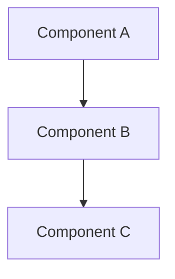
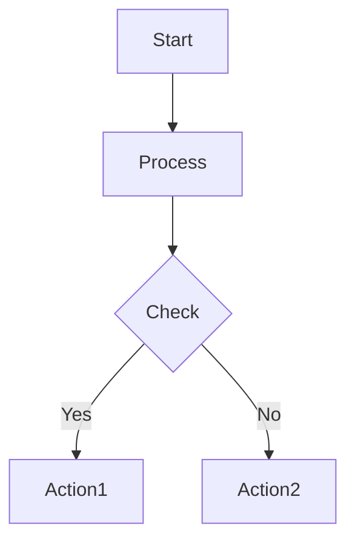
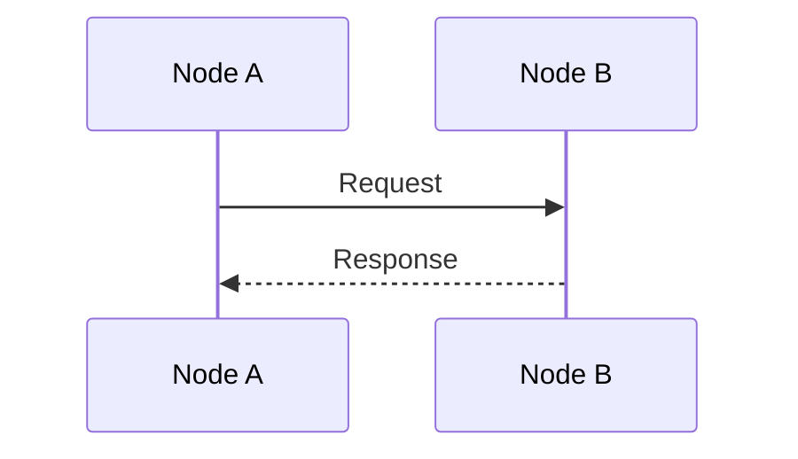
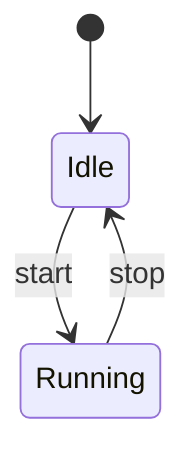
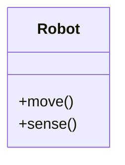

# Generate Diagram

Generate Mermaid diagrams for the textbook.

## Usage
```
/generate-diagram <type> <description>
```

## Types

### Architecture


### Flowchart


### Sequence


### State


### Class


## Guidelines
- Keep diagrams simple
- Use clear labels
- Max 10-15 nodes
- Add title comments
