# Generate Diagram

Generate Mermaid diagrams for the Physical AI Textbook with robotics-specific templates.

## Arguments
- `$ARGUMENTS` - `<type> <description>`

## Usage
```
/generate-diagram architecture ROS 2 node communication
/generate-diagram flowchart sensor fusion pipeline
/generate-diagram sequence robot arm motion planning
/generate-diagram state navigation state machine
/generate-diagram ros2-graph camera processing pipeline
```

## Available Diagram Types

| Type | Use Case | Best For |
|------|----------|----------|
| `architecture` | System overview | High-level design, component relationships |
| `flowchart` | Process flow | Algorithms, decision trees, data pipelines |
| `sequence` | Interactions | Message passing, API calls, protocols |
| `state` | State machines | Lifecycle, behavior states, modes |
| `class` | OOP design | Class hierarchies, interfaces |
| `ros2-graph` | ROS 2 topology | Nodes, topics, services |
| `er` | Data models | Database schemas, relationships |
| `gantt` | Timelines | Project phases, timing diagrams |

---

## Templates

### Architecture Diagram
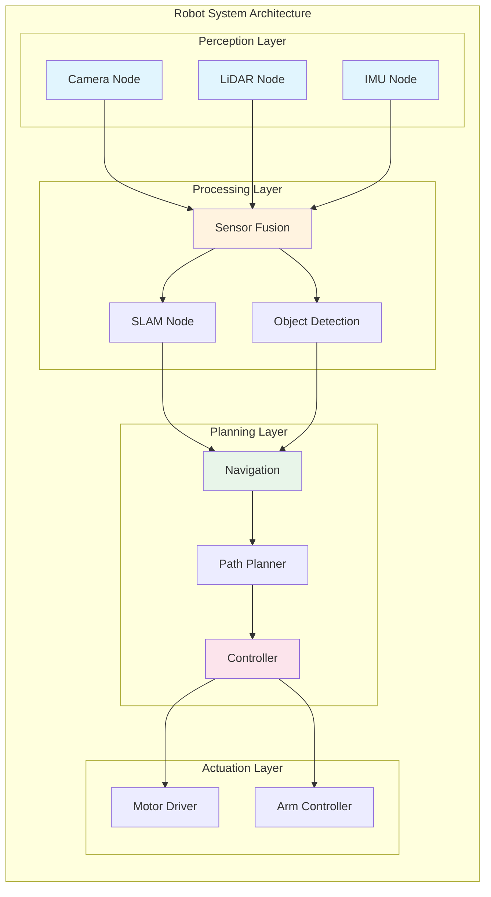

### ROS 2 Node Graph
```mermaid
graph LR
    subgraph "ROS 2 Computation Graph"
        direction LR

        %% Nodes
        CAM_NODE((camera_node))
        PROC_NODE((image_processor))
        DET_NODE((detector_node))
        NAV_NODE((nav2_controller))

        %% Topics
        RAW[/camera/raw]
        PROC[/camera/processed]
        DET[/detections]
        CMD[/cmd_vel]

        %% Connections
        CAM_NODE -->|pub| RAW
        RAW -->|sub| PROC_NODE
        PROC_NODE -->|pub| PROC
        PROC -->|sub| DET_NODE
        DET_NODE -->|pub| DET
        DET -->|sub| NAV_NODE
        NAV_NODE -->|pub| CMD
    end

    style CAM_NODE fill:#4fc3f7
    style PROC_NODE fill:#4fc3f7
    style DET_NODE fill:#4fc3f7
    style NAV_NODE fill:#4fc3f7
    style RAW fill:#ffcc80
    style PROC fill:#ffcc80
    style DET fill:#ffcc80
    style CMD fill:#ffcc80
```

### Flowchart - Algorithm
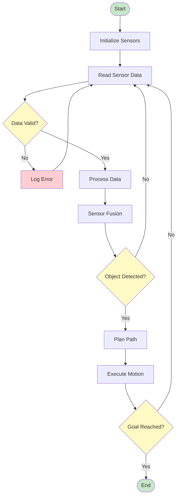

### Sequence Diagram - Message Passing
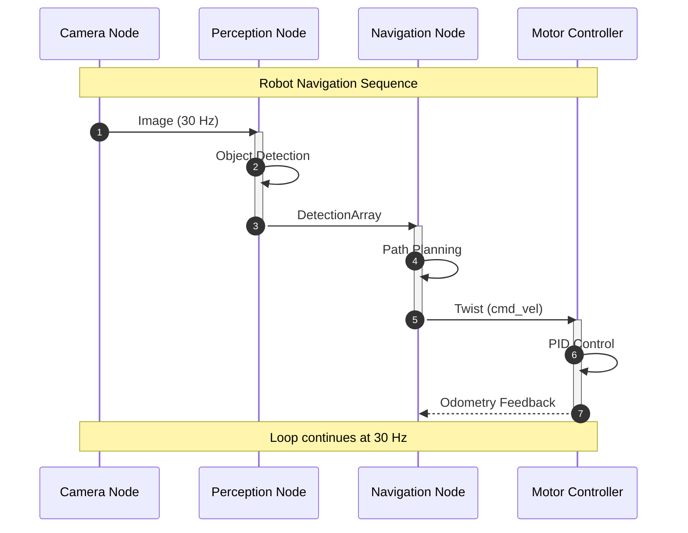

### State Machine - Lifecycle
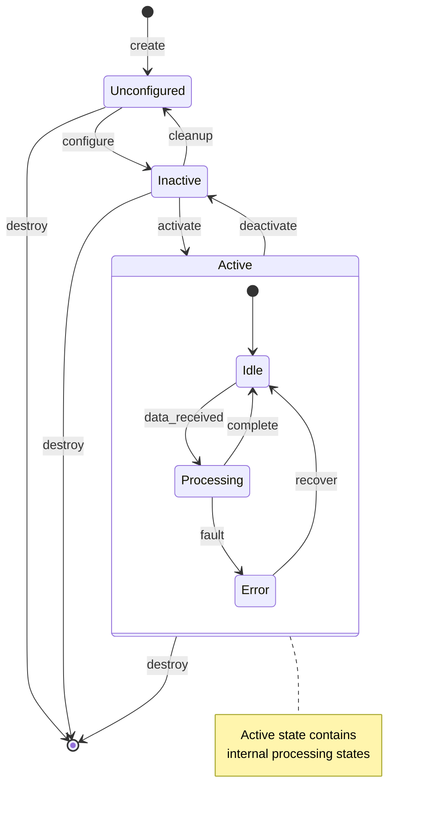

### State Machine - Robot Behavior
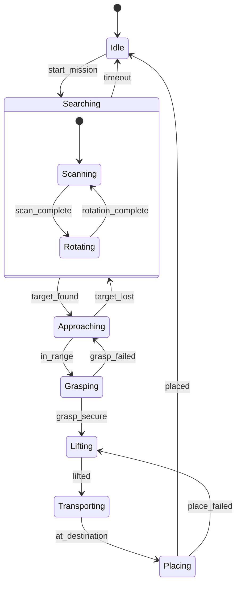

### Class Diagram - ROS 2 Node
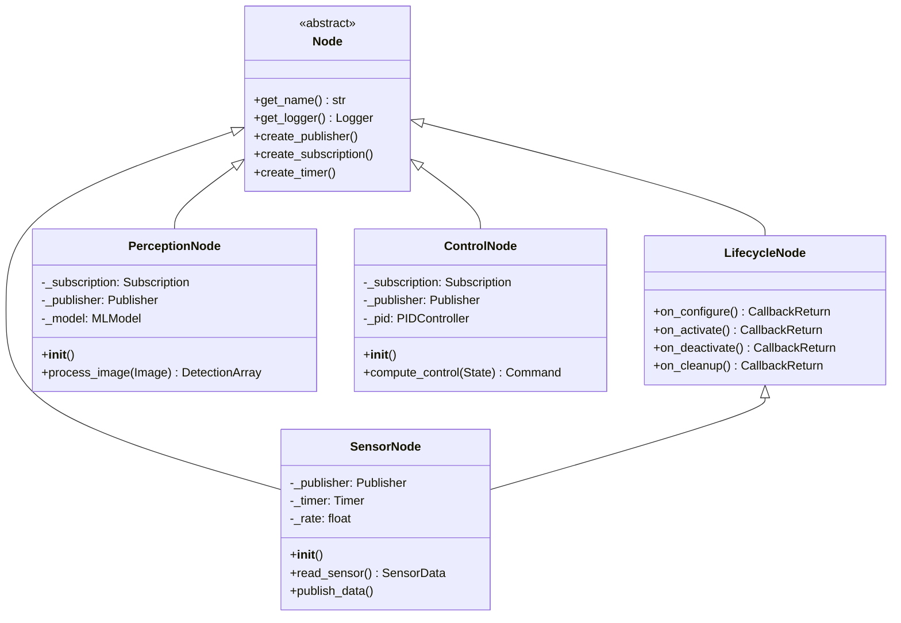

### Entity-Relationship Diagram
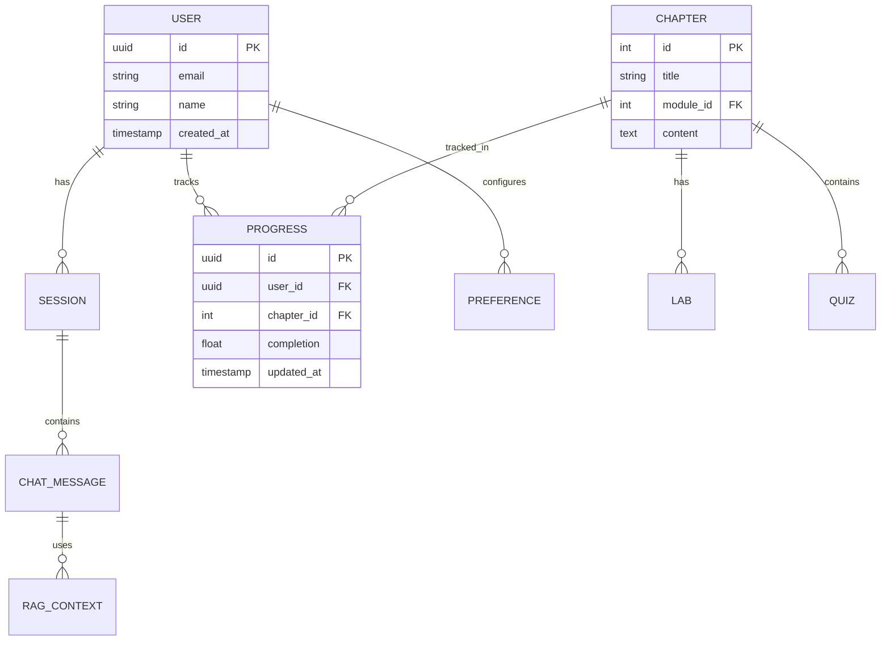

### Gantt Chart - Project Timeline
```mermaid
gantt
    title Robot Arm Motion Planning
    dateFormat X
    axisFormat %L ms

    section Path Planning
    Inverse Kinematics    :a1, 0, 50
    Collision Check       :a2, after a1, 30
    Trajectory Generation :a3, after a2, 100

    section Execution
    Joint Interpolation   :b1, after a3, 200
    Motor Commands        :b2, after b1, 50

    section Feedback
    Position Feedback     :c1, after b2, 50
    Error Correction      :c2, after c1, 30
```

---

## Robotics-Specific Patterns

### Sensor Fusion Pipeline
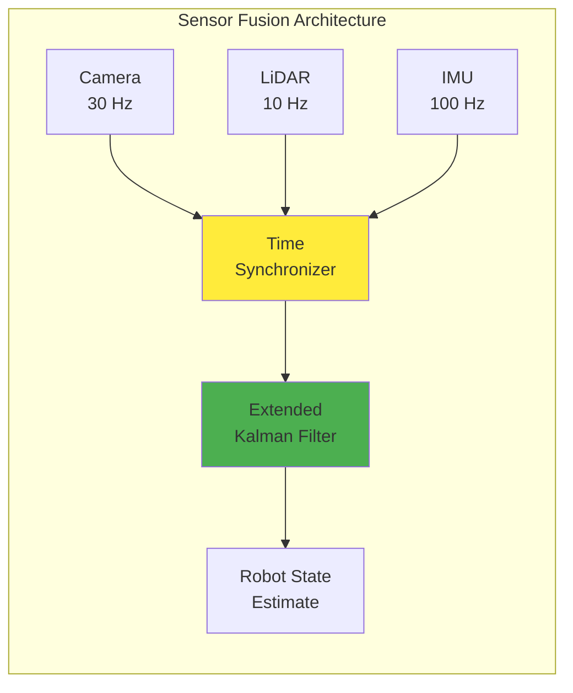

### Control Loop
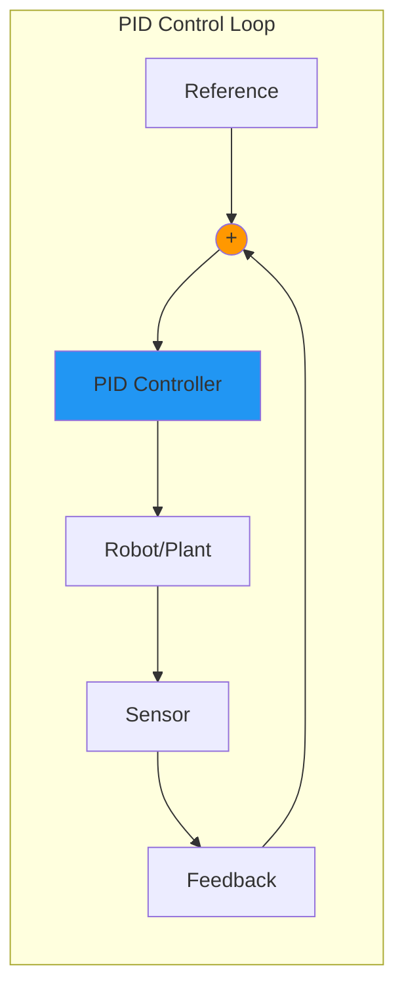

### Sim2Real Pipeline
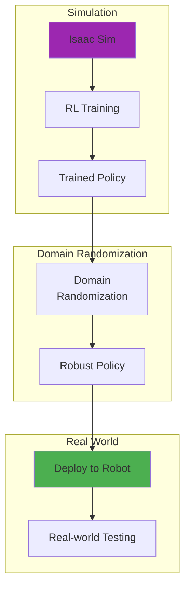

---

## Guidelines

### General Rules
- ✅ Keep diagrams focused (max 15-20 nodes)
- ✅ Use clear, descriptive labels
- ✅ Group related components with subgraphs
- ✅ Use consistent color coding
- ✅ Add comments for complex diagrams

### Color Conventions
| Category | Color | Hex |
|----------|-------|-----|
| Input/Sensor | Light Blue | `#e1f5fe` |
| Processing | Light Orange | `#fff3e0` |
| Output/Actuation | Light Pink | `#fce4ec` |
| Decision | Light Yellow | `#fff9c4` |
| Error/Warning | Light Red | `#ffcdd2` |
| Success/Complete | Light Green | `#c8e6c9` |

### Accessibility
- Use high-contrast colors
- Include text labels (not just colors)
- Keep line crossings minimal
- Use directional arrows clearly
