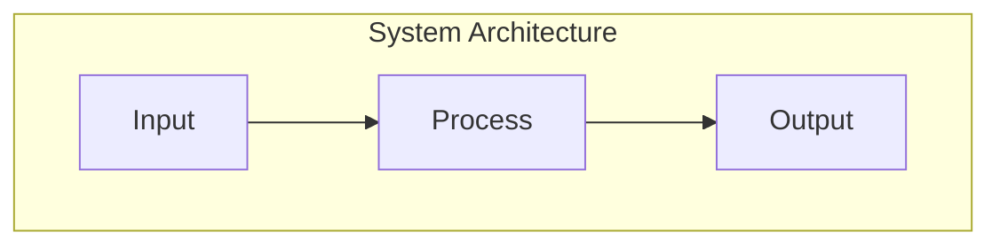

# Write Chapter

Generate textbook chapter content following the Physical AI Textbook structure.

## Arguments
- `$ARGUMENTS` - Chapter ID (e.g., "ch01", "ch14") and optional word count target

## Usage
```
/write-chapter ch01
/write-chapter ch14 3500
```

## Execution Steps

1. **Identify Chapter Context**
   - Parse chapter ID to determine module and topic
   - Load chapter outline from `specs/001-physical-ai-textbook/spec.md`
   - Determine if regular (1700-2500 words) or capstone (3000-3500 words)

2. **Generate Content**
   - Follow template structure below
   - Include 2-4 code examples per chapter
   - Add 1-2 Mermaid diagrams
   - Create RAG-optimized sections with clear semantic boundaries

3. **Validate Output**
   - Run word count validation: `wc -w <file>`
   - Check structure: all required sections present
   - Verify code examples are syntactically correct
   - Ensure RAG injection points are marked

## Template Structure

```markdown
---
sidebar_position: {{POSITION}}
title: "Chapter {{NUM}}: {{TITLE}}"
description: {{DESCRIPTION}}
keywords: [{{keyword1}}, {{keyword2}}, {{keyword3}}]
---

{/* RAG_SECTION: introduction */}
# {{TITLE}}

[Introduction paragraph - 100-150 words establishing context and relevance]

## Learning Objectives

By the end of this chapter, you will be able to:

- [ ] Objective 1 (measurable, action-oriented)
- [ ] Objective 2
- [ ] Objective 3
- [ ] Objective 4

## Prerequisites

Before starting this chapter, ensure you have:

- Completed Chapter {{PREV_NUM}}
- Understanding of [concept]
- Working [tool/environment] setup

{/* RAG_SECTION: core_content */}
## Section 1: [Core Concept]

[Content with clear explanations - 400-600 words]

### Key Terminology

| Term | Definition |
|------|------------|
| Term 1 | Clear, concise definition |
| Term 2 | Clear, concise definition |

### Code Example: [Description]

```python
#!/usr/bin/env python3
"""
[Module description for RAG indexing]
"""
import rclpy
from rclpy.node import Node

class ExampleNode(Node):
    """[Class description]."""

    def __init__(self) -> None:
        super().__init__('example_node')
        # Implementation with comments
```

{/* RAG_SECTION: practical_application */}
## Section 2: [Practical Application]

[Content with step-by-step guidance - 400-600 words]

### Architecture Diagram



{/* RAG_SECTION: hands_on */}
## Hands-On Exercise

**Time Required:** 20-30 minutes

### Step 1: [Setup]
[Clear instructions]

### Step 2: [Implementation]
[Step-by-step code]

### Step 3: [Verification]
[Expected outputs and checks]

{/* RAG_SECTION: summary */}
## Summary

**Key Takeaways:**
- Takeaway 1
- Takeaway 2
- Takeaway 3

**What's Next:** In Chapter {{NEXT_NUM}}, you'll learn [preview].

## Lab Exercise

🔬 **Hands-on Practice:** Complete the lab in [`labs/module-{{MOD}}/ch{{NUM}}-name/`](/labs/module-{{MOD}}/ch{{NUM}}-name)

## Self-Assessment Quiz

1. Question 1?
   - [ ] A) Option A
   - [ ] B) Option B (correct)
   - [ ] C) Option C

2. Question 2?

## Further Reading

- 📖 [Resource 1](url) - Brief description
- 📖 [Resource 2](url) - Brief description
- 🎥 [Video Resource](url) - Brief description
```

## Word Count Guidelines

| Chapter Type | Word Count | Sections | Code Examples | Diagrams |
|--------------|------------|----------|---------------|----------|
| Regular | 1700-2500 | 4-5 | 2-3 | 1-2 |
| Capstone | 3000-3500 | 6-8 | 4-5 | 2-3 |

### Validation Script
```bash
# Count words (excluding code blocks)
WORDS=$(sed '/```/,/```/d' "$FILE" | wc -w)
if [ "$WORDS" -lt 1700 ] || [ "$WORDS" -gt 2500 ]; then
  echo "WARNING: Word count $WORDS outside range 1700-2500"
fi
```

## RAG Integration Points

Mark semantic sections with `{/* RAG_SECTION: name */}` comments:
- `introduction` - Chapter intro and objectives
- `core_content` - Main technical content
- `practical_application` - Applied examples
- `hands_on` - Exercises and labs
- `summary` - Key takeaways and quiz

These markers help the RAG ingestion pipeline create semantically coherent chunks.

## Code Example Standards

```python
#!/usr/bin/env python3
"""
Brief: One-line description for RAG indexing.
Chapter: {{CHAPTER_NUM}}
Topic: {{TOPIC}}
"""
from typing import Optional, List
import rclpy
from rclpy.node import Node

class WellDocumentedNode(Node):
    """
    Detailed class description.

    Attributes:
        attr1: Description
        attr2: Description

    Example:
        >>> node = WellDocumentedNode()
        >>> node.process_data([1, 2, 3])
        [2, 4, 6]
    """

    def __init__(self) -> None:
        """Initialize the node with default configuration."""
        super().__init__('documented_node')
        self._setup_parameters()
        self._setup_publishers()

    def process_data(self, data: List[int]) -> List[int]:
        """
        Process input data.

        Args:
            data: Input list of integers

        Returns:
            Processed list with doubled values

        Raises:
            ValueError: If data is empty
        """
        if not data:
            raise ValueError("Data cannot be empty")
        return [x * 2 for x in data]
```

## Chapter Mapping Reference

| Module | Chapters | Type |
|--------|----------|------|
| 1: ROS 2 | ch01-ch04 | Regular |
| 1: ROS 2 | ch05 | Capstone |
| 2: Digital Twin | ch06 | Regular |
| 2: Digital Twin | ch07 | Capstone |
| 3: Isaac | ch08-ch10 | Regular |
| 4: VLA | ch11-ch13 | Regular |
| 4: VLA | ch14 | Capstone |
