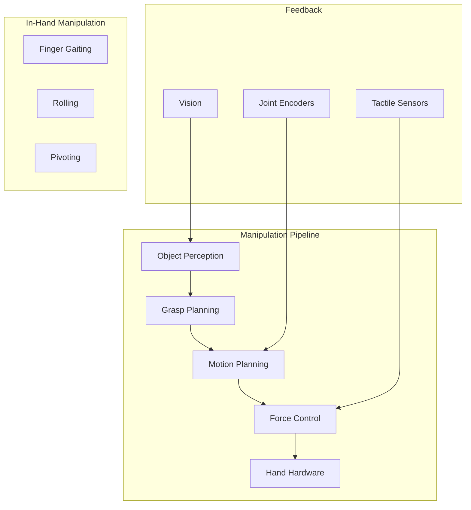

# Chapter 12: Dexterous Manipulation

## Learning Objectives

By the end of this chapter, you will be able to:

- Model multi-fingered hand kinematics
- Plan stable grasps for various objects
- Implement force and impedance control
- Handle contact dynamics and slip detection
- Integrate manipulation with vision systems

## Prerequisites

- Completed Chapter 11
- Understanding of kinematics and dynamics
- Control theory fundamentals

---

## 12.1 Introduction to Dexterous Manipulation

Dexterous manipulation enables robots to interact with objects using multi-fingered hands, achieving human-like grasping and in-hand manipulation capabilities.



### Types of Robotic Hands

| Type | DOF | Strengths | Examples |
|------|-----|-----------|----------|
| Parallel Gripper | 1 | Simple, robust | Most industrial |
| Multi-finger | 9-20 | Dexterous | Shadow, Allegro |
| Soft/Underactuated | 1-3 | Adaptive | Robotiq, SAKE |
| Anthropomorphic | 20+ | Human-like | DLR Hand, DEXMART |

### Grasp Taxonomy

| Grasp Type | Description | Use Cases |
|------------|-------------|-----------|
| Power Grasp | Full hand contact | Heavy objects, tools |
| Precision Grasp | Fingertip contact | Small objects, assembly |
| Lateral Pinch | Side of finger | Cards, thin objects |
| Hook Grasp | Fingers as hooks | Bags, handles |

---

## 12.2 Hand Kinematics

### Forward Kinematics

```python
# scripts/hand_kinematics.py
import numpy as np
from dataclasses import dataclass
from typing import List, Tuple


@dataclass
class FingerParams:
    """Parameters for a single finger."""
    num_joints: int = 3
    link_lengths: List[float] = None  # [proximal, middle, distal]
    joint_limits: List[Tuple[float, float]] = None

    def __post_init__(self):
        if self.link_lengths is None:
            self.link_lengths = [0.05, 0.03, 0.02]  # meters
        if self.joint_limits is None:
            self.joint_limits = [(-0.2, 1.6), (-0.1, 1.8), (-0.1, 1.5)]


class FingerKinematics:
    """Kinematics for a single finger."""

    def __init__(self, params: FingerParams, base_pose: np.ndarray):
        """
        Args:
            params: Finger parameters
            base_pose: 4x4 transformation from hand base to finger base
        """
        self.params = params
        self.base_pose = base_pose

    def forward_kinematics(self, joint_angles: np.ndarray) -> List[np.ndarray]:
        """
        Compute forward kinematics for all joints.

        Args:
            joint_angles: [num_joints] array of joint angles

        Returns:
            List of 4x4 transforms for each link frame
        """
        transforms = [self.base_pose.copy()]

        T_current = self.base_pose.copy()

        for i, (angle, length) in enumerate(zip(joint_angles, self.params.link_lengths)):
            # Rotation about z-axis (flexion)
            c, s = np.cos(angle), np.sin(angle)
            R = np.array([
                [c, -s, 0],
                [s, c, 0],
                [0, 0, 1]
            ])

            # Translation along x-axis (link length)
            t = np.array([length, 0, 0])

            # Build transform
            T = np.eye(4)
            T[:3, :3] = R
            T[:3, 3] = t

            T_current = T_current @ T
            transforms.append(T_current.copy())

        return transforms

    def fingertip_position(self, joint_angles: np.ndarray) -> np.ndarray:
        """Get fingertip position in hand base frame."""
        transforms = self.forward_kinematics(joint_angles)
        return transforms[-1][:3, 3]

    def jacobian(self, joint_angles: np.ndarray) -> np.ndarray:
        """
        Compute Jacobian for fingertip velocity.

        Returns:
            6 x num_joints Jacobian matrix
        """
        transforms = self.forward_kinematics(joint_angles)
        tip_pos = transforms[-1][:3, 3]

        J = np.zeros((6, self.params.num_joints))

        for i in range(self.params.num_joints):
            # Joint axis (z-axis of joint frame)
            z_i = transforms[i][:3, 2]

            # Position from joint to tip
            p_i = tip_pos - transforms[i][:3, 3]

            # Linear velocity Jacobian (cross product)
            J[:3, i] = np.cross(z_i, p_i)

            # Angular velocity Jacobian
            J[3:, i] = z_i

        return J


class HandKinematics:
    """Kinematics for multi-fingered hand."""

    def __init__(self, num_fingers=4):
        self.num_fingers = num_fingers
        self.fingers: List[FingerKinematics] = []

        # Setup finger base poses (example: 4-finger hand)
        finger_angles = np.linspace(-np.pi/4, np.pi/4, num_fingers)

        for i, angle in enumerate(finger_angles):
            # Finger base on palm
            base_pose = np.eye(4)
            base_pose[:3, 3] = [0.04, 0.02 * (i - 1.5), 0]
            base_pose[:3, :3] = self._rotation_z(angle)

            params = FingerParams()
            self.fingers.append(FingerKinematics(params, base_pose))

    def _rotation_z(self, angle):
        c, s = np.cos(angle), np.sin(angle)
        return np.array([
            [c, -s, 0],
            [s, c, 0],
            [0, 0, 1]
        ])

    def forward_kinematics(self, joint_angles: np.ndarray) -> dict:
        """
        Compute FK for all fingers.

        Args:
            joint_angles: [num_fingers * joints_per_finger] array

        Returns:
            Dict with fingertip positions and transforms
        """
        joints_per_finger = self.fingers[0].params.num_joints
        result = {
            'fingertips': [],
            'transforms': []
        }

        for i, finger in enumerate(self.fingers):
            start_idx = i * joints_per_finger
            end_idx = start_idx + joints_per_finger
            finger_angles = joint_angles[start_idx:end_idx]

            transforms = finger.forward_kinematics(finger_angles)
            fingertip = finger.fingertip_position(finger_angles)

            result['fingertips'].append(fingertip)
            result['transforms'].append(transforms)

        return result

    def full_jacobian(self, joint_angles: np.ndarray) -> np.ndarray:
        """Compute stacked Jacobian for all fingertips."""
        joints_per_finger = self.fingers[0].params.num_joints
        total_joints = self.num_fingers * joints_per_finger

        # Stack fingertip Jacobians
        J = np.zeros((6 * self.num_fingers, total_joints))

        for i, finger in enumerate(self.fingers):
            start_idx = i * joints_per_finger
            end_idx = start_idx + joints_per_finger
            finger_angles = joint_angles[start_idx:end_idx]

            J_finger = finger.jacobian(finger_angles)
            J[i*6:(i+1)*6, start_idx:end_idx] = J_finger

        return J
```

### Inverse Kinematics

```python
# scripts/hand_ik.py
import numpy as np
from scipy.optimize import minimize


class HandInverseKinematics:
    """Inverse kinematics solver for multi-fingered hand."""

    def __init__(self, hand: 'HandKinematics'):
        self.hand = hand

    def solve_fingertip_ik(self, finger_idx: int, target_pos: np.ndarray,
                           q_init: np.ndarray = None) -> np.ndarray:
        """
        Solve IK for a single fingertip.

        Args:
            finger_idx: Which finger to solve for
            target_pos: Desired fingertip position [x, y, z]
            q_init: Initial joint angles guess

        Returns:
            Joint angles that achieve target position
        """
        finger = self.hand.fingers[finger_idx]
        num_joints = finger.params.num_joints

        if q_init is None:
            q_init = np.zeros(num_joints)

        def objective(q):
            current_pos = finger.fingertip_position(q)
            error = target_pos - current_pos
            return np.sum(error**2)

        # Joint limits
        bounds = finger.params.joint_limits

        result = minimize(
            objective,
            q_init,
            method='SLSQP',
            bounds=bounds,
            options={'ftol': 1e-6}
        )

        return result.x

    def solve_grasp_ik(self, contact_points: List[np.ndarray],
                       q_init: np.ndarray = None) -> np.ndarray:
        """
        Solve IK for a grasp configuration.

        Args:
            contact_points: List of desired contact positions
            q_init: Initial full hand joint angles

        Returns:
            Joint angles for all fingers
        """
        num_fingers = len(self.hand.fingers)
        joints_per_finger = self.hand.fingers[0].params.num_joints
        total_joints = num_fingers * joints_per_finger

        if q_init is None:
            q_init = np.zeros(total_joints)

        q_result = q_init.copy()

        for i, target in enumerate(contact_points):
            if i < num_fingers:
                start_idx = i * joints_per_finger
                end_idx = start_idx + joints_per_finger

                finger_q = self.solve_fingertip_ik(
                    i, target, q_init[start_idx:end_idx]
                )
                q_result[start_idx:end_idx] = finger_q

        return q_result
```

---

## 12.3 Grasp Planning

### Grasp Quality Metrics

```python
# scripts/grasp_quality.py
import numpy as np
from typing import List


class GraspQualityMetrics:
    """Compute grasp quality metrics."""

    @staticmethod
    def compute_grasp_matrix(contact_points: np.ndarray,
                             contact_normals: np.ndarray,
                             object_center: np.ndarray) -> np.ndarray:
        """
        Compute grasp matrix G.

        G maps contact forces to object wrench:
        wrench = G @ contact_forces

        Args:
            contact_points: [n, 3] contact positions
            contact_normals: [n, 3] inward-pointing normals
            object_center: [3] object center of mass

        Returns:
            6 x 3n grasp matrix
        """
        n_contacts = len(contact_points)
        G = np.zeros((6, 3 * n_contacts))

        for i in range(n_contacts):
            # Position from object center to contact
            r = contact_points[i] - object_center

            # Force contribution (3x3 identity for point contact)
            G[:3, i*3:(i+1)*3] = np.eye(3)

            # Torque contribution (skew-symmetric of r)
            G[3:, i*3:(i+1)*3] = np.array([
                [0, -r[2], r[1]],
                [r[2], 0, -r[0]],
                [-r[1], r[0], 0]
            ])

        return G

    @staticmethod
    def force_closure_test(G: np.ndarray, contact_normals: np.ndarray,
                          friction_coef: float = 0.5) -> bool:
        """
        Test if grasp achieves force closure.

        Uses linear programming to check if any wrench can be resisted.
        """
        from scipy.optimize import linprog

        n_contacts = len(contact_normals)

        # Friction cone constraints (linearized)
        # For each contact: f_n >= 0, |f_t| <= mu * f_n

        # Simplified: Check if origin is in convex hull of primitive wrenches
        # A grasp has force closure if G has full row rank and
        # friction cones span the space

        # Check rank of G
        rank = np.linalg.matrix_rank(G)
        if rank < 6:
            return False

        # Additional friction cone check would go here
        return True

    @staticmethod
    def epsilon_metric(G: np.ndarray) -> float:
        """
        Compute epsilon quality metric.

        Epsilon = minimum singular value of G
        Higher is better (more isotropic force application)
        """
        _, s, _ = np.linalg.svd(G)
        return s[-1] if len(s) >= 6 else 0.0

    @staticmethod
    def volume_metric(G: np.ndarray) -> float:
        """
        Compute volume quality metric.

        Volume = product of singular values
        Higher is better
        """
        _, s, _ = np.linalg.svd(G)
        return np.prod(s[:6]) if len(s) >= 6 else 0.0


class GraspSampler:
    """Sample and evaluate grasp candidates."""

    def __init__(self, object_mesh, num_fingers=3):
        self.mesh = object_mesh
        self.num_fingers = num_fingers
        self.quality = GraspQualityMetrics()

    def sample_antipodal_grasps(self, num_samples=100) -> List[dict]:
        """
        Sample antipodal grasp configurations.

        Returns list of grasp candidates with quality scores.
        """
        grasps = []

        for _ in range(num_samples):
            # Sample points on object surface
            contacts, normals = self._sample_surface_points(self.num_fingers)

            if contacts is None:
                continue

            # Compute grasp matrix
            center = self.mesh.centroid
            G = self.quality.compute_grasp_matrix(contacts, normals, center)

            # Evaluate quality
            epsilon = self.quality.epsilon_metric(G)
            is_force_closure = self.quality.force_closure_test(G, normals)

            if is_force_closure and epsilon > 0.01:
                grasps.append({
                    'contacts': contacts,
                    'normals': normals,
                    'epsilon': epsilon,
                    'grasp_matrix': G
                })

        # Sort by quality
        grasps.sort(key=lambda x: x['epsilon'], reverse=True)
        return grasps

    def _sample_surface_points(self, n_points):
        """Sample random points on object surface."""
        # Simplified: Random sampling
        # In practice: Use mesh ray casting or sampling
        points = np.random.randn(n_points, 3) * 0.05
        normals = -points / np.linalg.norm(points, axis=1, keepdims=True)
        return points, normals
```

### Grasp Planning with Neural Networks

```python
# scripts/grasp_network.py
import torch
import torch.nn as nn
import numpy as np


class GraspPredictionNetwork(nn.Module):
    """Neural network for grasp prediction from point clouds."""

    def __init__(self, num_points=1024, num_grasps=10):
        super().__init__()

        self.num_grasps = num_grasps

        # PointNet-style encoder
        self.conv1 = nn.Conv1d(3, 64, 1)
        self.conv2 = nn.Conv1d(64, 128, 1)
        self.conv3 = nn.Conv1d(128, 256, 1)
        self.conv4 = nn.Conv1d(256, 512, 1)

        self.bn1 = nn.BatchNorm1d(64)
        self.bn2 = nn.BatchNorm1d(128)
        self.bn3 = nn.BatchNorm1d(256)
        self.bn4 = nn.BatchNorm1d(512)

        # Grasp prediction heads
        self.fc1 = nn.Linear(512, 256)
        self.fc2 = nn.Linear(256, 128)

        # Output: position (3) + orientation (4 quat) + width (1) + quality (1)
        self.grasp_head = nn.Linear(128, num_grasps * 9)

    def forward(self, point_cloud):
        """
        Predict grasps from point cloud.

        Args:
            point_cloud: [B, N, 3] batch of point clouds

        Returns:
            grasps: [B, num_grasps, 9] grasp parameters
        """
        # Transpose for Conv1d: [B, 3, N]
        x = point_cloud.transpose(1, 2)

        # Encoder
        x = torch.relu(self.bn1(self.conv1(x)))
        x = torch.relu(self.bn2(self.conv2(x)))
        x = torch.relu(self.bn3(self.conv3(x)))
        x = torch.relu(self.bn4(self.conv4(x)))

        # Global max pooling
        x = torch.max(x, dim=2)[0]

        # MLP
        x = torch.relu(self.fc1(x))
        x = torch.relu(self.fc2(x))

        # Grasp prediction
        grasps = self.grasp_head(x)
        grasps = grasps.view(-1, self.num_grasps, 9)

        # Normalize quaternion
        grasps[:, :, 3:7] = grasps[:, :, 3:7] / (
            torch.norm(grasps[:, :, 3:7], dim=2, keepdim=True) + 1e-8
        )

        # Sigmoid for quality score
        grasps[:, :, 8] = torch.sigmoid(grasps[:, :, 8])

        return grasps


class GraspPlanner:
    """High-level grasp planner using neural network."""

    def __init__(self, model_path: str):
        self.device = torch.device('cuda' if torch.cuda.is_available() else 'cpu')
        self.model = GraspPredictionNetwork()
        self.model.load_state_dict(torch.load(model_path, map_location=self.device))
        self.model.to(self.device)
        self.model.eval()

    def plan_grasp(self, point_cloud: np.ndarray) -> dict:
        """
        Plan best grasp for given point cloud.

        Args:
            point_cloud: [N, 3] object point cloud

        Returns:
            Best grasp with position, orientation, width, quality
        """
        # Preprocess
        pc_tensor = torch.from_numpy(point_cloud).float().unsqueeze(0).to(self.device)

        # Predict
        with torch.no_grad():
            grasps = self.model(pc_tensor)

        # Get best grasp (highest quality)
        grasps = grasps.cpu().numpy()[0]
        best_idx = np.argmax(grasps[:, 8])
        best_grasp = grasps[best_idx]

        return {
            'position': best_grasp[:3],
            'orientation': best_grasp[3:7],
            'width': best_grasp[7],
            'quality': best_grasp[8]
        }
```

---

## 12.4 Force and Impedance Control

### Force Controller

```python
# scripts/force_control.py
import numpy as np


class ForceController:
    """Force/torque controller for manipulation."""

    def __init__(self, stiffness=100.0, damping=20.0):
        self.Kp = stiffness  # N/m
        self.Kd = damping    # Ns/m

        # Force limits
        self.max_force = 20.0  # N
        self.max_torque = 5.0  # Nm

    def compute_force_error(self, desired_force: np.ndarray,
                           measured_force: np.ndarray) -> np.ndarray:
        """Compute force tracking error."""
        return desired_force - measured_force

    def force_control(self, desired_force: np.ndarray,
                     measured_force: np.ndarray,
                     velocity: np.ndarray) -> np.ndarray:
        """
        Compute position adjustment for force control.

        Uses admittance control: position = (F_des - F_meas) / K
        """
        force_error = self.compute_force_error(desired_force, measured_force)

        # Admittance: delta_x = (F_error - D * v) / K
        delta_pos = (force_error - self.Kd * velocity) / self.Kp

        return delta_pos

    def hybrid_control(self, desired_pose: np.ndarray,
                      desired_force: np.ndarray,
                      current_pose: np.ndarray,
                      measured_force: np.ndarray,
                      selection_matrix: np.ndarray) -> np.ndarray:
        """
        Hybrid position/force control.

        Args:
            desired_pose: [6] desired position and orientation
            desired_force: [6] desired force/torque
            current_pose: [6] current position and orientation
            measured_force: [6] measured force/torque
            selection_matrix: [6, 6] diagonal matrix (1=force, 0=position)

        Returns:
            Command pose adjustment
        """
        # Position control component
        position_error = desired_pose - current_pose

        # Force control component
        force_error = desired_force - measured_force
        force_adjustment = force_error / self.Kp

        # Combine based on selection matrix
        I = np.eye(6)
        S = selection_matrix
        command = (I - S) @ position_error + S @ force_adjustment

        return command


class ImpedanceController:
    """Impedance controller for compliant manipulation."""

    def __init__(self):
        # Impedance parameters (can be varied)
        self.M = np.diag([1.0, 1.0, 1.0, 0.1, 0.1, 0.1])  # Inertia
        self.D = np.diag([50.0, 50.0, 50.0, 5.0, 5.0, 5.0])  # Damping
        self.K = np.diag([500.0, 500.0, 500.0, 50.0, 50.0, 50.0])  # Stiffness

    def compute_wrench(self, desired_pose: np.ndarray,
                      current_pose: np.ndarray,
                      current_velocity: np.ndarray,
                      external_force: np.ndarray) -> np.ndarray:
        """
        Compute commanded wrench for impedance behavior.

        Implements: M * x_ddot + D * x_dot + K * x = F_ext

        Args:
            desired_pose: [6] desired equilibrium pose
            current_pose: [6] current pose
            current_velocity: [6] current velocity
            external_force: [6] measured external wrench

        Returns:
            Commanded wrench [6]
        """
        # Pose error
        pose_error = desired_pose - current_pose

        # Impedance equation
        # F_cmd = K * (x_d - x) - D * x_dot + F_ext
        wrench = self.K @ pose_error - self.D @ current_velocity + external_force

        return wrench

    def variable_impedance(self, task_phase: str) -> None:
        """
        Adjust impedance based on task phase.

        Different phases require different compliance.
        """
        if task_phase == 'approach':
            # High stiffness for accurate positioning
            self.K = np.diag([1000, 1000, 1000, 100, 100, 100])
            self.D = np.diag([100, 100, 100, 10, 10, 10])

        elif task_phase == 'contact':
            # Low stiffness in contact direction
            self.K = np.diag([1000, 1000, 100, 100, 100, 50])
            self.D = np.diag([100, 100, 50, 10, 10, 5])

        elif task_phase == 'insertion':
            # Very compliant for insertion
            self.K = np.diag([500, 500, 50, 50, 50, 20])
            self.D = np.diag([50, 50, 20, 5, 5, 2])
```

### Tactile Sensing Integration

```python
# scripts/tactile_controller.py
import numpy as np
from dataclasses import dataclass
from typing import List


@dataclass
class TactileReading:
    """Single tactile sensor reading."""
    position: np.ndarray  # Contact position
    normal: np.ndarray    # Contact normal
    force: float          # Normal force magnitude
    slip: bool            # Slip detection flag


class TactileController:
    """Controller using tactile feedback."""

    def __init__(self, num_sensors: int):
        self.num_sensors = num_sensors

        # Grasp force targets
        self.target_force = 5.0  # N per contact
        self.min_force = 1.0     # N
        self.max_force = 20.0    # N

        # Slip prevention
        self.slip_margin = 0.2   # Force increase on slip

    def process_tactile(self, readings: List[TactileReading]) -> dict:
        """
        Process tactile readings for grasp control.

        Returns control adjustments for each finger.
        """
        adjustments = []
        total_force = 0.0
        slip_detected = False

        for reading in readings:
            # Check for slip
            if reading.slip:
                slip_detected = True

            total_force += reading.force

            # Force control for this contact
            force_error = self.target_force - reading.force
            adjustment = 0.001 * force_error  # Position adjustment

            adjustments.append({
                'position_delta': adjustment * reading.normal,
                'force_error': force_error
            })

        # Global slip response
        if slip_detected:
            for adj in adjustments:
                # Increase grip force
                adj['position_delta'] *= (1.0 + self.slip_margin)

        return {
            'adjustments': adjustments,
            'total_force': total_force,
            'slip_detected': slip_detected
        }

    def adaptive_grasp_force(self, object_weight: float,
                            friction_coef: float = 0.5) -> float:
        """
        Compute minimum grasp force for object.

        F_grip >= W / (n * mu)
        """
        n_contacts = self.num_sensors
        min_force = object_weight / (n_contacts * friction_coef)

        # Add safety margin
        return min_force * 1.5

    def detect_contact(self, readings: List[TactileReading],
                      threshold: float = 0.5) -> List[bool]:
        """Detect which sensors are in contact."""
        return [r.force > threshold for r in readings]
```

---

## 12.5 In-Hand Manipulation

### Finger Gaiting

```python
# scripts/in_hand_manipulation.py
import numpy as np
from typing import List, Tuple


class FingerGaiting:
    """Controller for finger gaiting manipulation."""

    def __init__(self, hand_kinematics, num_fingers=4):
        self.hand = hand_kinematics
        self.num_fingers = num_fingers

        # Gaiting parameters
        self.support_fingers = 3  # Minimum fingers in contact
        self.swing_time = 0.5     # Seconds per finger swing

    def plan_regrasping(self, current_contacts: List[np.ndarray],
                       target_contacts: List[np.ndarray]) -> List[dict]:
        """
        Plan finger gaiting sequence for regrasping.

        Moves one finger at a time while maintaining grasp.
        """
        sequence = []
        contacts = [c.copy() for c in current_contacts]

        for i in range(self.num_fingers):
            if not np.allclose(contacts[i], target_contacts[i], atol=0.01):
                # Plan finger swing
                sequence.append({
                    'finger_idx': i,
                    'start': contacts[i].copy(),
                    'end': target_contacts[i].copy(),
                    'support_fingers': [j for j in range(self.num_fingers) if j != i]
                })
                contacts[i] = target_contacts[i].copy()

        return sequence

    def execute_swing(self, finger_idx: int,
                     start_pos: np.ndarray,
                     end_pos: np.ndarray,
                     duration: float) -> List[np.ndarray]:
        """
        Generate trajectory for finger swing.

        Lifts finger, moves to new position, and establishes contact.
        """
        num_steps = int(duration * 100)  # 100 Hz
        trajectory = []

        # Phase 1: Lift (30%)
        # Phase 2: Move (40%)
        # Phase 3: Lower (30%)

        lift_height = 0.02  # meters

        for t in np.linspace(0, 1, num_steps):
            if t < 0.3:
                # Lift
                phase = t / 0.3
                pos = start_pos + np.array([0, 0, lift_height * phase])
            elif t < 0.7:
                # Move
                phase = (t - 0.3) / 0.4
                pos = start_pos + phase * (end_pos - start_pos)
                pos[2] = start_pos[2] + lift_height
            else:
                # Lower
                phase = (t - 0.7) / 0.3
                pos = end_pos + np.array([0, 0, lift_height * (1 - phase)])

            trajectory.append(pos)

        return trajectory


class ObjectRotation:
    """Controller for in-hand object rotation."""

    def __init__(self, hand_kinematics):
        self.hand = hand_kinematics

    def plan_rotation(self, axis: np.ndarray, angle: float,
                     object_center: np.ndarray,
                     contact_points: List[np.ndarray]) -> List[np.ndarray]:
        """
        Plan contact point trajectories for object rotation.

        Args:
            axis: Rotation axis (unit vector)
            angle: Rotation angle (radians)
            object_center: Object center of rotation
            contact_points: Current contact positions

        Returns:
            List of contact trajectories
        """
        num_steps = 50
        trajectories = []

        # Rodrigues rotation formula
        def rotate_point(point, axis, angle):
            c, s = np.cos(angle), np.sin(angle)
            r = point - object_center
            rotated = (c * r +
                      s * np.cross(axis, r) +
                      (1 - c) * np.dot(axis, r) * axis)
            return rotated + object_center

        for contact in contact_points:
            traj = []
            for t in np.linspace(0, angle, num_steps):
                new_pos = rotate_point(contact, axis, t)
                traj.append(new_pos)
            trajectories.append(traj)

        return trajectories

    def coordinated_finger_control(self, trajectories: List[List[np.ndarray]],
                                  grasp_force: float) -> List[dict]:
        """
        Generate coordinated control commands for all fingers.

        Maintains constant grasp force during rotation.
        """
        commands = []
        num_steps = len(trajectories[0])

        for step in range(num_steps):
            step_cmd = {
                'positions': [traj[step] for traj in trajectories],
                'forces': [grasp_force] * len(trajectories)
            }
            commands.append(step_cmd)

        return commands
```

---

## 12.6 ROS 2 Integration

### Manipulation Controller Node

```python
# scripts/manipulation_node.py
import rclpy
from rclpy.node import Node
from sensor_msgs.msg import JointState, PointCloud2
from geometry_msgs.msg import WrenchStamped, PoseStamped
from std_msgs.msg import Float64MultiArray
import numpy as np
import sensor_msgs_py.point_cloud2 as pc2


class ManipulationController(Node):
    """ROS 2 node for dexterous manipulation."""

    def __init__(self):
        super().__init__('manipulation_controller')

        # Parameters
        self.declare_parameter('control_rate', 100.0)
        self.declare_parameter('grasp_force', 5.0)

        self.control_rate = self.get_parameter('control_rate').value
        self.grasp_force = self.get_parameter('grasp_force').value

        # State
        self.joint_positions = None
        self.fingertip_forces = None
        self.object_pose = None

        # Controllers
        from scripts.force_control import ForceController, ImpedanceController
        self.force_controller = ForceController()
        self.impedance_controller = ImpedanceController()

        # Subscribers
        self.joint_sub = self.create_subscription(
            JointState, '/hand/joint_states', self.joint_callback, 10
        )
        self.force_sub = self.create_subscription(
            WrenchStamped, '/hand/fingertip_force', self.force_callback, 10
        )
        self.pointcloud_sub = self.create_subscription(
            PointCloud2, '/camera/depth/points', self.pointcloud_callback, 10
        )

        # Publishers
        self.joint_cmd_pub = self.create_publisher(
            Float64MultiArray, '/hand/joint_commands', 10
        )
        self.grasp_status_pub = self.create_publisher(
            PoseStamped, '/manipulation/grasp_status', 10
        )

        # Control timer
        self.create_timer(1.0 / self.control_rate, self.control_loop)

        # State machine
        self.state = 'idle'
        self.target_object = None

        self.get_logger().info('Manipulation Controller initialized')

    def joint_callback(self, msg):
        self.joint_positions = np.array(msg.position)

    def force_callback(self, msg):
        self.fingertip_forces = np.array([
            msg.wrench.force.x,
            msg.wrench.force.y,
            msg.wrench.force.z
        ])

    def pointcloud_callback(self, msg):
        """Process point cloud for object detection."""
        points = []
        for p in pc2.read_points(msg, field_names=['x', 'y', 'z'], skip_nans=True):
            points.append([p[0], p[1], p[2]])

        if points:
            self.object_pointcloud = np.array(points)

    def control_loop(self):
        """Main control loop."""
        if self.joint_positions is None:
            return

        if self.state == 'idle':
            pass
        elif self.state == 'approaching':
            self._approach_object()
        elif self.state == 'grasping':
            self._execute_grasp()
        elif self.state == 'holding':
            self._maintain_grasp()
        elif self.state == 'manipulating':
            self._in_hand_manipulation()

    def plan_grasp(self, target_pose: np.ndarray):
        """Plan and initiate grasp."""
        self.target_object = target_pose
        self.state = 'approaching'

    def _approach_object(self):
        """Move hand toward object."""
        if self.target_object is None:
            return

        # Use motion planning to approach
        # ...
        self.state = 'grasping'

    def _execute_grasp(self):
        """Close fingers and establish grasp."""
        # Close fingers until contact
        if self.fingertip_forces is not None:
            total_force = np.sum(self.fingertip_forces)
            if total_force > self.grasp_force:
                self.state = 'holding'
                self.get_logger().info('Grasp established')

    def _maintain_grasp(self):
        """Maintain stable grasp with force control."""
        if self.fingertip_forces is None:
            return

        # Force control to maintain grasp
        desired_force = np.array([self.grasp_force, 0, 0])
        delta_pos = self.force_controller.force_control(
            desired_force,
            self.fingertip_forces,
            np.zeros(3)  # velocity
        )

        # Apply adjustment
        # ...

    def _in_hand_manipulation(self):
        """Execute in-hand manipulation."""
        # Finger gaiting or rotation
        pass

    def release_grasp(self):
        """Open hand and release object."""
        self.state = 'idle'
        self.target_object = None

        # Open fingers command
        msg = Float64MultiArray()
        msg.data = [0.0] * 12  # Open position
        self.joint_cmd_pub.publish(msg)


def main(args=None):
    rclpy.init(args=args)
    node = ManipulationController()
    rclpy.spin(node)
    node.destroy_node()
    rclpy.shutdown()


if __name__ == '__main__':
    main()
```

### MoveIt 2 Integration

```python
# scripts/moveit_grasp_interface.py
import rclpy
from rclpy.node import Node
from moveit_msgs.msg import Grasp, GripperTranslation
from moveit_msgs.srv import GetCartesianPath
from geometry_msgs.msg import PoseStamped, Pose
from trajectory_msgs.msg import JointTrajectory
import numpy as np


class MoveItGraspInterface(Node):
    """Interface to MoveIt 2 for grasp execution."""

    def __init__(self):
        super().__init__('moveit_grasp_interface')

        # MoveIt service clients
        self.cartesian_path_client = self.create_client(
            GetCartesianPath, '/compute_cartesian_path'
        )

        self.get_logger().info('MoveIt Grasp Interface initialized')

    def create_grasp_message(self, grasp_pose: Pose,
                            pre_grasp_approach: float = 0.1,
                            post_grasp_retreat: float = 0.1) -> Grasp:
        """
        Create MoveIt Grasp message.

        Args:
            grasp_pose: Gripper pose at grasp
            pre_grasp_approach: Approach distance
            post_grasp_retreat: Retreat distance
        """
        grasp = Grasp()
        grasp.id = 'grasp_0'

        # Grasp pose
        grasp.grasp_pose.header.frame_id = 'base_link'
        grasp.grasp_pose.pose = grasp_pose

        # Pre-grasp approach
        grasp.pre_grasp_approach.direction.header.frame_id = 'base_link'
        grasp.pre_grasp_approach.direction.vector.z = -1.0
        grasp.pre_grasp_approach.min_distance = 0.05
        grasp.pre_grasp_approach.desired_distance = pre_grasp_approach

        # Post-grasp retreat
        grasp.post_grasp_retreat.direction.header.frame_id = 'base_link'
        grasp.post_grasp_retreat.direction.vector.z = 1.0
        grasp.post_grasp_retreat.min_distance = 0.05
        grasp.post_grasp_retreat.desired_distance = post_grasp_retreat

        # Gripper posture (open)
        grasp.pre_grasp_posture = self._create_gripper_posture(0.08)

        # Gripper posture (closed)
        grasp.grasp_posture = self._create_gripper_posture(0.02)

        grasp.max_contact_force = 10.0
        grasp.allowed_touch_objects = ['target_object']

        return grasp

    def _create_gripper_posture(self, width: float) -> JointTrajectory:
        """Create gripper posture trajectory."""
        traj = JointTrajectory()
        traj.joint_names = ['finger_joint']

        from trajectory_msgs.msg import JointTrajectoryPoint
        point = JointTrajectoryPoint()
        point.positions = [width / 2.0]  # Assuming symmetric gripper
        point.time_from_start.sec = 1

        traj.points = [point]
        return traj


def main(args=None):
    rclpy.init(args=args)
    node = MoveItGraspInterface()
    rclpy.spin(node)
    node.destroy_node()
    rclpy.shutdown()
```

---

## Lab Exercise

Complete the hands-on lab in [`labs/module-4/ch12-manipulation/`](https://github.com/physical-ai-textbook/physical-ai-textbook/tree/main/labs/module-4/ch12-manipulation) where you will:

1. Implement forward kinematics for a 3-finger hand
2. Sample and evaluate grasp candidates on a test object
3. Implement force control for stable grasping
4. Execute a pick-and-place task in simulation
5. Integrate tactile feedback for slip prevention

**Estimated time**: 3-4 hours

---

## Summary

In this chapter, you learned:

- **Hand kinematics**: Forward/inverse kinematics for multi-fingered hands
- **Grasp planning**: Quality metrics, sampling, and neural network approaches
- **Force control**: Hybrid position/force and impedance control
- **Tactile sensing**: Contact detection and slip prevention
- **In-hand manipulation**: Finger gaiting and object rotation
- **ROS 2 integration**: Building manipulation controller nodes

Dexterous manipulation enables robots to perform complex tasks requiring precise object interaction. The combination of kinematics, force control, and tactile feedback provides the foundation for human-like manipulation capabilities.

---

## Further Reading

- [A Mathematical Introduction to Robotic Manipulation](http://www.cds.caltech.edu/~murray/mlswiki/)
- [MoveIt 2 Documentation](https://moveit.ros.org/)
- [Dex-Net Grasp Planning](https://berkeleyautomation.github.io/dex-net/)
- [Contact-Rich Manipulation with RL](https://arxiv.org/abs/1910.10897)
- [Shadow Hand Documentation](https://www.shadowrobot.com/dexterous-hand-series/)
