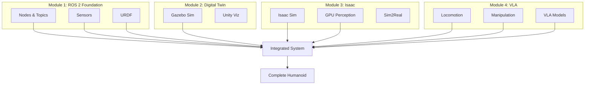
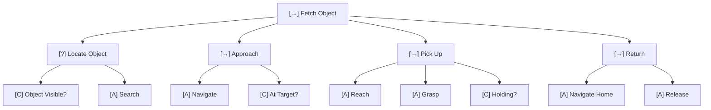

# Chapter 14: Final Capstone - Complete Humanoid System

## Learning Objectives

By the end of this chapter, you will be able to:

- Integrate perception, locomotion, and manipulation systems
- Design behavior trees for complex task execution
- Implement safety systems and fault handling
- Deploy and operate a complete humanoid system
- Document and present your capstone project

## Prerequisites

- Completed all previous chapters (1-13)
- Access to humanoid simulation or hardware
- Behavior tree design experience recommended

---

## 14.1 System Integration Overview

The final capstone brings together all the skills you've learned across four modules into a complete, functioning humanoid robot system.



### System Architecture

Your capstone system should include these components:

| Component | Purpose | Source Module |
|-----------|---------|---------------|
| **ROS 2 Core** | Communication backbone | Module 1 |
| **Perception** | Visual understanding | Module 3 |
| **Locomotion** | Walking and balance | Module 4 Ch11 |
| **Manipulation** | Grasping and handling | Module 4 Ch12 |
| **VLA Agent** | Language understanding | Module 4 Ch13 |
| **Behavior Tree** | Task orchestration | Module 4 Ch14 |
| **Safety System** | Fault handling | Module 4 Ch14 |

---

## 14.2 Behavior Trees for Task Orchestration

Behavior trees provide a modular, reusable framework for organizing complex robot behaviors.

### Node Types

```
[→] Sequence: Execute children in order (AND)
[?] Selector: Try until one succeeds (OR)
[⇒] Parallel: Execute simultaneously
[D] Decorator: Modify child behavior
[C] Condition: Check state
[A] Action: Execute behavior
```

### Example: Fetch Task



### Implementation Pattern

```python
from behavior_tree import Sequence, Selector, ActionNode, ConditionNode

def build_fetch_tree(robot_system):
    """Build behavior tree for fetch task."""

    # Conditions
    object_visible = ConditionNode(
        "ObjectVisible",
        lambda: robot_system.perception.has_target()
    )

    holding_object = ConditionNode(
        "HoldingObject",
        lambda: robot_system.manipulation.holding_object is not None
    )

    # Actions
    search = ActionNode("Search", robot_system.perception.search)
    navigate = ActionNode("Navigate", robot_system.locomotion.navigate_to_target)
    pick = ActionNode("Pick", robot_system.manipulation.pick_target)
    return_home = ActionNode("ReturnHome", robot_system.locomotion.go_home)
    release = ActionNode("Release", robot_system.manipulation.release)

    # Build tree
    locate = Selector("Locate").add_child(object_visible).add_child(search)
    approach = Sequence("Approach").add_child(navigate)
    pick_up = Sequence("PickUp").add_child(pick).add_child(holding_object)
    return_seq = Sequence("Return").add_child(return_home).add_child(release)

    root = Sequence("Fetch")
    root.add_child(locate)
    root.add_child(approach)
    root.add_child(pick_up)
    root.add_child(return_seq)

    return root
```

---

## 14.3 Safety Systems

Safety is paramount in humanoid robotics. Your system must handle failures gracefully.

### Safety Hierarchy

```
┌─────────────────────────────────────────────┐
│         Emergency Stop (Hardware)           │  ← Physical kill switch
├─────────────────────────────────────────────┤
│         Safety Monitor (Software)           │  ← Continuous monitoring
├─────────────────────────────────────────────┤
│         Behavior Tree Safety Checks         │  ← Task-level safety
├─────────────────────────────────────────────┤
│         Subsystem Safety (per module)       │  ← Component-level
└─────────────────────────────────────────────┘
```

### Safety Checks

| Check | Threshold | Action |
|-------|-----------|--------|
| **Joint velocity** | < 2 rad/s | Reduce speed |
| **Joint torque** | < 100 Nm | Limit force |
| **Body tilt** | < 30° | Emergency stop |
| **Battery** | > 10% | Warn, then shutdown |
| **Temperature** | < 80°C | Throttle |
| **Communication** | < 1s timeout | Safe mode |

### Implementation

```python
class SafetyMonitor:
    """Continuous safety monitoring."""

    def __init__(self, robot):
        self.robot = robot
        self.violations = []

    def check(self, sensor_data):
        self.violations = []

        # Check tilt
        if abs(sensor_data.orientation[0]) > 0.5:  # rad
            self.violations.append("TILT_ROLL")
        if abs(sensor_data.orientation[1]) > 0.5:
            self.violations.append("TILT_PITCH")

        # Check velocities
        if sensor_data.joint_velocities is not None:
            if np.any(np.abs(sensor_data.joint_velocities) > 2.0):
                self.violations.append("VELOCITY_EXCEEDED")

        # Check contact forces
        total_force = sensor_data.left_foot_force[2] + sensor_data.right_foot_force[2]
        if total_force < 100:  # N - robot might be falling
            self.violations.append("LOW_CONTACT_FORCE")

        return len(self.violations) == 0

    def handle_violations(self):
        if "TILT_ROLL" in self.violations or "TILT_PITCH" in self.violations:
            self.robot.emergency_stop("Excessive tilt detected")
        elif "VELOCITY_EXCEEDED" in self.violations:
            self.robot.reduce_speed(0.5)
```

---

## 14.4 Capstone Project

This is the final capstone integrating everything learned across all four modules.

### Project Overview

Design and implement a complete humanoid robot system that can:
1. Understand natural language commands
2. Perceive and understand its environment
3. Navigate safely through the environment
4. Manipulate objects to complete tasks
5. Handle errors and recover gracefully

### Project Requirements

#### Core Requirements (Must Have)

1. **Perception System** (20%)
   - Object detection and recognition
   - Scene understanding
   - Target localization

2. **Locomotion** (20%)
   - Stable walking/navigation
   - Balance control
   - Obstacle avoidance

3. **Manipulation** (20%)
   - Reaching and grasping
   - Object transport
   - Placement accuracy

4. **Language Interface** (15%)
   - Command parsing
   - Intent recognition
   - Confirmation feedback

5. **Safety** (15%)
   - Emergency stop
   - Fault detection
   - Graceful degradation

6. **Integration & Demo** (10%)
   - End-to-end functionality
   - Demonstration quality

### Implementation Checklist

```markdown
## Capstone Requirements

### Perception (20 points)
- [ ] (5) Object detection working at 10+ FPS
- [ ] (5) Scene understanding identifies objects and locations
- [ ] (5) 3D localization accuracy < 10cm
- [ ] (5) Works under varying lighting conditions

### Locomotion (20 points)
- [ ] (5) Robot can walk forward/backward
- [ ] (5) Robot can turn in place
- [ ] (5) Balance maintained on uneven surfaces
- [ ] (5) Navigation reaches target within 20cm

### Manipulation (20 points)
- [ ] (5) Can reach objects within workspace
- [ ] (5) Grasp success rate > 80%
- [ ] (5) Can transport objects without dropping
- [ ] (5) Placement accuracy < 5cm

### Language Interface (15 points)
- [ ] (5) Parses 10+ command types correctly
- [ ] (3) Handles ambiguous commands gracefully
- [ ] (4) Provides appropriate feedback
- [ ] (3) Supports multi-step commands

### Safety (15 points)
- [ ] (5) Emergency stop works within 100ms
- [ ] (5) Detects and handles common faults
- [ ] (5) Recovers gracefully from errors

### Integration (10 points)
- [ ] (5) Full demo completes without crashes
- [ ] (5) Smooth transitions between behaviors
```

### Grading Rubric

| Criteria | Points | Description |
|----------|--------|-------------|
| **System Integration** | 25 | All subsystems work together seamlessly |
| **Task Completion** | 25 | Demo achieves stated objectives reliably |
| **Safety & Robustness** | 20 | Handles errors, edge cases, and failures |
| **Code Quality** | 15 | Clean, documented, maintainable code |
| **Documentation & Demo** | 15 | Clear presentation and thorough docs |
| **Total** | 100 | |

### Grading Breakdown

| Grade | Points | Description |
|-------|--------|-------------|
| **A** | 90-100 | Exceeds requirements, innovative solutions |
| **B** | 80-89 | Meets all requirements, minor issues |
| **C** | 70-79 | Most requirements met, some gaps |
| **D** | 60-69 | Partial implementation, significant issues |
| **F** | &lt;60 | Incomplete or non-functional |

### Demo Scenarios

Choose one of these demonstration scenarios:

**Scenario A: Table Service**
> The robot receives the command "Set the table for dinner."
> It must fetch plates, cups, and utensils from a cabinet
> and arrange them properly on the dining table.

**Scenario B: Object Sorting**
> The robot receives the command "Sort the colored blocks."
> It must identify blocks by color, pick them up, and
> place them in the correct colored bins.

**Scenario C: Personal Assistant**
> The robot responds to various commands like:
> - "Bring me the water bottle"
> - "Put this book on the shelf"
> - "Find my phone"

### Submission Requirements

1. **Source Code Repository**
   - All ROS 2 packages
   - Behavior tree implementation
   - Configuration files
   - Clear README with setup instructions

2. **Documentation**
   - System architecture diagram
   - Design decisions and rationale
   - Performance measurements
   - Known limitations

3. **Video Demonstration** (5-10 minutes)
   - System startup and initialization
   - Language command processing
   - Task execution (full scenario)
   - Error handling demonstration
   - Summary of achievements

4. **Written Report** (4-6 pages)
   - Design overview
   - Implementation challenges
   - Performance analysis
   - Future improvements

---

## Lab Exercise

Complete the hands-on lab in [`labs/module-4/ch14-capstone/`](https://github.com/physical-ai-textbook/physical-ai-textbook/tree/main/labs/module-4/ch14-capstone) where you will:

1. Integrate all subsystems into a unified system
2. Implement behavior trees for task execution
3. Add safety monitoring and error handling
4. Build and test your capstone demonstration

**Estimated time**: 8-12 hours (project)

---

## Summary

In this capstone chapter, you've learned:

- **System Integration**: Combining perception, locomotion, manipulation, and language
- **Behavior Trees**: Organizing complex behaviors into modular, reusable components
- **Safety Systems**: Implementing multi-level safety for humanoid robots
- **Project Management**: Planning, implementing, and demonstrating a complete system

Congratulations on completing the Physical AI & Humanoid Robotics course!

---

## Further Reading

- [Behavior Trees in Robotics and AI](https://arxiv.org/abs/1709.00084)
- [Safety in Human-Robot Interaction](https://link.springer.com/book/10.1007/978-3-319-24862-5)
- [BehaviorTree.CPP Library](https://www.behaviortree.dev/)
- [ROS 2 Navigation Stack](https://navigation.ros.org/)
- [MoveIt 2 for Manipulation](https://moveit.ros.org/)
