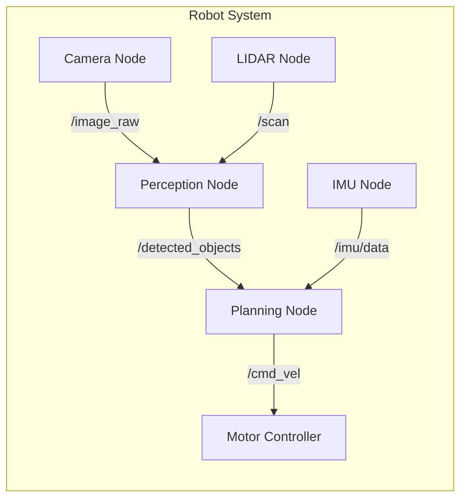
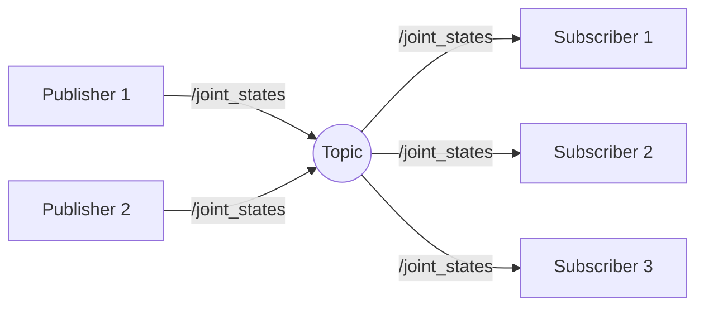

# Chapter 1: Welcome & Your First Node

## Learning Objectives

By the end of this chapter, you will be able to:

- Understand the ROS 2 ecosystem and its role in physical AI
- Set up a ROS 2 Humble development environment
- Create and run your first ROS 2 node
- Implement basic publisher and subscriber patterns
- Debug ROS 2 applications using CLI tools

## Prerequisites

- Basic Python programming knowledge
- Ubuntu 22.04 LTS or compatible Linux distribution
- Completed [Hardware & Lab Setup](/front-matter/hardware-lab-setup)

---

## 1.1 What is ROS 2?

The **Robot Operating System 2 (ROS 2)** is not an operating system in the traditional sense. Instead, it is a flexible framework for writing robot software—a collection of tools, libraries, and conventions that simplify creating complex robotic behaviors across diverse hardware platforms.

ROS 2 emerged from lessons learned in its predecessor (ROS 1), addressing critical limitations for modern robotics:

| Challenge | ROS 1 Limitation | ROS 2 Solution |
|-----------|------------------|----------------|
| Real-time control | No real-time guarantees | DDS middleware with QoS policies |
| Multi-robot systems | Single rosmaster bottleneck | Decentralized discovery |
| Security | No built-in security | DDS-Security for encryption/auth |
| Embedded systems | Linux-only | Cross-platform (Linux, Windows, RTOS) |
| Production deployment | Research-focused | Industrial-grade reliability |

For physical AI and humanoid robotics, ROS 2 provides the communication backbone that connects sensors, actuators, perception systems, and decision-making algorithms into a coherent whole.

### The ROS 2 Computation Graph

At its core, ROS 2 organizes software as a **computation graph**—a network of processes (nodes) exchanging data through well-defined interfaces:



This architecture enables:

- **Modularity**: Replace or upgrade individual components without rewriting the entire system
- **Reusability**: Share nodes across different robots and projects
- **Distributed computing**: Spread computation across multiple machines seamlessly
- **Introspection**: Monitor and debug the system at runtime

---

## 1.2 Setting Up Your Environment

Before writing code, ensure ROS 2 Humble is properly installed. We recommend using the Docker environment provided in this textbook's lab materials for consistent results.

### Option A: Docker Environment (Recommended)

```bash
# Navigate to labs directory
cd labs/

# Start the ROS 2 development container
docker-compose up -d ros2-dev

# Enter the container
docker exec -it ros2-dev bash

# Verify installation
ros2 --version
```

### Option B: Native Installation

For native Ubuntu 22.04 installation:

```bash
# Set locale
sudo apt update && sudo apt install locales
sudo locale-gen en_US en_US.UTF-8
sudo update-locale LC_ALL=en_US.UTF-8 LANG=en_US.UTF-8
export LANG=en_US.UTF-8

# Add ROS 2 apt repository
sudo apt install software-properties-common
sudo add-apt-repository universe
sudo apt update && sudo apt install curl -y
sudo curl -sSL https://raw.githubusercontent.com/ros/rosdistro/master/ros.key -o /usr/share/keyrings/ros-archive-keyring.gpg
echo "deb [arch=$(dpkg --print-architecture) signed-by=/usr/share/keyrings/ros-archive-keyring.gpg] http://packages.ros.org/ros2/ubuntu $(. /etc/os-release && echo $UBUNTU_CODENAME) main" | sudo tee /etc/apt/sources.list.d/ros2.list > /dev/null

# Install ROS 2 Humble
sudo apt update
sudo apt install ros-humble-desktop python3-colcon-common-extensions

# Source the setup script
echo "source /opt/ros/humble/setup.bash" >> ~/.bashrc
source ~/.bashrc
```

### Verify Your Installation

```bash
# Check ROS 2 version
ros2 --version
# Expected output: ros2 0.x.x

# List available commands
ros2 --help

# Run a demo talker node
ros2 run demo_nodes_cpp talker
```

Open a second terminal and run the listener:

```bash
ros2 run demo_nodes_cpp listener
```

You should see messages flowing between the two nodes. Press `Ctrl+C` to stop.

---

## 1.3 Understanding Nodes

A **node** is a single-purpose process that performs computation. In a humanoid robot, you might have separate nodes for:

- Reading joint encoders
- Processing camera images
- Computing inverse kinematics
- Generating walking gaits
- Handling voice commands

Each node communicates with others through three primary mechanisms:

### Topics (Publish/Subscribe)

Topics provide **asynchronous, many-to-many** communication. Publishers send messages to a named topic; any number of subscribers can receive them.



**Use cases**: Sensor data streams, state updates, continuous data flows

### Services (Request/Response)

Services provide **synchronous, one-to-one** communication. A client sends a request and blocks until receiving a response.

**Use cases**: Configuration changes, one-shot computations, state queries

### Actions (Goal/Feedback/Result)

Actions provide **asynchronous, preemptable** communication for long-running tasks with progress feedback.

**Use cases**: Navigation goals, manipulation sequences, any task that takes time

---

## 1.4 Your First Node: Hello Robot

Let's create a minimal ROS 2 node that publishes a greeting message. First, create a workspace:

```bash
# Create workspace directory
mkdir -p ~/ros2_ws/src
cd ~/ros2_ws/src

# Create a Python package
ros2 pkg create --build-type ament_python hello_robot --dependencies rclpy std_msgs
```

This creates the following structure:

```
hello_robot/
├── hello_robot/
│   └── __init__.py
├── package.xml
├── setup.py
├── setup.cfg
└── resource/
    └── hello_robot
```

### Creating a Publisher Node

Create the file `~/ros2_ws/src/hello_robot/hello_robot/talker.py`:

```python
#!/usr/bin/env python3
"""
talker.py - A simple ROS 2 publisher node

This node publishes greeting messages to the /hello topic at 1 Hz.
"""

import rclpy
from rclpy.node import Node
from std_msgs.msg import String


class HelloPublisher(Node):
    """A node that publishes greeting messages."""

    def __init__(self):
        # Initialize the node with name 'hello_publisher'
        super().__init__('hello_publisher')

        # Create a publisher on the '/hello' topic
        # Queue size of 10 allows buffering if subscribers are slow
        self.publisher_ = self.create_publisher(String, '/hello', 10)

        # Create a timer that fires every 1.0 seconds
        timer_period = 1.0  # seconds
        self.timer = self.create_timer(timer_period, self.timer_callback)

        # Counter for message numbering
        self.count = 0

        self.get_logger().info('Hello Publisher node started!')

    def timer_callback(self):
        """Called every timer_period seconds to publish a message."""
        msg = String()
        msg.data = f'Hello, Robot! Message #{self.count}'

        self.publisher_.publish(msg)
        self.get_logger().info(f'Publishing: "{msg.data}"')

        self.count += 1


def main(args=None):
    """Entry point for the node."""
    # Initialize the ROS 2 Python client library
    rclpy.init(args=args)

    # Create our node
    node = HelloPublisher()

    try:
        # Spin the node so callbacks are executed
        rclpy.spin(node)
    except KeyboardInterrupt:
        pass
    finally:
        # Clean up
        node.destroy_node()
        rclpy.shutdown()


if __name__ == '__main__':
    main()
```

### Creating a Subscriber Node

Create the file `~/ros2_ws/src/hello_robot/hello_robot/listener.py`:

```python
#!/usr/bin/env python3
"""
listener.py - A simple ROS 2 subscriber node

This node subscribes to the /hello topic and logs received messages.
"""

import rclpy
from rclpy.node import Node
from std_msgs.msg import String


class HelloSubscriber(Node):
    """A node that subscribes to greeting messages."""

    def __init__(self):
        super().__init__('hello_subscriber')

        # Create a subscription to the '/hello' topic
        self.subscription = self.create_subscription(
            String,           # Message type
            '/hello',         # Topic name
            self.listener_callback,  # Callback function
            10               # Queue size
        )
        # Prevent unused variable warning
        self.subscription

        self.get_logger().info('Hello Subscriber node started!')

    def listener_callback(self, msg: String):
        """Called whenever a message is received on /hello."""
        self.get_logger().info(f'Received: "{msg.data}"')


def main(args=None):
    rclpy.init(args=args)
    node = HelloSubscriber()

    try:
        rclpy.spin(node)
    except KeyboardInterrupt:
        pass
    finally:
        node.destroy_node()
        rclpy.shutdown()


if __name__ == '__main__':
    main()
```

### Registering Entry Points

Edit `~/ros2_ws/src/hello_robot/setup.py` to register the executables:

```python
from setuptools import find_packages, setup

package_name = 'hello_robot'

setup(
    name=package_name,
    version='0.1.0',
    packages=find_packages(exclude=['test']),
    data_files=[
        ('share/ament_index/resource_index/packages',
            ['resource/' + package_name]),
        ('share/' + package_name, ['package.xml']),
    ],
    install_requires=['setuptools'],
    zip_safe=True,
    maintainer='Your Name',
    maintainer_email='your.email@example.com',
    description='My first ROS 2 package',
    license='MIT',
    tests_require=['pytest'],
    entry_points={
        'console_scripts': [
            'talker = hello_robot.talker:main',
            'listener = hello_robot.listener:main',
        ],
    },
)
```

### Building and Running

```bash
# Navigate to workspace root
cd ~/ros2_ws

# Build the package
colcon build --packages-select hello_robot

# Source the workspace overlay
source install/setup.bash

# Run the publisher (Terminal 1)
ros2 run hello_robot talker
```

In a second terminal:

```bash
source ~/ros2_ws/install/setup.bash
ros2 run hello_robot listener
```

You should see the listener receiving messages from the talker:

```
[INFO] [hello_subscriber]: Received: "Hello, Robot! Message #0"
[INFO] [hello_subscriber]: Received: "Hello, Robot! Message #1"
[INFO] [hello_subscriber]: Received: "Hello, Robot! Message #2"
```

---

## 1.5 Debugging with CLI Tools

ROS 2 provides powerful command-line tools for introspection:

### Listing Active Nodes

```bash
ros2 node list
# Output:
# /hello_publisher
# /hello_subscriber
```

### Viewing Topics

```bash
# List all topics
ros2 topic list
# Output:
# /hello
# /parameter_events
# /rosout

# Show topic info
ros2 topic info /hello
# Output:
# Type: std_msgs/msg/String
# Publisher count: 1
# Subscription count: 1

# Echo messages in real-time
ros2 topic echo /hello
```

### Inspecting Node Details

```bash
ros2 node info /hello_publisher
# Shows publishers, subscribers, services, and parameters
```

### Publishing Test Messages

```bash
# Manually publish a message
ros2 topic pub /hello std_msgs/msg/String "{data: 'Manual test message'}"
```

### Visualizing the Graph

```bash
# Launch the graph visualization tool
ros2 run rqt_graph rqt_graph
```

This opens a GUI showing all nodes and their topic connections—invaluable for debugging complex systems.

---

## Lab Exercise

Complete the hands-on lab in [`labs/module-1/ch01-hello-robot/`](/labs/module-1/ch01-hello-robot/) where you will:

1. Create a custom message type for robot status
2. Build a node that publishes simulated sensor data
3. Implement a node that processes and transforms the data
4. Use CLI tools to verify the data flow

**Estimated time**: 45-60 minutes

---

## Summary

In this chapter, you learned:

- **ROS 2 fundamentals**: The computation graph model, nodes, and communication patterns
- **Environment setup**: Installing ROS 2 Humble via Docker or native packages
- **Node creation**: Building Python nodes with publishers and subscribers
- **Communication patterns**: Topics for streaming data, services for request/response, actions for long-running tasks
- **CLI debugging**: Using `ros2 node`, `ros2 topic`, and `rqt_graph` for introspection

These foundations will serve you throughout the book as we build increasingly sophisticated robotic systems.

---

## Further Reading

- [ROS 2 Humble Documentation](https://docs.ros.org/en/humble/)
- [ROS 2 Tutorials](https://docs.ros.org/en/humble/Tutorials.html)
- [Understanding ROS 2 Nodes](https://docs.ros.org/en/humble/Tutorials/Beginner-CLI-Tools/Understanding-ROS2-Nodes/Understanding-ROS2-Nodes.html)
- [rclpy API Reference](https://docs.ros2.org/latest/api/rclpy/)
- [DDS and ROS 2 Middleware](https://design.ros2.org/articles/ros_on_dds.html)
