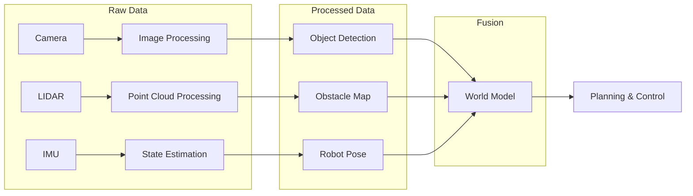
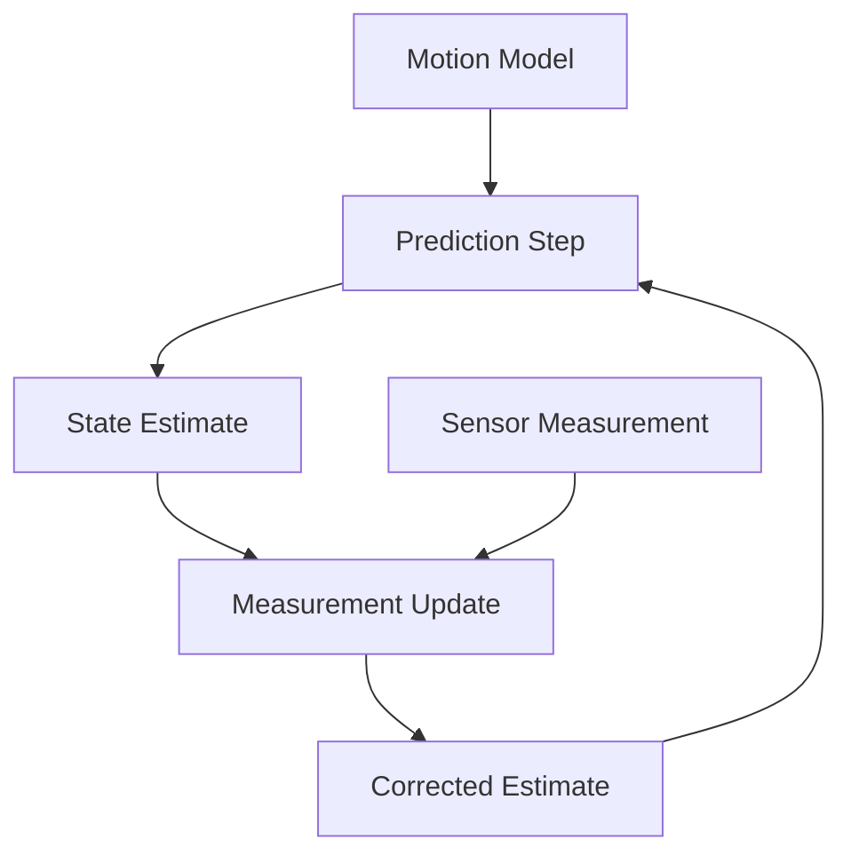

# Chapter 2: Sensors & Perception

## Learning Objectives

By the end of this chapter, you will be able to:

- Interface with common robotic sensors (camera, LIDAR, IMU)
- Process sensor data using ROS 2 message types
- Implement basic sensor fusion techniques
- Visualize sensor data in RViz2
- Handle sensor calibration and noise filtering

## Prerequisites

- Completed [Chapter 1: Welcome & Your First Node](/module-1-ros2/ch01-welcome-first-node)
- Basic understanding of coordinate systems and transforms
- Camera and/or LIDAR hardware (or Gazebo simulation)

---

## 2.1 The Perception Pipeline

For a humanoid robot to interact with its environment, it must perceive the world through sensors. The **perception pipeline** transforms raw sensor data into actionable information:



Each sensor provides complementary information:

| Sensor | Data Type | Strengths | Weaknesses |
|--------|-----------|-----------|------------|
| Camera | 2D Images | Rich texture, color, object recognition | No depth, lighting dependent |
| LIDAR | 3D Point Cloud | Precise depth, lighting independent | No color, expensive |
| IMU | Linear/Angular Acceleration | High frequency, orientation | Drift over time |
| Depth Camera | RGBD | Color + depth combined | Limited range, interference |

A robust robotic system fuses multiple sensor modalities to overcome individual limitations.

---

## 2.2 Camera Integration

Cameras are ubiquitous in robotics, providing rich visual information for object recognition, navigation, and human-robot interaction.

### ROS 2 Image Messages

Camera data in ROS 2 uses the `sensor_msgs/msg/Image` message type:

```python
# sensor_msgs/msg/Image structure
std_msgs/Header header
  builtin_interfaces/Time stamp
  string frame_id
uint32 height          # Image height in pixels
uint32 width           # Image width in pixels
string encoding        # Pixel format (rgb8, bgr8, mono8, etc.)
uint8 is_bigendian
uint32 step            # Row length in bytes
uint8[] data           # Actual image data
```

### USB Camera Driver

To use a USB webcam, install the `usb_cam` package:

```bash
sudo apt install ros-humble-usb-cam
```

Launch the camera node:

```bash
ros2 run usb_cam usb_cam_node_exe --ros-args -p video_device:="/dev/video0"
```

Verify the image topic:

```bash
ros2 topic list | grep image
# /image_raw
# /camera_info

ros2 topic hz /image_raw
# average rate: 30.00
```

### Processing Images with OpenCV

ROS 2 uses `cv_bridge` to convert between ROS Image messages and OpenCV arrays. Create a node that processes camera images:

```python
#!/usr/bin/env python3
"""
image_processor.py - Process camera images with OpenCV

Subscribes to raw images, applies edge detection, and publishes results.
"""

import rclpy
from rclpy.node import Node
from sensor_msgs.msg import Image
from cv_bridge import CvBridge
import cv2
import numpy as np


class ImageProcessor(Node):
    """Node that processes images using OpenCV."""

    def __init__(self):
        super().__init__('image_processor')

        # Create CV bridge for ROS <-> OpenCV conversion
        self.bridge = CvBridge()

        # Subscribe to raw camera images
        self.subscription = self.create_subscription(
            Image,
            '/image_raw',
            self.image_callback,
            10
        )

        # Publish processed images
        self.publisher = self.create_publisher(
            Image,
            '/image_processed',
            10
        )

        self.get_logger().info('Image Processor node started')

    def image_callback(self, msg: Image):
        """Process incoming images."""
        try:
            # Convert ROS Image to OpenCV format (BGR)
            cv_image = self.bridge.imgmsg_to_cv2(msg, desired_encoding='bgr8')

            # Apply Gaussian blur to reduce noise
            blurred = cv2.GaussianBlur(cv_image, (5, 5), 0)

            # Convert to grayscale
            gray = cv2.cvtColor(blurred, cv2.COLOR_BGR2GRAY)

            # Apply Canny edge detection
            edges = cv2.Canny(gray, threshold1=50, threshold2=150)

            # Convert edges back to 3-channel for visualization
            edges_colored = cv2.cvtColor(edges, cv2.COLOR_GRAY2BGR)

            # Convert back to ROS Image and publish
            processed_msg = self.bridge.cv2_to_imgmsg(edges_colored, encoding='bgr8')
            processed_msg.header = msg.header  # Preserve timestamp
            self.publisher.publish(processed_msg)

        except Exception as e:
            self.get_logger().error(f'Failed to process image: {e}')


def main(args=None):
    rclpy.init(args=args)
    node = ImageProcessor()

    try:
        rclpy.spin(node)
    except KeyboardInterrupt:
        pass
    finally:
        node.destroy_node()
        rclpy.shutdown()


if __name__ == '__main__':
    main()
```

Add to your `package.xml`:

```xml
<depend>sensor_msgs</depend>
<depend>cv_bridge</depend>
<depend>opencv2</depend>
```

### Visualizing with RViz2

```bash
# Launch RViz2
ros2 run rviz2 rviz2

# Add Image display:
# 1. Click "Add" in Displays panel
# 2. Select "By topic" tab
# 3. Choose /image_raw or /image_processed
```

---

## 2.3 LIDAR Integration

LIDAR (Light Detection and Ranging) sensors emit laser pulses and measure return times to create precise 3D point clouds of the environment.

### ROS 2 LIDAR Messages

2D LIDAR data uses `sensor_msgs/msg/LaserScan`:

```python
# sensor_msgs/msg/LaserScan structure
std_msgs/Header header
float32 angle_min        # Start angle (radians)
float32 angle_max        # End angle (radians)
float32 angle_increment  # Angle between measurements
float32 time_increment   # Time between measurements
float32 scan_time        # Time for complete scan
float32 range_min        # Minimum valid range
float32 range_max        # Maximum valid range
float32[] ranges         # Distance measurements
float32[] intensities    # Reflection intensities
```

3D LIDAR data uses `sensor_msgs/msg/PointCloud2`:

```python
# sensor_msgs/msg/PointCloud2 structure
std_msgs/Header header
uint32 height            # 1 for unorganized clouds
uint32 width             # Number of points
sensor_msgs/PointField[] fields  # Description of point data
bool is_bigendian
uint32 point_step        # Bytes per point
uint32 row_step          # Bytes per row
uint8[] data             # Point data
bool is_dense            # True if no invalid points
```

### Processing LIDAR Data

Create a node that filters LIDAR data and detects obstacles:

```python
#!/usr/bin/env python3
"""
lidar_processor.py - Process LIDAR scans for obstacle detection

Filters invalid readings and identifies obstacles within a danger zone.
"""

import rclpy
from rclpy.node import Node
from sensor_msgs.msg import LaserScan
from std_msgs.msg import Bool
import numpy as np


class LidarProcessor(Node):
    """Node that processes LIDAR scans for obstacle detection."""

    def __init__(self):
        super().__init__('lidar_processor')

        # Parameters
        self.declare_parameter('danger_distance', 0.5)  # meters
        self.declare_parameter('danger_angle', 45.0)    # degrees from center

        self.danger_dist = self.get_parameter('danger_distance').value
        self.danger_angle = np.radians(self.get_parameter('danger_angle').value)

        # Subscriber for raw LIDAR data
        self.subscription = self.create_subscription(
            LaserScan,
            '/scan',
            self.scan_callback,
            10
        )

        # Publisher for filtered scan
        self.scan_pub = self.create_publisher(LaserScan, '/scan_filtered', 10)

        # Publisher for obstacle alert
        self.alert_pub = self.create_publisher(Bool, '/obstacle_detected', 10)

        self.get_logger().info(
            f'LIDAR Processor started (danger zone: {self.danger_dist}m, '
            f'±{np.degrees(self.danger_angle):.0f}°)'
        )

    def scan_callback(self, msg: LaserScan):
        """Process incoming LIDAR scan."""
        ranges = np.array(msg.ranges)

        # Replace invalid readings (inf, nan) with max range
        ranges = np.where(
            np.isfinite(ranges),
            ranges,
            msg.range_max
        )

        # Clip to valid range
        ranges = np.clip(ranges, msg.range_min, msg.range_max)

        # Calculate angles for each measurement
        angles = np.linspace(msg.angle_min, msg.angle_max, len(ranges))

        # Find measurements in the danger zone (front sector)
        front_mask = np.abs(angles) < self.danger_angle
        front_ranges = ranges[front_mask]

        # Check for obstacles
        obstacle_detected = np.any(front_ranges < self.danger_dist)

        # Publish alert
        alert_msg = Bool()
        alert_msg.data = bool(obstacle_detected)
        self.alert_pub.publish(alert_msg)

        if obstacle_detected:
            min_dist = np.min(front_ranges)
            self.get_logger().warn(f'Obstacle detected at {min_dist:.2f}m!')

        # Publish filtered scan
        filtered_msg = LaserScan()
        filtered_msg.header = msg.header
        filtered_msg.angle_min = msg.angle_min
        filtered_msg.angle_max = msg.angle_max
        filtered_msg.angle_increment = msg.angle_increment
        filtered_msg.time_increment = msg.time_increment
        filtered_msg.scan_time = msg.scan_time
        filtered_msg.range_min = msg.range_min
        filtered_msg.range_max = msg.range_max
        filtered_msg.ranges = ranges.tolist()
        filtered_msg.intensities = msg.intensities

        self.scan_pub.publish(filtered_msg)


def main(args=None):
    rclpy.init(args=args)
    node = LidarProcessor()

    try:
        rclpy.spin(node)
    except KeyboardInterrupt:
        pass
    finally:
        node.destroy_node()
        rclpy.shutdown()


if __name__ == '__main__':
    main()
```

### Simulating LIDAR in Gazebo

For testing without hardware, Gazebo provides realistic LIDAR simulation:

```bash
# Launch Gazebo with a robot that has LIDAR
ros2 launch gazebo_ros gazebo.launch.py

# Verify LIDAR topic
ros2 topic echo /scan --once
```

---

## 2.4 IMU Integration

The Inertial Measurement Unit (IMU) provides high-frequency measurements of linear acceleration and angular velocity, essential for balance and orientation estimation.

### ROS 2 IMU Messages

```python
# sensor_msgs/msg/Imu structure
std_msgs/Header header
geometry_msgs/Quaternion orientation
float64[9] orientation_covariance
geometry_msgs/Vector3 angular_velocity
float64[9] angular_velocity_covariance
geometry_msgs/Vector3 linear_acceleration
float64[9] linear_acceleration_covariance
```

### IMU Data Processing

Create a node that processes IMU data and estimates orientation:

```python
#!/usr/bin/env python3
"""
imu_processor.py - Process IMU data for orientation estimation

Applies a complementary filter to combine accelerometer and gyroscope data.
"""

import rclpy
from rclpy.node import Node
from sensor_msgs.msg import Imu
from geometry_msgs.msg import Vector3Stamped
import numpy as np
from scipy.spatial.transform import Rotation


class ImuProcessor(Node):
    """Node that processes IMU data for orientation."""

    def __init__(self):
        super().__init__('imu_processor')

        # Filter parameter (0 = trust accel, 1 = trust gyro)
        self.declare_parameter('alpha', 0.98)
        self.alpha = self.get_parameter('alpha').value

        # State
        self.orientation = np.array([0.0, 0.0, 0.0])  # roll, pitch, yaw
        self.last_time = None

        # Subscriber
        self.subscription = self.create_subscription(
            Imu,
            '/imu/data',
            self.imu_callback,
            10
        )

        # Publisher for filtered orientation (as Euler angles)
        self.orientation_pub = self.create_publisher(
            Vector3Stamped,
            '/imu/orientation_euler',
            10
        )

        self.get_logger().info(f'IMU Processor started (alpha={self.alpha})')

    def imu_callback(self, msg: Imu):
        """Process IMU data using complementary filter."""
        current_time = msg.header.stamp.sec + msg.header.stamp.nanosec * 1e-9

        if self.last_time is None:
            self.last_time = current_time
            return

        dt = current_time - self.last_time
        self.last_time = current_time

        if dt <= 0 or dt > 1.0:
            return

        # Extract measurements
        ax = msg.linear_acceleration.x
        ay = msg.linear_acceleration.y
        az = msg.linear_acceleration.z

        gx = msg.angular_velocity.x
        gy = msg.angular_velocity.y
        gz = msg.angular_velocity.z

        # Orientation from accelerometer (assumes robot is not accelerating)
        accel_roll = np.arctan2(ay, az)
        accel_pitch = np.arctan2(-ax, np.sqrt(ay**2 + az**2))

        # Integrate gyroscope
        gyro_roll = self.orientation[0] + gx * dt
        gyro_pitch = self.orientation[1] + gy * dt
        gyro_yaw = self.orientation[2] + gz * dt

        # Complementary filter: combine accel (low freq) and gyro (high freq)
        self.orientation[0] = self.alpha * gyro_roll + (1 - self.alpha) * accel_roll
        self.orientation[1] = self.alpha * gyro_pitch + (1 - self.alpha) * accel_pitch
        self.orientation[2] = gyro_yaw  # Yaw has no absolute reference

        # Publish orientation
        orientation_msg = Vector3Stamped()
        orientation_msg.header = msg.header
        orientation_msg.vector.x = np.degrees(self.orientation[0])  # Roll
        orientation_msg.vector.y = np.degrees(self.orientation[1])  # Pitch
        orientation_msg.vector.z = np.degrees(self.orientation[2])  # Yaw

        self.orientation_pub.publish(orientation_msg)


def main(args=None):
    rclpy.init(args=args)
    node = ImuProcessor()

    try:
        rclpy.spin(node)
    except KeyboardInterrupt:
        pass
    finally:
        node.destroy_node()
        rclpy.shutdown()


if __name__ == '__main__':
    main()
```

---

## 2.5 Sensor Fusion Fundamentals

Real-world perception requires combining data from multiple sensors. **Sensor fusion** produces estimates that are more accurate and robust than any single sensor alone.

### The Kalman Filter Concept

The Kalman Filter is the foundational algorithm for sensor fusion:



1. **Predict**: Use motion model to estimate current state
2. **Update**: Incorporate sensor measurements to correct estimate
3. **Repeat**: Continue as new data arrives

For production systems, consider the `robot_localization` package which implements Extended Kalman Filters for sensor fusion:

```bash
sudo apt install ros-humble-robot-localization
```

### Simple Fusion Example

Here's a basic sensor fusion approach combining LIDAR and camera for obstacle detection:

```python
#!/usr/bin/env python3
"""
sensor_fusion.py - Fuse LIDAR and camera data for obstacle detection

Combines visual detection with depth information for robust obstacle identification.
"""

import rclpy
from rclpy.node import Node
from sensor_msgs.msg import Image, LaserScan
from std_msgs.msg import Bool
from message_filters import Subscriber, ApproximateTimeSynchronizer
from cv_bridge import CvBridge
import cv2
import numpy as np


class SensorFusion(Node):
    """Fuses camera and LIDAR data for obstacle detection."""

    def __init__(self):
        super().__init__('sensor_fusion')

        self.bridge = CvBridge()

        # Synchronized subscribers
        self.image_sub = Subscriber(self, Image, '/image_raw')
        self.scan_sub = Subscriber(self, LaserScan, '/scan')

        # Synchronize messages within 100ms
        self.sync = ApproximateTimeSynchronizer(
            [self.image_sub, self.scan_sub],
            queue_size=10,
            slop=0.1
        )
        self.sync.registerCallback(self.fused_callback)

        # Publisher
        self.alert_pub = self.create_publisher(Bool, '/obstacle_alert', 10)

        self.get_logger().info('Sensor Fusion node started')

    def fused_callback(self, image_msg: Image, scan_msg: LaserScan):
        """Process synchronized camera and LIDAR data."""
        # Convert image
        cv_image = self.bridge.imgmsg_to_cv2(image_msg, 'bgr8')

        # Simple visual obstacle detection (red objects)
        hsv = cv2.cvtColor(cv_image, cv2.COLOR_BGR2HSV)
        red_mask = cv2.inRange(hsv, (0, 100, 100), (10, 255, 255))
        visual_obstacle = np.sum(red_mask) > 10000

        # LIDAR obstacle detection (front sector < 1m)
        ranges = np.array(scan_msg.ranges)
        center_idx = len(ranges) // 2
        front_ranges = ranges[center_idx-10:center_idx+10]
        front_ranges = front_ranges[np.isfinite(front_ranges)]
        lidar_obstacle = len(front_ranges) > 0 and np.min(front_ranges) < 1.0

        # Fused decision: require both sensors to agree for high confidence
        # Or either for low confidence alert
        high_confidence = visual_obstacle and lidar_obstacle
        low_confidence = visual_obstacle or lidar_obstacle

        alert = Bool()
        alert.data = high_confidence

        if high_confidence:
            self.get_logger().warn('HIGH CONFIDENCE: Obstacle detected!')
        elif low_confidence:
            self.get_logger().info('Low confidence obstacle indication')

        self.alert_pub.publish(alert)


def main(args=None):
    rclpy.init(args=args)
    node = SensorFusion()

    try:
        rclpy.spin(node)
    except KeyboardInterrupt:
        pass
    finally:
        node.destroy_node()
        rclpy.shutdown()


if __name__ == '__main__':
    main()
```

---

## 2.6 Sensor Calibration

Raw sensor data often contains systematic errors that must be corrected through calibration.

### Camera Calibration

Cameras require **intrinsic calibration** to correct lens distortion:

```bash
# Install calibration tools
sudo apt install ros-humble-camera-calibration

# Run calibration with a checkerboard pattern
ros2 run camera_calibration cameracalibrator \
  --size 8x6 \
  --square 0.025 \
  --ros-args -r image:=/image_raw -r camera:=/camera
```

The calibration produces a `camera_info` topic with intrinsic parameters:

```yaml
# Intrinsic camera matrix (K)
camera_matrix:
  rows: 3
  cols: 3
  data: [fx, 0, cx, 0, fy, cy, 0, 0, 1]

# Distortion coefficients
distortion_coefficients:
  rows: 1
  cols: 5
  data: [k1, k2, p1, p2, k3]
```

### IMU Calibration

IMU sensors require calibration for:

- **Bias offset**: Constant error when stationary
- **Scale factor**: Gain error in measurements
- **Axis misalignment**: Non-orthogonal sensor axes

```python
# Simple bias calibration: collect data while stationary
def calibrate_imu_bias(samples: list) -> dict:
    """Calculate IMU bias from stationary samples."""
    accel = np.array([[s.linear_acceleration.x,
                       s.linear_acceleration.y,
                       s.linear_acceleration.z] for s in samples])
    gyro = np.array([[s.angular_velocity.x,
                      s.angular_velocity.y,
                      s.angular_velocity.z] for s in samples])

    return {
        'accel_bias': np.mean(accel, axis=0) - [0, 0, 9.81],
        'gyro_bias': np.mean(gyro, axis=0)
    }
```

---

## Lab Exercise

Complete the hands-on lab in [`labs/module-1/ch02-sensor-fusion/`](https://github.com/physical-ai-textbook/physical-ai-textbook/tree/main/labs/module-1/ch02-sensor-fusion) where you will:

1. Configure and launch a USB camera or simulated camera
2. Implement a LIDAR-based obstacle detection node
3. Create an IMU orientation estimator with complementary filter
4. Build a sensor fusion node that combines camera and LIDAR data
5. Visualize all sensor data in RViz2

**Estimated time**: 60-90 minutes

---

## Summary

In this chapter, you learned:

- **Camera integration**: Using `cv_bridge` to process images with OpenCV
- **LIDAR processing**: Filtering LaserScan data and detecting obstacles
- **IMU handling**: Implementing complementary filters for orientation estimation
- **Sensor fusion**: Combining multiple sensor modalities for robust perception
- **Calibration**: Correcting systematic sensor errors

These perception capabilities form the foundation for all higher-level robot behaviors—from navigation to manipulation to human interaction.

---

## Further Reading

- [ROS 2 Sensor Messages](https://docs.ros.org/en/humble/Concepts/About-ROS-2-Interfaces.html)
- [OpenCV Documentation](https://docs.opencv.org/4.x/)
- [cv_bridge Tutorial](https://docs.ros.org/en/humble/Tutorials/cv_bridge.html)
- [robot_localization Package](http://docs.ros.org/en/noetic/api/robot_localization/html/)
- [Probabilistic Robotics (Thrun et al.)](http://www.probabilistic-robotics.org/) - Chapters on Kalman Filtering
