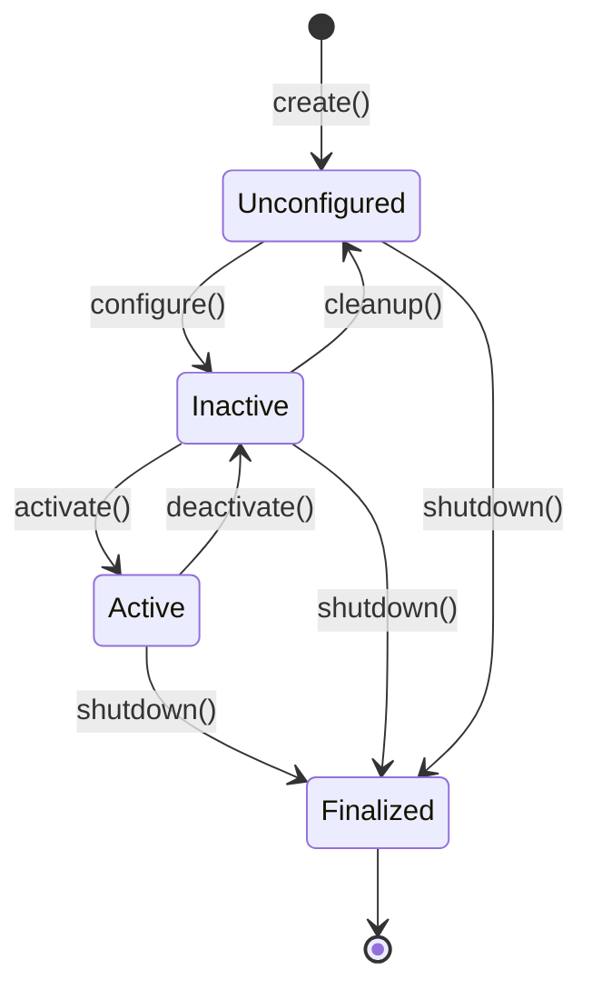
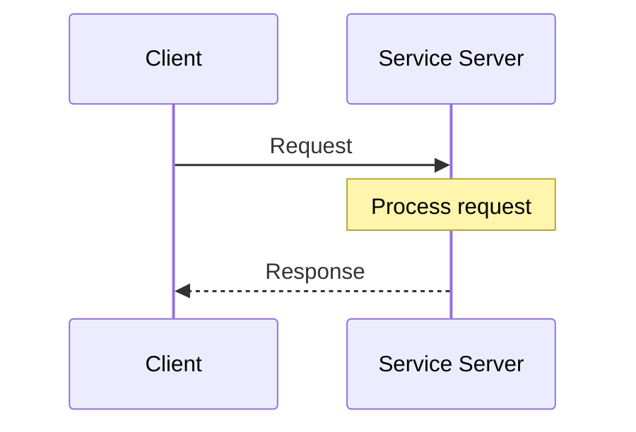
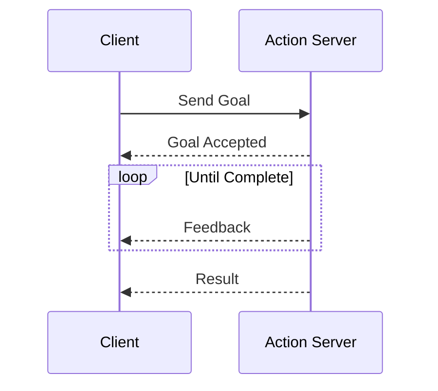

# Chapter 3: ROS 2 Architecture Deep Dive

## Learning Objectives

By the end of this chapter, you will be able to:

- Implement managed lifecycle nodes for controlled startup/shutdown
- Create and consume ROS 2 services for request/response patterns
- Build action servers and clients for long-running tasks with feedback
- Manage parameters dynamically at runtime
- Design robust, production-ready node architectures

## Prerequisites

- Completed [Chapter 1](/module-1-ros2/ch01-welcome-first-node) and [Chapter 2](/module-1-ros2/ch02-sensors-perception)
- Familiarity with asynchronous programming concepts
- Understanding of state machines

---

## 3.1 Lifecycle Nodes

Standard ROS 2 nodes start immediately upon instantiation. For complex robotic systems, this creates problems:

- Hardware initialization may fail silently
- Dependencies between nodes are unclear
- Graceful shutdown is difficult to coordinate
- Error recovery is ad-hoc

**Lifecycle nodes** (also called managed nodes) solve these issues by defining explicit states and transitions:



### Lifecycle States

| State | Description | Allowed Operations |
|-------|-------------|-------------------|
| **Unconfigured** | Initial state after creation | Load parameters, validate config |
| **Inactive** | Configured but not running | Allocate resources, connect to hardware |
| **Active** | Fully operational | Process data, publish messages |
| **Finalized** | Terminal state before destruction | Release all resources |

### Implementing a Lifecycle Node

```python
#!/usr/bin/env python3
"""
lifecycle_sensor.py - A managed lifecycle node for sensor handling

Demonstrates proper resource management through lifecycle callbacks.
"""

import rclpy
from rclpy.lifecycle import Node as LifecycleNode
from rclpy.lifecycle import State, TransitionCallbackReturn
from std_msgs.msg import Float32
import random


class LifecycleSensor(LifecycleNode):
    """A lifecycle-managed sensor node."""

    def __init__(self, node_name: str = 'lifecycle_sensor'):
        super().__init__(node_name)
        self.get_logger().info('Node created (Unconfigured state)')

        # Resources initialized to None
        self._publisher = None
        self._timer = None
        self._sensor_handle = None

    def on_configure(self, state: State) -> TransitionCallbackReturn:
        """
        Configure callback: Load parameters, validate configuration.
        Called when transitioning from Unconfigured -> Inactive.
        """
        self.get_logger().info('Configuring...')

        # Declare and load parameters
        self.declare_parameter('publish_rate', 10.0)
        self.declare_parameter('sensor_id', 'sensor_001')

        self._rate = self.get_parameter('publish_rate').value
        self._sensor_id = self.get_parameter('sensor_id').value

        # Validate configuration
        if self._rate <= 0:
            self.get_logger().error('Invalid publish_rate')
            return TransitionCallbackReturn.FAILURE

        # Create publisher (but don't activate yet)
        self._publisher = self.create_lifecycle_publisher(
            Float32,
            f'/{self._sensor_id}/reading',
            10
        )

        self.get_logger().info(f'Configured: rate={self._rate}Hz, id={self._sensor_id}')
        return TransitionCallbackReturn.SUCCESS

    def on_activate(self, state: State) -> TransitionCallbackReturn:
        """
        Activate callback: Start processing, enable publishing.
        Called when transitioning from Inactive -> Active.
        """
        self.get_logger().info('Activating...')

        try:
            # Simulate hardware connection
            self._sensor_handle = self._connect_to_sensor()

            # Create and start the timer
            self._timer = self.create_timer(
                1.0 / self._rate,
                self._timer_callback
            )

            self.get_logger().info('Activated successfully')
            return TransitionCallbackReturn.SUCCESS

        except Exception as e:
            self.get_logger().error(f'Activation failed: {e}')
            return TransitionCallbackReturn.FAILURE

    def on_deactivate(self, state: State) -> TransitionCallbackReturn:
        """
        Deactivate callback: Stop processing, disable publishing.
        Called when transitioning from Active -> Inactive.
        """
        self.get_logger().info('Deactivating...')

        # Stop the timer
        if self._timer:
            self.destroy_timer(self._timer)
            self._timer = None

        # Disconnect from hardware
        if self._sensor_handle:
            self._disconnect_from_sensor()
            self._sensor_handle = None

        self.get_logger().info('Deactivated')
        return TransitionCallbackReturn.SUCCESS

    def on_cleanup(self, state: State) -> TransitionCallbackReturn:
        """
        Cleanup callback: Release all resources.
        Called when transitioning from Inactive -> Unconfigured.
        """
        self.get_logger().info('Cleaning up...')

        # Destroy publisher
        if self._publisher:
            self.destroy_publisher(self._publisher)
            self._publisher = None

        self.get_logger().info('Cleaned up')
        return TransitionCallbackReturn.SUCCESS

    def on_shutdown(self, state: State) -> TransitionCallbackReturn:
        """
        Shutdown callback: Final cleanup before destruction.
        Can be called from any state.
        """
        self.get_logger().info('Shutting down...')

        # Ensure all resources are released
        self.on_deactivate(state)
        self.on_cleanup(state)

        self.get_logger().info('Shutdown complete')
        return TransitionCallbackReturn.SUCCESS

    def _connect_to_sensor(self):
        """Simulate connecting to hardware sensor."""
        self.get_logger().info('Connecting to sensor hardware...')
        return {'connected': True, 'id': self._sensor_id}

    def _disconnect_from_sensor(self):
        """Simulate disconnecting from hardware sensor."""
        self.get_logger().info('Disconnecting from sensor hardware...')

    def _timer_callback(self):
        """Publish sensor reading when active."""
        if self._publisher is None or not self._publisher.is_activated:
            return

        msg = Float32()
        msg.data = random.uniform(20.0, 30.0)  # Simulated reading
        self._publisher.publish(msg)


def main(args=None):
    rclpy.init(args=args)
    node = LifecycleSensor()

    try:
        rclpy.spin(node)
    except KeyboardInterrupt:
        pass
    finally:
        node.destroy_node()
        rclpy.shutdown()


if __name__ == '__main__':
    main()
```

### Managing Lifecycle Nodes

Control lifecycle nodes via CLI or programmatically:

```bash
# List lifecycle nodes
ros2 lifecycle nodes

# Get current state
ros2 lifecycle get /lifecycle_sensor

# Trigger transitions
ros2 lifecycle set /lifecycle_sensor configure
ros2 lifecycle set /lifecycle_sensor activate
ros2 lifecycle set /lifecycle_sensor deactivate
ros2 lifecycle set /lifecycle_sensor cleanup
ros2 lifecycle set /lifecycle_sensor shutdown
```

---

## 3.2 Services

Services implement the **request/response** communication pattern—a client sends a request and waits for a response from a server.



### Defining a Service Interface

Create a custom service definition in `srv/ComputeTrajectory.srv`:

```
# Request
geometry_msgs/Pose start_pose
geometry_msgs/Pose goal_pose
float64 max_velocity
---
# Response
bool success
string message
trajectory_msgs/JointTrajectory trajectory
```

### Service Server Implementation

```python
#!/usr/bin/env python3
"""
trajectory_service.py - Service server for trajectory computation

Provides a service to compute joint trajectories between poses.
"""

import rclpy
from rclpy.node import Node
from rclpy.callback_groups import ReentrantCallbackGroup
from example_interfaces.srv import AddTwoInts  # Using built-in for demo
import time


class TrajectoryService(Node):
    """Service server that computes trajectories."""

    def __init__(self):
        super().__init__('trajectory_service')

        # Use ReentrantCallbackGroup to allow concurrent service calls
        self._callback_group = ReentrantCallbackGroup()

        # Create the service
        self._service = self.create_service(
            AddTwoInts,  # Service type
            'compute_trajectory',  # Service name
            self._handle_request,  # Callback
            callback_group=self._callback_group
        )

        self.get_logger().info('Trajectory service ready')

    def _handle_request(self, request, response):
        """Handle incoming service requests."""
        self.get_logger().info(f'Received request: a={request.a}, b={request.b}')

        # Simulate computation time
        time.sleep(0.5)

        # Compute result
        response.sum = request.a + request.b

        self.get_logger().info(f'Sending response: sum={response.sum}')
        return response


def main(args=None):
    rclpy.init(args=args)
    node = TrajectoryService()

    try:
        rclpy.spin(node)
    except KeyboardInterrupt:
        pass
    finally:
        node.destroy_node()
        rclpy.shutdown()


if __name__ == '__main__':
    main()
```

### Service Client Implementation

```python
#!/usr/bin/env python3
"""
trajectory_client.py - Service client for trajectory requests

Demonstrates synchronous and asynchronous service calls.
"""

import rclpy
from rclpy.node import Node
from example_interfaces.srv import AddTwoInts


class TrajectoryClient(Node):
    """Service client that requests trajectories."""

    def __init__(self):
        super().__init__('trajectory_client')

        # Create client
        self._client = self.create_client(AddTwoInts, 'compute_trajectory')

        # Wait for service to become available
        while not self._client.wait_for_service(timeout_sec=1.0):
            self.get_logger().info('Waiting for service...')

        self.get_logger().info('Service available')

    def send_request_sync(self, a: int, b: int) -> int:
        """Send request and wait for response (blocking)."""
        request = AddTwoInts.Request()
        request.a = a
        request.b = b

        self.get_logger().info(f'Sending sync request: {a} + {b}')

        # Call service synchronously
        future = self._client.call_async(request)
        rclpy.spin_until_future_complete(self, future)

        return future.result().sum

    async def send_request_async(self, a: int, b: int) -> int:
        """Send request asynchronously (non-blocking)."""
        request = AddTwoInts.Request()
        request.a = a
        request.b = b

        self.get_logger().info(f'Sending async request: {a} + {b}')

        # Call service asynchronously
        response = await self._client.call_async(request)
        return response.sum


def main(args=None):
    rclpy.init(args=args)
    client = TrajectoryClient()

    # Synchronous call
    result = client.send_request_sync(10, 20)
    client.get_logger().info(f'Result: {result}')

    client.destroy_node()
    rclpy.shutdown()


if __name__ == '__main__':
    main()
```

### Testing Services via CLI

```bash
# List available services
ros2 service list

# Get service type
ros2 service type /compute_trajectory

# Call service from command line
ros2 service call /compute_trajectory example_interfaces/srv/AddTwoInts "{a: 5, b: 3}"
```

---

## 3.3 Actions

Actions extend services for **long-running tasks** with:

- **Goal**: What to achieve
- **Feedback**: Progress updates during execution
- **Result**: Final outcome when complete
- **Cancellation**: Ability to abort mid-execution



### Action Server Implementation

```python
#!/usr/bin/env python3
"""
navigation_action.py - Action server for robot navigation

Executes navigation goals with progress feedback.
"""

import rclpy
from rclpy.node import Node
from rclpy.action import ActionServer, CancelResponse, GoalResponse
from rclpy.callback_groups import ReentrantCallbackGroup
from rclpy.executors import MultiThreadedExecutor
from example_interfaces.action import Fibonacci  # Using built-in for demo
import time


class NavigationAction(Node):
    """Action server for navigation goals."""

    def __init__(self):
        super().__init__('navigation_action')

        self._callback_group = ReentrantCallbackGroup()

        self._action_server = ActionServer(
            self,
            Fibonacci,
            'navigate_to_pose',
            execute_callback=self._execute_callback,
            goal_callback=self._goal_callback,
            cancel_callback=self._cancel_callback,
            callback_group=self._callback_group
        )

        self.get_logger().info('Navigation action server ready')

    def _goal_callback(self, goal_request):
        """Accept or reject incoming goal requests."""
        self.get_logger().info(f'Received goal: order={goal_request.order}')

        # Validate goal
        if goal_request.order < 0:
            self.get_logger().warn('Rejecting invalid goal')
            return GoalResponse.REJECT

        return GoalResponse.ACCEPT

    def _cancel_callback(self, goal_handle):
        """Accept or reject cancellation requests."""
        self.get_logger().info('Received cancel request')
        return CancelResponse.ACCEPT

    async def _execute_callback(self, goal_handle):
        """Execute the navigation goal."""
        self.get_logger().info('Executing goal...')

        feedback_msg = Fibonacci.Feedback()
        feedback_msg.partial_sequence = [0, 1]

        # Simulate navigation with progress feedback
        for i in range(2, goal_handle.request.order):
            # Check for cancellation
            if goal_handle.is_cancel_requested:
                goal_handle.canceled()
                self.get_logger().info('Goal canceled')
                return Fibonacci.Result()

            # Compute next Fibonacci number (simulate progress)
            next_val = feedback_msg.partial_sequence[-1] + feedback_msg.partial_sequence[-2]
            feedback_msg.partial_sequence.append(next_val)

            # Publish feedback
            self.get_logger().info(f'Progress: {len(feedback_msg.partial_sequence)}/{goal_handle.request.order}')
            goal_handle.publish_feedback(feedback_msg)

            # Simulate work
            time.sleep(0.5)

        # Complete the goal
        goal_handle.succeed()

        result = Fibonacci.Result()
        result.sequence = feedback_msg.partial_sequence

        self.get_logger().info('Goal succeeded')
        return result


def main(args=None):
    rclpy.init(args=args)
    node = NavigationAction()

    # Use multi-threaded executor for concurrent goal handling
    executor = MultiThreadedExecutor()
    executor.add_node(node)

    try:
        executor.spin()
    except KeyboardInterrupt:
        pass
    finally:
        node.destroy_node()
        rclpy.shutdown()


if __name__ == '__main__':
    main()
```

### Action Client Implementation

```python
#!/usr/bin/env python3
"""
navigation_client.py - Action client for navigation requests

Sends navigation goals and monitors progress.
"""

import rclpy
from rclpy.node import Node
from rclpy.action import ActionClient
from example_interfaces.action import Fibonacci


class NavigationClient(Node):
    """Action client for navigation goals."""

    def __init__(self):
        super().__init__('navigation_client')

        self._action_client = ActionClient(
            self,
            Fibonacci,
            'navigate_to_pose'
        )

        self.get_logger().info('Navigation client ready')

    def send_goal(self, order: int):
        """Send a navigation goal."""
        self.get_logger().info(f'Sending goal: order={order}')

        # Wait for action server
        self._action_client.wait_for_server()

        goal_msg = Fibonacci.Goal()
        goal_msg.order = order

        # Send goal with feedback callback
        self._send_goal_future = self._action_client.send_goal_async(
            goal_msg,
            feedback_callback=self._feedback_callback
        )
        self._send_goal_future.add_done_callback(self._goal_response_callback)

    def _goal_response_callback(self, future):
        """Handle goal acceptance/rejection."""
        goal_handle = future.result()

        if not goal_handle.accepted:
            self.get_logger().info('Goal rejected')
            return

        self.get_logger().info('Goal accepted')

        # Request result
        self._get_result_future = goal_handle.get_result_async()
        self._get_result_future.add_done_callback(self._result_callback)

    def _feedback_callback(self, feedback_msg):
        """Handle progress feedback."""
        sequence = feedback_msg.feedback.partial_sequence
        self.get_logger().info(f'Feedback: {sequence}')

    def _result_callback(self, future):
        """Handle final result."""
        result = future.result().result
        self.get_logger().info(f'Result: {result.sequence}')


def main(args=None):
    rclpy.init(args=args)
    client = NavigationClient()

    client.send_goal(10)

    try:
        rclpy.spin(client)
    except KeyboardInterrupt:
        pass
    finally:
        client.destroy_node()
        rclpy.shutdown()


if __name__ == '__main__':
    main()
```

### Testing Actions via CLI

```bash
# List available actions
ros2 action list

# Get action info
ros2 action info /navigate_to_pose

# Send goal from command line
ros2 action send_goal /navigate_to_pose example_interfaces/action/Fibonacci "{order: 5}" --feedback
```

---

## 3.4 Parameters

Parameters provide **runtime configuration** for nodes without recompilation. They support:

- Type enforcement (bool, int, float, string, arrays)
- Default values and descriptions
- Dynamic updates with callbacks
- Parameter services for external access

### Declaring and Using Parameters

```python
#!/usr/bin/env python3
"""
parameterized_controller.py - Node with dynamic parameters

Demonstrates parameter declaration, access, and callbacks.
"""

import rclpy
from rclpy.node import Node
from rcl_interfaces.msg import ParameterDescriptor, SetParametersResult


class ParameterizedController(Node):
    """A node with configurable parameters."""

    def __init__(self):
        super().__init__('parameterized_controller')

        # Declare parameters with descriptions and constraints
        self.declare_parameter(
            'control_frequency',
            100.0,
            ParameterDescriptor(
                description='Control loop frequency in Hz',
                floating_point_range=[{
                    'from_value': 1.0,
                    'to_value': 1000.0,
                    'step': 0.0
                }]
            )
        )

        self.declare_parameter(
            'max_velocity',
            1.0,
            ParameterDescriptor(description='Maximum velocity in m/s')
        )

        self.declare_parameter(
            'enabled',
            True,
            ParameterDescriptor(description='Enable/disable controller')
        )

        self.declare_parameter(
            'joint_names',
            ['joint1', 'joint2', 'joint3'],
            ParameterDescriptor(description='List of controlled joints')
        )

        # Register callback for parameter changes
        self.add_on_set_parameters_callback(self._parameter_callback)

        # Read initial values
        self._update_parameters()

        # Create timer using control frequency
        period = 1.0 / self._control_freq
        self._timer = self.create_timer(period, self._control_loop)

        self.get_logger().info('Controller initialized')

    def _parameter_callback(self, params) -> SetParametersResult:
        """Handle parameter update requests."""
        for param in params:
            self.get_logger().info(f'Parameter changed: {param.name} = {param.value}')

            # Validate changes
            if param.name == 'max_velocity' and param.value < 0:
                return SetParametersResult(
                    successful=False,
                    reason='max_velocity must be non-negative'
                )

        # Apply changes
        self._update_parameters()

        return SetParametersResult(successful=True)

    def _update_parameters(self):
        """Read current parameter values."""
        self._control_freq = self.get_parameter('control_frequency').value
        self._max_velocity = self.get_parameter('max_velocity').value
        self._enabled = self.get_parameter('enabled').value
        self._joint_names = self.get_parameter('joint_names').value

    def _control_loop(self):
        """Main control loop."""
        if not self._enabled:
            return

        self.get_logger().debug(
            f'Control tick: freq={self._control_freq}Hz, '
            f'max_vel={self._max_velocity}m/s, '
            f'joints={self._joint_names}'
        )


def main(args=None):
    rclpy.init(args=args)
    node = ParameterizedController()

    try:
        rclpy.spin(node)
    except KeyboardInterrupt:
        pass
    finally:
        node.destroy_node()
        rclpy.shutdown()


if __name__ == '__main__':
    main()
```

### Managing Parameters via CLI

```bash
# List all parameters
ros2 param list /parameterized_controller

# Get parameter value
ros2 param get /parameterized_controller max_velocity

# Set parameter (triggers callback)
ros2 param set /parameterized_controller max_velocity 2.0

# Dump all parameters to YAML
ros2 param dump /parameterized_controller

# Load parameters from YAML
ros2 param load /parameterized_controller params.yaml
```

### Parameter Files (YAML)

Store parameter configurations in YAML files:

```yaml
# config/controller_params.yaml
parameterized_controller:
  ros__parameters:
    control_frequency: 200.0
    max_velocity: 1.5
    enabled: true
    joint_names:
      - shoulder_pan
      - shoulder_lift
      - elbow
      - wrist_1
      - wrist_2
      - wrist_3
```

Load at launch:

```bash
ros2 run my_package parameterized_controller --ros-args --params-file config/controller_params.yaml
```

---

## 3.5 Executors and Callback Groups

ROS 2 uses **executors** to manage callback execution. Understanding them is crucial for real-time and multi-threaded applications.

### Executor Types

| Executor | Description | Use Case |
|----------|-------------|----------|
| SingleThreadedExecutor | Sequential callback execution | Simple nodes, debugging |
| MultiThreadedExecutor | Parallel callback execution | High-throughput, I/O-bound |
| StaticSingleThreadedExecutor | Optimized single-threaded | Production, low latency |

### Callback Groups

Callback groups control which callbacks can run concurrently:

```python
from rclpy.callback_groups import MutuallyExclusiveCallbackGroup, ReentrantCallbackGroup

class ConcurrentNode(Node):
    def __init__(self):
        super().__init__('concurrent_node')

        # Callbacks in this group never run concurrently
        self._exclusive_group = MutuallyExclusiveCallbackGroup()

        # Callbacks in this group can run concurrently
        self._reentrant_group = ReentrantCallbackGroup()

        # Timer in exclusive group
        self.create_timer(
            1.0,
            self._critical_callback,
            callback_group=self._exclusive_group
        )

        # Service in reentrant group (allows concurrent calls)
        self.create_service(
            AddTwoInts,
            'add',
            self._service_callback,
            callback_group=self._reentrant_group
        )
```

### Multi-Threaded Execution

```python
from rclpy.executors import MultiThreadedExecutor

def main():
    rclpy.init()

    node1 = SensorNode()
    node2 = ControllerNode()

    # Create executor with thread pool
    executor = MultiThreadedExecutor(num_threads=4)
    executor.add_node(node1)
    executor.add_node(node2)

    try:
        executor.spin()
    finally:
        executor.shutdown()
        rclpy.shutdown()
```

---

## 3.6 Quality of Service (QoS)

QoS policies control message delivery guarantees:

```python
from rclpy.qos import QoSProfile, ReliabilityPolicy, DurabilityPolicy, HistoryPolicy

# Sensor data: best-effort, volatile (drop old messages)
sensor_qos = QoSProfile(
    reliability=ReliabilityPolicy.BEST_EFFORT,
    durability=DurabilityPolicy.VOLATILE,
    history=HistoryPolicy.KEEP_LAST,
    depth=1
)

# Command data: reliable, transient local (late joiners get last value)
command_qos = QoSProfile(
    reliability=ReliabilityPolicy.RELIABLE,
    durability=DurabilityPolicy.TRANSIENT_LOCAL,
    history=HistoryPolicy.KEEP_LAST,
    depth=10
)

# Apply to publishers/subscribers
self.create_publisher(Image, '/camera/image', sensor_qos)
self.create_subscription(Twist, '/cmd_vel', callback, command_qos)
```

---

## Lab Exercise

Complete the hands-on lab in [`labs/module-1/ch03-ros2-deep-dive/`](https://github.com/physical-ai-textbook/physical-ai-textbook/tree/main/labs/module-1/ch03-ros2-deep-dive) where you will:

1. Create a lifecycle node that manages a simulated motor controller
2. Implement a service for computing inverse kinematics
3. Build an action server for executing joint trajectories
4. Add dynamic parameters for tuning controller gains
5. Use callback groups for safe concurrent execution

**Estimated time**: 90-120 minutes

---

## Summary

In this chapter, you learned:

- **Lifecycle nodes**: Explicit state management for controlled startup/shutdown
- **Services**: Synchronous request/response for configuration and queries
- **Actions**: Asynchronous long-running tasks with feedback and cancellation
- **Parameters**: Dynamic runtime configuration with type safety
- **Executors**: Single-threaded and multi-threaded callback management
- **QoS**: Fine-grained control over message delivery guarantees

These architectural patterns form the backbone of production-ready robotic systems.

---

## Further Reading

- [ROS 2 Managed Nodes Design](https://design.ros2.org/articles/node_lifecycle.html)
- [ROS 2 Actions Design](https://design.ros2.org/articles/actions.html)
- [ROS 2 Parameter Design](https://design.ros2.org/articles/ros_parameters.html)
- [ROS 2 Executors](https://docs.ros.org/en/humble/Concepts/Intermediate/About-Executors.html)
- [QoS Policies](https://docs.ros.org/en/humble/Concepts/Intermediate/About-Quality-of-Service-Settings.html)
