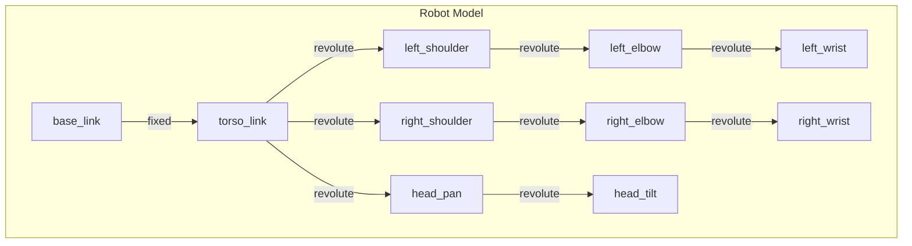
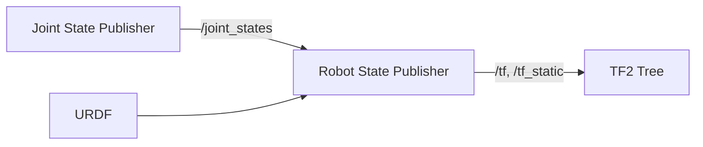

# Chapter 4: URDF & Humanoid Modeling

## Learning Objectives

By the end of this chapter, you will be able to:

- Write URDF files to describe robot kinematics and dynamics
- Use Xacro macros for modular, maintainable robot descriptions
- Integrate mesh files for realistic visual and collision models
- Model a humanoid robot with multiple kinematic chains
- Visualize and debug robot models in RViz2

## Prerequisites

- Completed [Chapters 1-3](/module-1-ros2/ch01-welcome-first-node)
- Basic understanding of 3D coordinate systems
- Familiarity with XML syntax

---

## 4.1 Introduction to URDF

The **Unified Robot Description Format (URDF)** is an XML specification for describing a robot's physical structure. It defines:

- **Links**: Rigid bodies with visual appearance, collision geometry, and inertial properties
- **Joints**: Connections between links that define motion constraints
- **Transmissions**: Mappings between actuators and joints
- **Sensors**: Cameras, LIDAR, IMU placements



### Why URDF Matters

URDF is the foundation for:

- **Visualization**: Rendering robots in RViz2 and simulation
- **Motion planning**: MoveIt uses URDF for collision checking and IK
- **Physics simulation**: Gazebo and Isaac Sim import URDF for dynamics
- **Control**: Joint limits, velocity bounds, and effort limits
- **TF tree**: Automatic transform broadcasting between frames

---

## 4.2 URDF Fundamentals

### Basic Structure

A minimal URDF file:

```xml
<?xml version="1.0"?>
<robot name="simple_robot">
  <!-- Base link (root of the kinematic tree) -->
  <link name="base_link">
    <visual>
      <geometry>
        <box size="0.5 0.3 0.1"/>
      </geometry>
      <material name="blue">
        <color rgba="0.0 0.0 0.8 1.0"/>
      </material>
    </visual>
    <collision>
      <geometry>
        <box size="0.5 0.3 0.1"/>
      </geometry>
    </collision>
    <inertial>
      <mass value="10.0"/>
      <inertia ixx="0.1" ixy="0.0" ixz="0.0"
               iyy="0.1" iyz="0.0" izz="0.1"/>
    </inertial>
  </link>

  <!-- Wheel link -->
  <link name="wheel_link">
    <visual>
      <geometry>
        <cylinder radius="0.1" length="0.05"/>
      </geometry>
      <material name="black">
        <color rgba="0.1 0.1 0.1 1.0"/>
      </material>
    </visual>
    <collision>
      <geometry>
        <cylinder radius="0.1" length="0.05"/>
      </geometry>
    </collision>
    <inertial>
      <mass value="1.0"/>
      <inertia ixx="0.01" ixy="0.0" ixz="0.0"
               iyy="0.01" iyz="0.0" izz="0.01"/>
    </inertial>
  </link>

  <!-- Joint connecting base to wheel -->
  <joint name="wheel_joint" type="continuous">
    <parent link="base_link"/>
    <child link="wheel_link"/>
    <origin xyz="0.2 0.0 -0.05" rpy="1.5708 0 0"/>
    <axis xyz="0 0 1"/>
  </joint>
</robot>
```

### Link Elements

Each link can contain:

| Element | Purpose | Required |
|---------|---------|----------|
| `<visual>` | Appearance for rendering | No |
| `<collision>` | Simplified geometry for collision detection | No |
| `<inertial>` | Mass and moment of inertia for dynamics | For simulation |

#### Visual and Collision Geometry

```xml
<link name="arm_link">
  <!-- Visual: detailed mesh for rendering -->
  <visual>
    <origin xyz="0 0 0.15" rpy="0 0 0"/>
    <geometry>
      <mesh filename="package://my_robot/meshes/arm_visual.dae" scale="1 1 1"/>
    </geometry>
    <material name="silver">
      <color rgba="0.8 0.8 0.8 1.0"/>
    </material>
  </visual>

  <!-- Collision: simplified geometry for performance -->
  <collision>
    <origin xyz="0 0 0.15" rpy="0 0 0"/>
    <geometry>
      <cylinder radius="0.05" length="0.3"/>
    </geometry>
  </collision>

  <!-- Inertial: mass properties at center of mass -->
  <inertial>
    <origin xyz="0 0 0.15" rpy="0 0 0"/>
    <mass value="2.5"/>
    <inertia ixx="0.02" ixy="0.0" ixz="0.0"
             iyy="0.02" iyz="0.0" izz="0.005"/>
  </inertial>
</link>
```

### Joint Types

| Type | DOF | Description | Example |
|------|-----|-------------|---------|
| `fixed` | 0 | No relative motion | Sensor mount |
| `revolute` | 1 | Rotation with limits | Elbow joint |
| `continuous` | 1 | Unlimited rotation | Wheel |
| `prismatic` | 1 | Linear translation | Lift mechanism |
| `floating` | 6 | Free motion | Mobile base |
| `planar` | 3 | Motion in a plane | Holonomic base |

#### Joint Definition

```xml
<joint name="shoulder_pitch" type="revolute">
  <parent link="torso_link"/>
  <child link="upper_arm_link"/>

  <!-- Position and orientation of joint frame relative to parent -->
  <origin xyz="0 0.15 0.4" rpy="0 0 0"/>

  <!-- Axis of rotation/translation in joint frame -->
  <axis xyz="0 1 0"/>

  <!-- Joint limits -->
  <limit lower="-1.57" upper="1.57"
         effort="100.0" velocity="2.0"/>

  <!-- Dynamics (optional) -->
  <dynamics damping="0.5" friction="0.1"/>

  <!-- Safety controller (optional) -->
  <safety_controller k_position="100"
                     k_velocity="10"
                     soft_lower_limit="-1.5"
                     soft_upper_limit="1.5"/>
</joint>
```

---

## 4.3 Xacro: Modular Robot Descriptions

Raw URDF becomes unwieldy for complex robots. **Xacro** (XML Macros) provides:

- **Properties**: Reusable constants
- **Macros**: Parameterized templates
- **Math expressions**: Computed values
- **Conditionals**: Optional components
- **Includes**: Split files for organization

### Converting URDF to Xacro

Save files with `.urdf.xacro` extension and process with:

```bash
# Generate URDF from Xacro
xacro model.urdf.xacro > model.urdf

# Or use directly in launch files (preferred)
ros2 launch my_robot display.launch.py
```

### Properties and Math

```xml
<?xml version="1.0"?>
<robot xmlns:xacro="http://www.ros.org/wiki/xacro" name="humanoid">

  <!-- Properties (constants) -->
  <xacro:property name="torso_height" value="0.4"/>
  <xacro:property name="torso_width" value="0.3"/>
  <xacro:property name="torso_depth" value="0.2"/>
  <xacro:property name="arm_length" value="0.35"/>
  <xacro:property name="leg_length" value="0.45"/>

  <!-- Computed properties -->
  <xacro:property name="torso_mass" value="${torso_height * torso_width * torso_depth * 1000}"/>
  <xacro:property name="shoulder_offset" value="${torso_width / 2 + 0.02}"/>

  <!-- Use in elements -->
  <link name="torso_link">
    <visual>
      <geometry>
        <box size="${torso_depth} ${torso_width} ${torso_height}"/>
      </geometry>
    </visual>
  </link>

</robot>
```

### Macros for Reusable Components

```xml
<?xml version="1.0"?>
<robot xmlns:xacro="http://www.ros.org/wiki/xacro" name="humanoid">

  <!-- Macro for a simple link with box geometry -->
  <xacro:macro name="box_link" params="name width depth height mass color">
    <link name="${name}">
      <visual>
        <geometry>
          <box size="${depth} ${width} ${height}"/>
        </geometry>
        <material name="${color}"/>
      </visual>
      <collision>
        <geometry>
          <box size="${depth} ${width} ${height}"/>
        </geometry>
      </collision>
      <inertial>
        <mass value="${mass}"/>
        <inertia ixx="${mass*(width*width + height*height)/12}"
                 ixy="0" ixz="0"
                 iyy="${mass*(depth*depth + height*height)/12}"
                 iyz="0"
                 izz="${mass*(depth*depth + width*width)/12}"/>
      </inertial>
    </link>
  </xacro:macro>

  <!-- Macro for a revolute joint -->
  <xacro:macro name="revolute_joint" params="name parent child xyz rpy axis lower upper">
    <joint name="${name}" type="revolute">
      <parent link="${parent}"/>
      <child link="${child}"/>
      <origin xyz="${xyz}" rpy="${rpy}"/>
      <axis xyz="${axis}"/>
      <limit lower="${lower}" upper="${upper}" effort="100" velocity="2"/>
      <dynamics damping="0.5"/>
    </joint>
  </xacro:macro>

  <!-- Use the macros -->
  <xacro:box_link name="torso" width="0.3" depth="0.2" height="0.4" mass="15" color="gray"/>
  <xacro:box_link name="upper_arm_left" width="0.08" depth="0.08" height="0.3" mass="2" color="blue"/>

</robot>
```

### Arm Macro (Complete Kinematic Chain)

```xml
<!-- Macro for a complete arm with shoulder, elbow, and wrist -->
<xacro:macro name="arm" params="side parent reflect">

  <!-- Shoulder roll joint -->
  <joint name="${side}_shoulder_roll" type="revolute">
    <parent link="${parent}"/>
    <child link="${side}_shoulder_link"/>
    <origin xyz="0 ${reflect * 0.17} 0.35" rpy="0 0 0"/>
    <axis xyz="1 0 0"/>
    <limit lower="-1.57" upper="1.57" effort="50" velocity="2"/>
  </joint>

  <link name="${side}_shoulder_link">
    <visual>
      <geometry><sphere radius="0.05"/></geometry>
      <material name="joint_color"/>
    </visual>
    <inertial>
      <mass value="0.5"/>
      <inertia ixx="0.001" ixy="0" ixz="0" iyy="0.001" iyz="0" izz="0.001"/>
    </inertial>
  </link>

  <!-- Shoulder pitch joint -->
  <joint name="${side}_shoulder_pitch" type="revolute">
    <parent link="${side}_shoulder_link"/>
    <child link="${side}_upper_arm"/>
    <origin xyz="0 0 0" rpy="0 0 0"/>
    <axis xyz="0 1 0"/>
    <limit lower="-2.0" upper="2.0" effort="50" velocity="2"/>
  </joint>

  <link name="${side}_upper_arm">
    <visual>
      <origin xyz="0 0 -0.15"/>
      <geometry><cylinder radius="0.04" length="0.3"/></geometry>
      <material name="arm_color"/>
    </visual>
    <collision>
      <origin xyz="0 0 -0.15"/>
      <geometry><cylinder radius="0.04" length="0.3"/></geometry>
    </collision>
    <inertial>
      <origin xyz="0 0 -0.15"/>
      <mass value="2.0"/>
      <inertia ixx="0.02" ixy="0" ixz="0" iyy="0.02" iyz="0" izz="0.005"/>
    </inertial>
  </link>

  <!-- Elbow joint -->
  <joint name="${side}_elbow" type="revolute">
    <parent link="${side}_upper_arm"/>
    <child link="${side}_forearm"/>
    <origin xyz="0 0 -0.3" rpy="0 0 0"/>
    <axis xyz="0 1 0"/>
    <limit lower="0" upper="2.5" effort="30" velocity="2"/>
  </joint>

  <link name="${side}_forearm">
    <visual>
      <origin xyz="0 0 -0.125"/>
      <geometry><cylinder radius="0.035" length="0.25"/></geometry>
      <material name="arm_color"/>
    </visual>
    <collision>
      <origin xyz="0 0 -0.125"/>
      <geometry><cylinder radius="0.035" length="0.25"/></geometry>
    </collision>
    <inertial>
      <origin xyz="0 0 -0.125"/>
      <mass value="1.5"/>
      <inertia ixx="0.01" ixy="0" ixz="0" iyy="0.01" iyz="0" izz="0.003"/>
    </inertial>
  </link>

  <!-- Wrist joint -->
  <joint name="${side}_wrist" type="revolute">
    <parent link="${side}_forearm"/>
    <child link="${side}_hand"/>
    <origin xyz="0 0 -0.25" rpy="0 0 0"/>
    <axis xyz="0 0 1"/>
    <limit lower="-1.57" upper="1.57" effort="10" velocity="3"/>
  </joint>

  <link name="${side}_hand">
    <visual>
      <geometry><box size="0.08 0.06 0.12"/></geometry>
      <material name="hand_color"/>
    </visual>
    <collision>
      <geometry><box size="0.08 0.06 0.12"/></geometry>
    </collision>
    <inertial>
      <mass value="0.5"/>
      <inertia ixx="0.001" ixy="0" ixz="0" iyy="0.001" iyz="0" izz="0.001"/>
    </inertial>
  </link>

</xacro:macro>

<!-- Instantiate left and right arms -->
<xacro:arm side="left" parent="torso_link" reflect="1"/>
<xacro:arm side="right" parent="torso_link" reflect="-1"/>
```

---

## 4.4 Complete Humanoid Model

Here's a complete humanoid upper body model:

```xml
<?xml version="1.0"?>
<robot xmlns:xacro="http://www.ros.org/wiki/xacro" name="humanoid_robot">

  <!-- ==================== PROPERTIES ==================== -->
  <xacro:property name="pi" value="3.14159265359"/>

  <!-- Torso dimensions -->
  <xacro:property name="torso_width" value="0.35"/>
  <xacro:property name="torso_depth" value="0.2"/>
  <xacro:property name="torso_height" value="0.45"/>

  <!-- Head dimensions -->
  <xacro:property name="head_radius" value="0.1"/>
  <xacro:property name="neck_length" value="0.08"/>

  <!-- ==================== MATERIALS ==================== -->
  <material name="white">
    <color rgba="1.0 1.0 1.0 1.0"/>
  </material>
  <material name="gray">
    <color rgba="0.5 0.5 0.5 1.0"/>
  </material>
  <material name="dark_gray">
    <color rgba="0.3 0.3 0.3 1.0"/>
  </material>
  <material name="blue">
    <color rgba="0.2 0.4 0.8 1.0"/>
  </material>

  <!-- ==================== INERTIA MACROS ==================== -->
  <xacro:macro name="box_inertia" params="mass x y z">
    <inertial>
      <mass value="${mass}"/>
      <inertia ixx="${mass*(y*y + z*z)/12}" ixy="0" ixz="0"
               iyy="${mass*(x*x + z*z)/12}" iyz="0"
               izz="${mass*(x*x + y*y)/12}"/>
    </inertial>
  </xacro:macro>

  <xacro:macro name="cylinder_inertia" params="mass radius length">
    <inertial>
      <mass value="${mass}"/>
      <inertia ixx="${mass*(3*radius*radius + length*length)/12}" ixy="0" ixz="0"
               iyy="${mass*(3*radius*radius + length*length)/12}" iyz="0"
               izz="${mass*radius*radius/2}"/>
    </inertial>
  </xacro:macro>

  <xacro:macro name="sphere_inertia" params="mass radius">
    <inertial>
      <mass value="${mass}"/>
      <inertia ixx="${2*mass*radius*radius/5}" ixy="0" ixz="0"
               iyy="${2*mass*radius*radius/5}" iyz="0"
               izz="${2*mass*radius*radius/5}"/>
    </inertial>
  </xacro:macro>

  <!-- ==================== BASE LINK ==================== -->
  <link name="base_link"/>

  <joint name="base_to_torso" type="fixed">
    <parent link="base_link"/>
    <child link="torso_link"/>
    <origin xyz="0 0 0.9" rpy="0 0 0"/>
  </joint>

  <!-- ==================== TORSO ==================== -->
  <link name="torso_link">
    <visual>
      <geometry>
        <box size="${torso_depth} ${torso_width} ${torso_height}"/>
      </geometry>
      <material name="white"/>
    </visual>
    <collision>
      <geometry>
        <box size="${torso_depth} ${torso_width} ${torso_height}"/>
      </geometry>
    </collision>
    <xacro:box_inertia mass="15.0" x="${torso_depth}" y="${torso_width}" z="${torso_height}"/>
  </link>

  <!-- ==================== HEAD ==================== -->
  <joint name="neck_pan" type="revolute">
    <parent link="torso_link"/>
    <child link="neck_link"/>
    <origin xyz="0 0 ${torso_height/2 + neck_length/2}" rpy="0 0 0"/>
    <axis xyz="0 0 1"/>
    <limit lower="${-pi/2}" upper="${pi/2}" effort="10" velocity="2"/>
    <dynamics damping="0.1"/>
  </joint>

  <link name="neck_link">
    <visual>
      <geometry>
        <cylinder radius="0.04" length="${neck_length}"/>
      </geometry>
      <material name="gray"/>
    </visual>
    <collision>
      <geometry>
        <cylinder radius="0.04" length="${neck_length}"/>
      </geometry>
    </collision>
    <xacro:cylinder_inertia mass="0.5" radius="0.04" length="${neck_length}"/>
  </link>

  <joint name="neck_tilt" type="revolute">
    <parent link="neck_link"/>
    <child link="head_link"/>
    <origin xyz="0 0 ${neck_length/2 + head_radius}" rpy="0 0 0"/>
    <axis xyz="0 1 0"/>
    <limit lower="${-pi/4}" upper="${pi/4}" effort="10" velocity="2"/>
    <dynamics damping="0.1"/>
  </joint>

  <link name="head_link">
    <visual>
      <geometry>
        <sphere radius="${head_radius}"/>
      </geometry>
      <material name="white"/>
    </visual>
    <collision>
      <geometry>
        <sphere radius="${head_radius}"/>
      </geometry>
    </collision>
    <xacro:sphere_inertia mass="3.0" radius="${head_radius}"/>
  </link>

  <!-- Camera on head -->
  <joint name="camera_joint" type="fixed">
    <parent link="head_link"/>
    <child link="camera_link"/>
    <origin xyz="${head_radius} 0 0" rpy="0 0 0"/>
  </joint>

  <link name="camera_link">
    <visual>
      <geometry>
        <box size="0.02 0.06 0.02"/>
      </geometry>
      <material name="dark_gray"/>
    </visual>
  </link>

  <!-- ==================== ARM MACRO ==================== -->
  <xacro:include filename="$(find my_robot_description)/urdf/arm.urdf.xacro"/>

  <!-- Instantiate arms -->
  <xacro:arm side="left" parent="torso_link" reflect="1"/>
  <xacro:arm side="right" parent="torso_link" reflect="-1"/>

</robot>
```

---

## 4.5 Visualization and Validation

### Launching in RViz2

Create a launch file to visualize your robot:

```python
# launch/display.launch.py
from launch import LaunchDescription
from launch.substitutions import Command, PathJoinSubstitution
from launch_ros.actions import Node
from launch_ros.substitutions import FindPackageShare


def generate_launch_description():
    # Get URDF via xacro
    robot_description_content = Command([
        'xacro ',
        PathJoinSubstitution([
            FindPackageShare('my_robot_description'),
            'urdf',
            'humanoid.urdf.xacro'
        ])
    ])

    robot_description = {'robot_description': robot_description_content}

    # Robot State Publisher
    robot_state_publisher = Node(
        package='robot_state_publisher',
        executable='robot_state_publisher',
        output='screen',
        parameters=[robot_description]
    )

    # Joint State Publisher GUI (for manual joint control)
    joint_state_publisher_gui = Node(
        package='joint_state_publisher_gui',
        executable='joint_state_publisher_gui',
        name='joint_state_publisher_gui'
    )

    # RViz2
    rviz = Node(
        package='rviz2',
        executable='rviz2',
        name='rviz2',
        arguments=['-d', PathJoinSubstitution([
            FindPackageShare('my_robot_description'),
            'rviz',
            'display.rviz'
        ])]
    )

    return LaunchDescription([
        robot_state_publisher,
        joint_state_publisher_gui,
        rviz,
    ])
```

Install dependencies and launch:

```bash
sudo apt install ros-humble-joint-state-publisher-gui ros-humble-robot-state-publisher

ros2 launch my_robot_description display.launch.py
```

### URDF Validation

Check for errors before visualization:

```bash
# Install check_urdf tool
sudo apt install liburdfdom-tools

# Generate URDF and validate
xacro humanoid.urdf.xacro > humanoid.urdf
check_urdf humanoid.urdf

# View the kinematic tree
urdf_to_graphviz humanoid.urdf
```

### Common URDF Errors

| Error | Cause | Solution |
|-------|-------|----------|
| "Link has no parent" | Missing joint to parent | Add joint connecting to parent link |
| "Multiple roots" | More than one link without parent | Ensure single root (usually `base_link`) |
| "Inertia matrix not positive definite" | Invalid inertia values | Check mass and inertia calculations |
| "Joint limits violated" | Initial pose outside limits | Adjust limits or initial position |
| "Mesh file not found" | Incorrect `package://` path | Verify package name and mesh path |

---

## 4.6 TF and Robot State Publisher

ROS 2 uses the **TF2** library to track coordinate frames. The `robot_state_publisher` node:

1. Reads the URDF from the `robot_description` parameter
2. Subscribes to `/joint_states` for current joint positions
3. Broadcasts transforms for all links



### Viewing the TF Tree

```bash
# View TF tree as PDF
ros2 run tf2_tools view_frames

# Echo specific transform
ros2 run tf2_ros tf2_echo base_link left_hand

# Monitor TF updates
ros2 run tf2_ros tf2_monitor
```

### Publishing Joint States Programmatically

```python
#!/usr/bin/env python3
"""
joint_state_publisher.py - Publish joint states for the humanoid

Reads from hardware or simulation and publishes joint positions.
"""

import rclpy
from rclpy.node import Node
from sensor_msgs.msg import JointState
import math


class JointStatePublisher(Node):
    """Publishes joint states for the robot."""

    def __init__(self):
        super().__init__('joint_state_publisher')

        self.publisher = self.create_publisher(JointState, '/joint_states', 10)
        self.timer = self.create_timer(0.02, self.publish_joint_states)  # 50 Hz

        # Joint names must match URDF
        self.joint_names = [
            'neck_pan', 'neck_tilt',
            'left_shoulder_roll', 'left_shoulder_pitch', 'left_elbow', 'left_wrist',
            'right_shoulder_roll', 'right_shoulder_pitch', 'right_elbow', 'right_wrist',
        ]

        self.positions = [0.0] * len(self.joint_names)
        self.time = 0.0

        self.get_logger().info('Joint State Publisher started')

    def publish_joint_states(self):
        """Publish current joint positions."""
        self.time += 0.02

        # Simulate simple wave motion
        self.positions[2] = 0.3 * math.sin(self.time)  # left_shoulder_roll
        self.positions[4] = 0.5 + 0.3 * math.sin(self.time)  # left_elbow

        msg = JointState()
        msg.header.stamp = self.get_clock().now().to_msg()
        msg.name = self.joint_names
        msg.position = self.positions
        msg.velocity = [0.0] * len(self.joint_names)
        msg.effort = [0.0] * len(self.joint_names)

        self.publisher.publish(msg)


def main(args=None):
    rclpy.init(args=args)
    node = JointStatePublisher()

    try:
        rclpy.spin(node)
    except KeyboardInterrupt:
        pass
    finally:
        node.destroy_node()
        rclpy.shutdown()


if __name__ == '__main__':
    main()
```

---

## 4.7 Adding Sensors to URDF

### Camera Sensor

```xml
<!-- RGB Camera -->
<link name="camera_link">
  <visual>
    <geometry>
      <box size="0.02 0.08 0.02"/>
    </geometry>
    <material name="dark_gray"/>
  </visual>
</link>

<joint name="camera_joint" type="fixed">
  <parent link="head_link"/>
  <child link="camera_link"/>
  <origin xyz="0.1 0 0" rpy="0 0 0"/>
</joint>

<!-- Camera optical frame (Z forward, X right, Y down) -->
<link name="camera_optical_frame"/>

<joint name="camera_optical_joint" type="fixed">
  <parent link="camera_link"/>
  <child link="camera_optical_frame"/>
  <origin xyz="0 0 0" rpy="${-pi/2} 0 ${-pi/2}"/>
</joint>

<!-- Gazebo camera plugin (for simulation) -->
<gazebo reference="camera_link">
  <sensor type="camera" name="head_camera">
    <update_rate>30.0</update_rate>
    <camera name="head">
      <horizontal_fov>1.3962634</horizontal_fov>
      <image>
        <width>640</width>
        <height>480</height>
        <format>R8G8B8</format>
      </image>
    </camera>
    <plugin name="camera_controller" filename="libgazebo_ros_camera.so">
      <ros>
        <namespace>/humanoid</namespace>
        <remapping>image_raw:=camera/image_raw</remapping>
        <remapping>camera_info:=camera/camera_info</remapping>
      </ros>
      <camera_name>head_camera</camera_name>
      <frame_name>camera_optical_frame</frame_name>
    </plugin>
  </sensor>
</gazebo>
```

### IMU Sensor

```xml
<!-- IMU mounted on torso -->
<link name="imu_link">
  <visual>
    <geometry>
      <box size="0.02 0.02 0.01"/>
    </geometry>
    <material name="green"/>
  </visual>
</link>

<joint name="imu_joint" type="fixed">
  <parent link="torso_link"/>
  <child link="imu_link"/>
  <origin xyz="0 0 0" rpy="0 0 0"/>
</joint>

<!-- Gazebo IMU plugin -->
<gazebo reference="imu_link">
  <sensor type="imu" name="torso_imu">
    <update_rate>100.0</update_rate>
    <plugin name="imu_plugin" filename="libgazebo_ros_imu_sensor.so">
      <ros>
        <namespace>/humanoid</namespace>
        <remapping>~/out:=imu/data</remapping>
      </ros>
      <frame_name>imu_link</frame_name>
    </plugin>
  </sensor>
</gazebo>
```

---

## Lab Exercise

Complete the hands-on lab in [`labs/module-1/ch04-urdf-humanoid/`](/labs/module-1/ch04-urdf-humanoid/) where you will:

1. Create a URDF for a simple robot arm with 3 joints
2. Convert it to Xacro with parameterized macros
3. Add visual meshes and collision geometry
4. Visualize in RViz2 with joint_state_publisher_gui
5. Extend to a full humanoid upper body with two arms and a head

**Estimated time**: 90-120 minutes

---

## Summary

In this chapter, you learned:

- **URDF fundamentals**: Links, joints, and their properties
- **Geometry types**: Boxes, cylinders, spheres, and meshes
- **Inertial properties**: Mass and moments of inertia for dynamics
- **Xacro**: Properties, macros, and includes for maintainable descriptions
- **Humanoid modeling**: Kinematic chains for arms and heads
- **Visualization**: RViz2, robot_state_publisher, and TF
- **Sensor integration**: Cameras and IMUs in URDF

A well-constructed URDF is the foundation for simulation, motion planning, and control.

---

## Further Reading

- [URDF Specification](http://wiki.ros.org/urdf/XML)
- [Xacro Documentation](http://wiki.ros.org/xacro)
- [ROS 2 URDF Tutorials](https://docs.ros.org/en/humble/Tutorials/Intermediate/URDF/URDF-Main.html)
- [robot_state_publisher](https://docs.ros.org/en/humble/p/robot_state_publisher/)
- [TF2 Documentation](https://docs.ros.org/en/humble/Concepts/Intermediate/About-Tf2.html)
- [MoveIt URDF Requirements](https://moveit.picknik.ai/main/doc/examples/urdf_srdf/urdf_srdf_tutorial.html)
