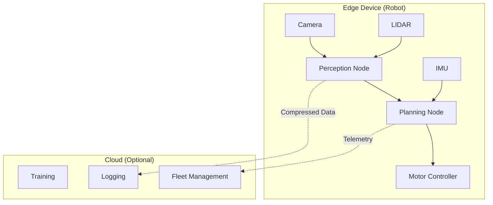
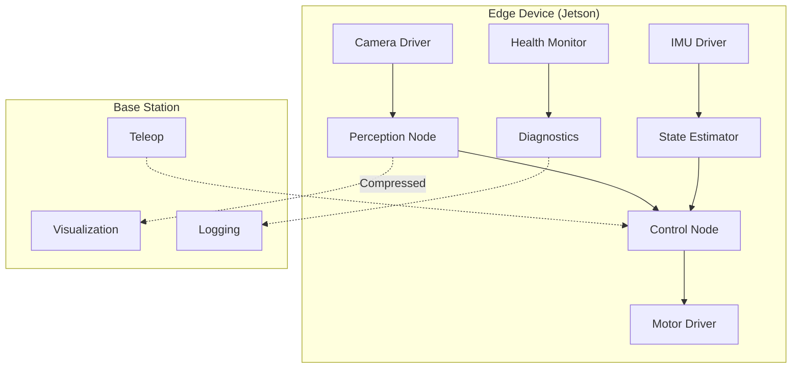

# Chapter 5: Edge Deployment Capstone

## Learning Objectives

By the end of this chapter, you will be able to:

- Cross-compile ROS 2 packages for ARM architectures
- Optimize nodes for resource-constrained edge devices
- Deploy ROS 2 applications using containers
- Implement efficient communication patterns for edge computing
- Monitor, profile, and debug edge deployments
- Complete a capstone project integrating all Module 1 concepts

## Prerequisites

- Completed [Chapters 1-4](/module-1-ros2/ch01-welcome-first-node)
- Access to edge hardware (NVIDIA Jetson, Raspberry Pi 4, or similar)
- Basic Docker knowledge
- SSH access to target device

---

## 5.1 Edge Computing in Robotics

**Edge computing** brings computation closer to sensors and actuators, reducing latency and enabling real-time decision-making essential for physical AI systems.



### Why Edge Deployment Matters

| Factor | Cloud Processing | Edge Processing |
|--------|------------------|-----------------|
| Latency | 50-200ms | &lt;10ms |
| Bandwidth | High (raw data) | Low (processed results) |
| Privacy | Data leaves device | Data stays local |
| Reliability | Network dependent | Autonomous operation |
| Cost | Ongoing cloud fees | One-time hardware |

For humanoid robots, edge processing is critical for:
- **Balance control**: &lt;5ms control loops
- **Collision avoidance**: Real-time sensor processing
- **Manipulation**: Tactile feedback response
- **Human interaction**: Low-latency speech/gesture response

---

## 5.2 Target Platforms

### NVIDIA Jetson Family

The Jetson platform is ideal for AI-powered robotics:

| Model | CPU | GPU | RAM | Power | Use Case |
|-------|-----|-----|-----|-------|----------|
| Jetson Nano | 4x A57 | 128 CUDA | 4GB | 5-10W | Prototyping |
| Jetson Xavier NX | 6x Carmel | 384 CUDA | 8GB | 10-20W | Production |
| Jetson Orin Nano | 6x A78 | 1024 CUDA | 8GB | 7-15W | AI Inference |
| Jetson AGX Orin | 12x A78 | 2048 CUDA | 32-64GB | 15-60W | Full autonomy |

### Raspberry Pi 4/5

For lighter workloads without GPU acceleration:

| Model | CPU | RAM | Power | Use Case |
|-------|-----|-----|-------|----------|
| Pi 4 | 4x Cortex-A72 | 4-8GB | 3-6W | Sensor aggregation |
| Pi 5 | 4x Cortex-A76 | 4-8GB | 5-12W | Light inference |

---

## 5.3 Cross-Compilation Strategies

### Strategy 1: Native Build on Target

Simplest approach—build directly on the edge device:

```bash
# SSH into Jetson
ssh user@jetson-robot

# Install ROS 2 Humble
sudo apt update
sudo apt install ros-humble-desktop

# Build your workspace
cd ~/ros2_ws
colcon build --packages-select my_robot_pkg
```

**Pros**: Simple, no toolchain setup
**Cons**: Slow builds, limited RAM may cause failures

### Strategy 2: Docker Multi-Architecture Builds

Use Docker BuildX for cross-platform builds:

```dockerfile
# Dockerfile.edge
FROM ros:humble-ros-base AS builder

# Install build dependencies
RUN apt-get update && apt-get install -y \
    python3-colcon-common-extensions \
    ros-humble-sensor-msgs \
    ros-humble-cv-bridge \
    && rm -rf /var/lib/apt/lists/*

# Copy and build workspace
WORKDIR /ros2_ws
COPY src/ src/
RUN . /opt/ros/humble/setup.sh && \
    colcon build --cmake-args -DCMAKE_BUILD_TYPE=Release

# Runtime image
FROM ros:humble-ros-base AS runtime

# Copy built packages
COPY --from=builder /ros2_ws/install /ros2_ws/install

# Set entrypoint
COPY entrypoint.sh /
RUN chmod +x /entrypoint.sh
ENTRYPOINT ["/entrypoint.sh"]
```

Build for ARM64:

```bash
# Enable BuildX
docker buildx create --name multiarch --use

# Build for ARM64 (Jetson, Pi)
docker buildx build \
    --platform linux/arm64 \
    -t myrobot/edge-controller:latest \
    --push \
    -f Dockerfile.edge .
```

### Strategy 3: Cross-Compilation Toolchain

For maximum performance, use a cross-compilation toolchain:

```bash
# Install cross-compilation tools
sudo apt install gcc-aarch64-linux-gnu g++-aarch64-linux-gnu

# Set up ROS 2 cross-compilation (simplified)
export TARGET_ARCH=aarch64
export CROSS_COMPILE=aarch64-linux-gnu-

# Build with colcon cross-compile
colcon build \
    --cmake-args \
    -DCMAKE_TOOLCHAIN_FILE=/path/to/aarch64_toolchain.cmake
```

---

## 5.4 Optimizing for Edge Devices

### Memory Optimization

Edge devices have limited RAM. Optimize your nodes:

```python
#!/usr/bin/env python3
"""
optimized_perception.py - Memory-efficient perception node

Demonstrates techniques for reducing memory footprint on edge devices.
"""

import rclpy
from rclpy.node import Node
from rclpy.qos import QoSProfile, ReliabilityPolicy, HistoryPolicy
from sensor_msgs.msg import Image, CompressedImage
from cv_bridge import CvBridge
import cv2
import numpy as np


class OptimizedPerception(Node):
    """Memory-efficient perception for edge deployment."""

    def __init__(self):
        super().__init__('optimized_perception')

        # QoS for sensor data: best-effort, keep only latest
        sensor_qos = QoSProfile(
            reliability=ReliabilityPolicy.BEST_EFFORT,
            history=HistoryPolicy.KEEP_LAST,
            depth=1  # Minimal buffer
        )

        self.bridge = CvBridge()

        # Use compressed images to reduce bandwidth
        self.subscription = self.create_subscription(
            CompressedImage,
            '/camera/image_compressed',
            self.image_callback,
            sensor_qos
        )

        # Pre-allocate buffers to avoid repeated allocations
        self._frame_buffer = np.zeros((480, 640, 3), dtype=np.uint8)
        self._gray_buffer = np.zeros((480, 640), dtype=np.uint8)

        # Downsample for processing
        self._processing_scale = 0.5
        self._small_size = (320, 240)

        self.get_logger().info('Optimized Perception node started')

    def image_callback(self, msg: CompressedImage):
        """Process compressed image with minimal memory allocation."""
        # Decode compressed image directly to pre-allocated buffer
        np_arr = np.frombuffer(msg.data, np.uint8)
        frame = cv2.imdecode(np_arr, cv2.IMREAD_COLOR)

        if frame is None:
            return

        # Resize for faster processing
        small_frame = cv2.resize(frame, self._small_size)

        # Convert to grayscale using pre-allocated buffer
        cv2.cvtColor(small_frame, cv2.COLOR_BGR2GRAY, dst=self._gray_buffer[:240, :320])

        # Process (example: edge detection)
        edges = cv2.Canny(self._gray_buffer[:240, :320], 50, 150)

        # Publish or use results
        self.get_logger().debug(f'Processed frame, edges: {np.sum(edges > 0)} pixels')


def main(args=None):
    rclpy.init(args=args)
    node = OptimizedPerception()

    try:
        rclpy.spin(node)
    except KeyboardInterrupt:
        pass
    finally:
        node.destroy_node()
        rclpy.shutdown()


if __name__ == '__main__':
    main()
```

### CPU Optimization

Reduce CPU usage with efficient patterns:

```python
#!/usr/bin/env python3
"""
efficient_controller.py - CPU-efficient control node

Uses timer coalescing and conditional processing to reduce CPU load.
"""

import rclpy
from rclpy.node import Node
from rclpy.executors import SingleThreadedExecutor
from sensor_msgs.msg import JointState
from std_msgs.msg import Float64MultiArray
import numpy as np


class EfficientController(Node):
    """CPU-efficient control node for edge devices."""

    def __init__(self):
        super().__init__('efficient_controller')

        # Declare parameters for tuning
        self.declare_parameter('control_rate', 100.0)
        self.declare_parameter('idle_threshold', 0.01)

        self._control_rate = self.get_parameter('control_rate').value
        self._idle_threshold = self.get_parameter('idle_threshold').value

        # State
        self._current_positions = None
        self._target_positions = None
        self._is_idle = True

        # Subscribers
        self.create_subscription(
            JointState, '/joint_states',
            self._joint_state_callback, 10
        )

        self.create_subscription(
            Float64MultiArray, '/target_positions',
            self._target_callback, 10
        )

        # Publisher
        self._cmd_pub = self.create_publisher(
            Float64MultiArray, '/joint_commands', 10
        )

        # Control timer - only runs when not idle
        self._control_timer = self.create_timer(
            1.0 / self._control_rate,
            self._control_loop
        )

        self.get_logger().info(
            f'Controller started at {self._control_rate}Hz, '
            f'idle threshold: {self._idle_threshold}'
        )

    def _joint_state_callback(self, msg: JointState):
        """Update current joint positions."""
        self._current_positions = np.array(msg.position)

    def _target_callback(self, msg: Float64MultiArray):
        """Update target positions and wake controller."""
        self._target_positions = np.array(msg.data)
        self._is_idle = False

    def _control_loop(self):
        """Main control loop - skips processing when idle."""
        # Skip if idle (no work to do)
        if self._is_idle:
            return

        # Skip if missing data
        if self._current_positions is None or self._target_positions is None:
            return

        # Compute error
        error = self._target_positions - self._current_positions

        # Check if we've reached target (become idle)
        if np.all(np.abs(error) < self._idle_threshold):
            self._is_idle = True
            self.get_logger().debug('Target reached, entering idle mode')
            return

        # Simple P controller
        kp = 5.0
        command = kp * error

        # Publish command
        msg = Float64MultiArray()
        msg.data = command.tolist()
        self._cmd_pub.publish(msg)


def main(args=None):
    rclpy.init(args=args)
    node = EfficientController()

    # Use single-threaded executor for lower overhead
    executor = SingleThreadedExecutor()
    executor.add_node(node)

    try:
        executor.spin()
    finally:
        node.destroy_node()
        rclpy.shutdown()


if __name__ == '__main__':
    main()
```

### Network Optimization

Reduce bandwidth between edge devices:

```python
#!/usr/bin/env python3
"""
compressed_publisher.py - Bandwidth-efficient data publishing

Compresses sensor data before transmission to reduce network load.
"""

import rclpy
from rclpy.node import Node
from sensor_msgs.msg import Image, CompressedImage, PointCloud2
from cv_bridge import CvBridge
import cv2
import numpy as np
import struct


class CompressedPublisher(Node):
    """Publishes compressed sensor data for bandwidth efficiency."""

    def __init__(self):
        super().__init__('compressed_publisher')

        self.bridge = CvBridge()

        # Parameters
        self.declare_parameter('jpeg_quality', 80)
        self.declare_parameter('downsample_factor', 2)

        self._jpeg_quality = self.get_parameter('jpeg_quality').value
        self._downsample = self.get_parameter('downsample_factor').value

        # Subscribe to raw image
        self.create_subscription(
            Image, '/camera/image_raw',
            self._image_callback, 10
        )

        # Publish compressed
        self._compressed_pub = self.create_publisher(
            CompressedImage, '/camera/image_compressed', 10
        )

        self.get_logger().info(
            f'Compressing images: quality={self._jpeg_quality}, '
            f'downsample={self._downsample}x'
        )

    def _image_callback(self, msg: Image):
        """Compress and republish image."""
        # Convert to OpenCV
        cv_image = self.bridge.imgmsg_to_cv2(msg, 'bgr8')

        # Downsample
        if self._downsample > 1:
            h, w = cv_image.shape[:2]
            new_size = (w // self._downsample, h // self._downsample)
            cv_image = cv2.resize(cv_image, new_size)

        # Compress to JPEG
        encode_params = [cv2.IMWRITE_JPEG_QUALITY, self._jpeg_quality]
        _, compressed = cv2.imencode('.jpg', cv_image, encode_params)

        # Publish
        compressed_msg = CompressedImage()
        compressed_msg.header = msg.header
        compressed_msg.format = 'jpeg'
        compressed_msg.data = compressed.tobytes()

        self._compressed_pub.publish(compressed_msg)

        # Log compression ratio periodically
        original_size = msg.height * msg.width * 3
        compressed_size = len(compressed_msg.data)
        ratio = original_size / compressed_size
        self.get_logger().debug(f'Compression ratio: {ratio:.1f}x')


def main(args=None):
    rclpy.init(args=args)
    node = CompressedPublisher()

    try:
        rclpy.spin(node)
    except KeyboardInterrupt:
        pass
    finally:
        node.destroy_node()
        rclpy.shutdown()


if __name__ == '__main__':
    main()
```

---

## 5.5 Deployment with Docker

### Docker Compose for Edge

Create a complete deployment stack:

```yaml
# docker-compose.edge.yml
version: "3.8"

services:
  ros-core:
    image: myrobot/edge-base:humble
    container_name: ros-core
    network_mode: host
    environment:
      - ROS_DOMAIN_ID=42
    command: ros2 daemon start

  perception:
    image: myrobot/perception:latest
    container_name: perception
    network_mode: host
    privileged: true  # For camera access
    devices:
      - /dev/video0:/dev/video0
    volumes:
      - /tmp/.X11-unix:/tmp/.X11-unix
    environment:
      - ROS_DOMAIN_ID=42
      - DISPLAY=${DISPLAY}
    depends_on:
      - ros-core
    deploy:
      resources:
        limits:
          memory: 1G
        reservations:
          devices:
            - driver: nvidia
              count: 1
              capabilities: [gpu]

  controller:
    image: myrobot/controller:latest
    container_name: controller
    network_mode: host
    environment:
      - ROS_DOMAIN_ID=42
    depends_on:
      - perception
    deploy:
      resources:
        limits:
          memory: 512M
          cpus: '2'

  robot-state-publisher:
    image: myrobot/description:latest
    container_name: robot-state-publisher
    network_mode: host
    environment:
      - ROS_DOMAIN_ID=42
    volumes:
      - ./config/robot.urdf.xacro:/robot.urdf.xacro:ro
    command: >
      ros2 run robot_state_publisher robot_state_publisher
      --ros-args -p robot_description:="$$(xacro /robot.urdf.xacro)"
```

Deploy to edge device:

```bash
# Copy compose file to Jetson
scp docker-compose.edge.yml user@jetson:~/

# SSH and deploy
ssh user@jetson
cd ~
docker compose -f docker-compose.edge.yml up -d

# Check status
docker compose -f docker-compose.edge.yml ps
docker compose -f docker-compose.edge.yml logs -f perception
```

### Systemd Service for Auto-Start

Create a systemd service for automatic startup:

```ini
# /etc/systemd/system/robot.service
[Unit]
Description=Robot ROS 2 Stack
After=docker.service network-online.target
Wants=network-online.target
Requires=docker.service

[Service]
Type=simple
User=robot
WorkingDirectory=/home/robot
ExecStartPre=/usr/bin/docker compose -f docker-compose.edge.yml pull
ExecStart=/usr/bin/docker compose -f docker-compose.edge.yml up
ExecStop=/usr/bin/docker compose -f docker-compose.edge.yml down
Restart=always
RestartSec=10

[Install]
WantedBy=multi-user.target
```

Enable the service:

```bash
sudo systemctl enable robot.service
sudo systemctl start robot.service
sudo systemctl status robot.service
```

---

## 5.6 Monitoring and Debugging

### Resource Monitoring

Monitor edge device resources:

```python
#!/usr/bin/env python3
"""
resource_monitor.py - System resource monitoring for edge devices

Publishes CPU, memory, GPU, and temperature metrics.
"""

import rclpy
from rclpy.node import Node
from diagnostic_msgs.msg import DiagnosticArray, DiagnosticStatus, KeyValue
import psutil
import subprocess


class ResourceMonitor(Node):
    """Monitors and publishes system resource usage."""

    def __init__(self):
        super().__init__('resource_monitor')

        self._pub = self.create_publisher(
            DiagnosticArray, '/diagnostics', 10
        )

        # Monitor at 1 Hz
        self.create_timer(1.0, self._publish_diagnostics)

        self.get_logger().info('Resource monitor started')

    def _publish_diagnostics(self):
        """Collect and publish system metrics."""
        msg = DiagnosticArray()
        msg.header.stamp = self.get_clock().now().to_msg()

        # CPU status
        cpu_status = DiagnosticStatus()
        cpu_status.name = 'System: CPU'
        cpu_status.hardware_id = 'cpu'

        cpu_percent = psutil.cpu_percent(interval=None)
        cpu_freq = psutil.cpu_freq()

        cpu_status.values = [
            KeyValue(key='usage_percent', value=f'{cpu_percent:.1f}'),
            KeyValue(key='frequency_mhz', value=f'{cpu_freq.current:.0f}'),
            KeyValue(key='core_count', value=str(psutil.cpu_count())),
        ]

        if cpu_percent > 90:
            cpu_status.level = DiagnosticStatus.WARN
            cpu_status.message = 'High CPU usage'
        else:
            cpu_status.level = DiagnosticStatus.OK
            cpu_status.message = 'CPU nominal'

        msg.status.append(cpu_status)

        # Memory status
        mem_status = DiagnosticStatus()
        mem_status.name = 'System: Memory'
        mem_status.hardware_id = 'memory'

        mem = psutil.virtual_memory()
        mem_status.values = [
            KeyValue(key='total_gb', value=f'{mem.total / 1e9:.1f}'),
            KeyValue(key='used_gb', value=f'{mem.used / 1e9:.1f}'),
            KeyValue(key='available_gb', value=f'{mem.available / 1e9:.1f}'),
            KeyValue(key='percent', value=f'{mem.percent:.1f}'),
        ]

        if mem.percent > 85:
            mem_status.level = DiagnosticStatus.WARN
            mem_status.message = 'High memory usage'
        else:
            mem_status.level = DiagnosticStatus.OK
            mem_status.message = 'Memory nominal'

        msg.status.append(mem_status)

        # Temperature (Jetson/Pi specific)
        temp_status = self._get_temperature_status()
        if temp_status:
            msg.status.append(temp_status)

        # GPU status (Jetson)
        gpu_status = self._get_gpu_status()
        if gpu_status:
            msg.status.append(gpu_status)

        self._pub.publish(msg)

    def _get_temperature_status(self) -> DiagnosticStatus:
        """Get CPU/GPU temperature."""
        status = DiagnosticStatus()
        status.name = 'System: Temperature'
        status.hardware_id = 'thermal'

        try:
            temps = psutil.sensors_temperatures()
            if temps:
                for name, entries in temps.items():
                    for entry in entries:
                        status.values.append(
                            KeyValue(key=f'{name}_{entry.label}', value=f'{entry.current:.1f}')
                        )

                        if entry.current > 80:
                            status.level = DiagnosticStatus.WARN
                            status.message = 'High temperature'
                        else:
                            status.level = DiagnosticStatus.OK
                            status.message = 'Temperature nominal'

                return status
        except Exception:
            pass

        return None

    def _get_gpu_status(self) -> DiagnosticStatus:
        """Get NVIDIA GPU status (Jetson)."""
        try:
            result = subprocess.run(
                ['tegrastats', '--interval', '100', '--stop'],
                capture_output=True, text=True, timeout=1
            )
            # Parse tegrastats output (simplified)
            # In production, use proper parsing
            status = DiagnosticStatus()
            status.name = 'System: GPU'
            status.hardware_id = 'gpu'
            status.level = DiagnosticStatus.OK
            status.message = 'GPU available'
            return status
        except Exception:
            return None


def main(args=None):
    rclpy.init(args=args)
    node = ResourceMonitor()

    try:
        rclpy.spin(node)
    except KeyboardInterrupt:
        pass
    finally:
        node.destroy_node()
        rclpy.shutdown()


if __name__ == '__main__':
    main()
```

### Remote Debugging

Set up remote debugging with VS Code:

```json
// .vscode/launch.json
{
    "version": "0.2.0",
    "configurations": [
        {
            "name": "Remote Debug (Jetson)",
            "type": "python",
            "request": "attach",
            "connect": {
                "host": "jetson-robot.local",
                "port": 5678
            },
            "pathMappings": [
                {
                    "localRoot": "${workspaceFolder}/src",
                    "remoteRoot": "/ros2_ws/src"
                }
            ]
        }
    ]
}
```

Add debugpy to your node:

```python
# At the start of your node
import debugpy
debugpy.listen(("0.0.0.0", 5678))
print("Waiting for debugger...")
debugpy.wait_for_client()
```

---

## 5.7 Capstone Project: Autonomous Edge Controller

### Project Overview

Build a complete edge-deployed robot controller that:

1. Reads sensor data (camera, IMU)
2. Processes data locally on edge hardware
3. Generates control commands
4. Monitors system health
5. Communicates efficiently with a base station

### System Architecture



### Implementation Checklist

```markdown
## Capstone Requirements

### Core Functionality (60 points)
- [ ] (15) Camera node publishes compressed images at 15+ FPS
- [ ] (15) IMU node publishes orientation at 100+ Hz
- [ ] (15) Control node generates motor commands at 50+ Hz
- [ ] (15) System runs autonomously without base station

### Edge Optimization (20 points)
- [ ] (5) Total memory usage < 2GB
- [ ] (5) CPU usage < 70% at steady state
- [ ] (5) Network bandwidth < 5 Mbps to base station
- [ ] (5) Boot to operational < 60 seconds

### Robustness (10 points)
- [ ] (5) Automatic recovery from node crashes
- [ ] (5) Graceful degradation when resources constrained

### Documentation (10 points)
- [ ] (5) README with setup instructions
- [ ] (5) Architecture diagram and design decisions
```

### Grading Rubric

| Criteria | Points | Description |
|----------|--------|-------------|
| **Node Implementation** | 25 | All nodes functional, proper ROS 2 patterns |
| **Sensor Integration** | 25 | Camera, IMU working with correct message types |
| **Edge Optimization** | 25 | Meets memory, CPU, bandwidth targets |
| **Documentation** | 15 | Clear README, architecture docs, comments |
| **Code Quality** | 10 | Clean code, error handling, logging |
| **Total** | 100 | |

### Submission Requirements

1. **Git Repository** with all source code
2. **Docker Images** published to registry
3. **Video Demo** (2-3 minutes) showing:
   - System startup
   - Sensor data visualization
   - Control response
   - Resource monitoring
4. **Written Report** (2-3 pages) covering:
   - Design decisions
   - Optimization techniques used
   - Performance measurements
   - Challenges and solutions

---

## Lab Exercise

Complete the hands-on lab in [`labs/module-1/ch05-edge-controller/`](/labs/module-1/ch05-edge-controller/) where you will:

1. Set up cross-compilation environment for ARM64
2. Build and deploy a Docker image to edge hardware
3. Implement an optimized perception node
4. Create a resource monitoring dashboard
5. Complete the capstone project requirements

**Estimated time**: 3-4 hours

---

## Summary

In this chapter, you learned:

- **Edge computing benefits**: Low latency, privacy, reliability for robotics
- **Target platforms**: Jetson and Raspberry Pi capabilities and trade-offs
- **Cross-compilation**: Docker BuildX and native toolchains
- **Optimization techniques**: Memory, CPU, and network efficiency
- **Deployment**: Docker Compose and systemd for production
- **Monitoring**: Resource tracking and remote debugging
- **Capstone integration**: Combining all Module 1 concepts

You now have the skills to deploy ROS 2 applications to resource-constrained edge devices—a critical capability for real-world robotic systems.

---

## Further Reading

- [ROS 2 Cross-Compilation Guide](https://docs.ros.org/en/humble/How-To-Guides/Cross-compilation.html)
- [NVIDIA Isaac ROS](https://nvidia-isaac-ros.github.io/)
- [Docker Multi-Platform Builds](https://docs.docker.com/build/building/multi-platform/)
- [Jetson ROS 2 Setup](https://developer.nvidia.com/embedded/learn/get-started-jetson)
- [Real-Time Linux for ROS 2](https://docs.ros.org/en/humble/Tutorials/Demos/Real-Time-Programming.html)
- [ROS 2 Performance Best Practices](https://docs.ros.org/en/humble/How-To-Guides/DDS-tuning.html)
