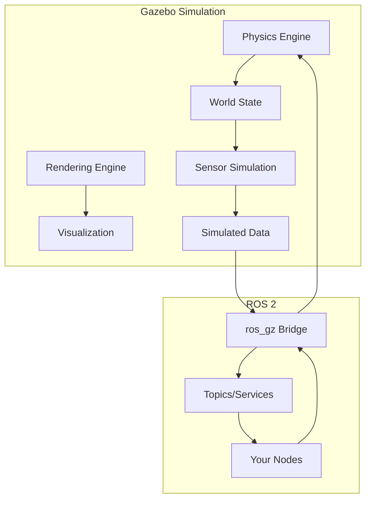

# Chapter 6: Gazebo & Physics Simulation

## Learning Objectives

By the end of this chapter, you will be able to:

- Set up Gazebo simulation environments with ROS 2
- Create world files with realistic physics properties
- Spawn and control robot models in simulation
- Implement sensor plugins for cameras, LIDAR, and IMU
- Bridge Gazebo and ROS 2 for seamless communication
- Design test environments for algorithm development

## Prerequisites

- Completed [Module 1: ROS 2 Fundamentals](/module-1-ros2/ch01-welcome-first-node)
- Gazebo Harmonic or Fortress installed
- Understanding of basic physics concepts (mass, friction, inertia)

---

## 6.1 Introduction to Gazebo

**Gazebo** is a powerful physics simulator for robotics that enables testing algorithms in realistic virtual environments before deploying to real hardware.



### Why Simulate?

| Benefit | Description |
|---------|-------------|
| **Safety** | Test dangerous scenarios without risk |
| **Cost** | No hardware wear, unlimited testing |
| **Speed** | Run faster than real-time, parallelize |
| **Reproducibility** | Exact conditions every run |
| **Edge Cases** | Simulate rare events on demand |

### Gazebo Versions

| Version | ROS 2 Support | Status |
|---------|---------------|--------|
| Gazebo Classic (11) | Humble | Legacy |
| Gazebo Fortress | Humble | LTS until 2026 |
| Gazebo Harmonic | Jazzy/Rolling | Current |

This chapter uses **Gazebo Harmonic** with the `ros_gz` bridge.

---

## 6.2 Installation and Setup

### Installing Gazebo Harmonic

```bash
# Add Gazebo repository
sudo wget https://packages.osrfoundation.org/gazebo.gpg -O /usr/share/keyrings/pkgs-osrf-archive-keyring.gpg
echo "deb [arch=$(dpkg --print-architecture) signed-by=/usr/share/keyrings/pkgs-osrf-archive-keyring.gpg] http://packages.osrfoundation.org/gazebo/ubuntu-stable $(lsb_release -cs) main" | sudo tee /etc/apt/sources.list.d/gazebo-stable.list > /dev/null

# Install Gazebo Harmonic
sudo apt update
sudo apt install gz-harmonic

# Install ROS 2 bridge
sudo apt install ros-humble-ros-gz
```

### Verify Installation

```bash
# Launch empty Gazebo world
gz sim empty.sdf

# Check available worlds
gz sim -l

# Test ros_gz bridge
ros2 run ros_gz_bridge parameter_bridge --help
```

---

## 6.3 Creating World Files

Gazebo worlds are defined in **SDF (Simulation Description Format)** files.

### Basic World Structure

```xml
<?xml version="1.0"?>
<sdf version="1.9">
  <world name="robot_lab">

    <!-- Physics configuration -->
    <physics name="default_physics" type="ode">
      <max_step_size>0.001</max_step_size>
      <real_time_factor>1.0</real_time_factor>
      <real_time_update_rate>1000</real_time_update_rate>
    </physics>

    <!-- Lighting -->
    <light type="directional" name="sun">
      <cast_shadows>true</cast_shadows>
      <pose>0 0 10 0 0 0</pose>
      <diffuse>0.8 0.8 0.8 1</diffuse>
      <specular>0.2 0.2 0.2 1</specular>
      <direction>-0.5 0.1 -0.9</direction>
    </light>

    <!-- Ground plane -->
    <model name="ground_plane">
      <static>true</static>
      <link name="link">
        <collision name="collision">
          <geometry>
            <plane>
              <normal>0 0 1</normal>
              <size>100 100</size>
            </plane>
          </geometry>
          <surface>
            <friction>
              <ode>
                <mu>0.8</mu>
                <mu2>0.8</mu2>
              </ode>
            </friction>
          </surface>
        </collision>
        <visual name="visual">
          <geometry>
            <plane>
              <normal>0 0 1</normal>
              <size>100 100</size>
            </plane>
          </geometry>
          <material>
            <ambient>0.8 0.8 0.8 1</ambient>
            <diffuse>0.8 0.8 0.8 1</diffuse>
          </material>
        </visual>
      </link>
    </model>

    <!-- Gravity -->
    <gravity>0 0 -9.81</gravity>

    <!-- Scene configuration -->
    <scene>
      <ambient>0.4 0.4 0.4 1</ambient>
      <background>0.7 0.7 0.7 1</background>
      <shadows>true</shadows>
    </scene>

  </world>
</sdf>
```

### Adding Objects to the World

```xml
<!-- Inside <world> tags -->

<!-- Simple box obstacle -->
<model name="box_obstacle">
  <static>true</static>
  <pose>2 0 0.5 0 0 0</pose>
  <link name="link">
    <collision name="collision">
      <geometry>
        <box><size>1 1 1</size></box>
      </geometry>
    </collision>
    <visual name="visual">
      <geometry>
        <box><size>1 1 1</size></box>
      </geometry>
      <material>
        <ambient>0.8 0.2 0.2 1</ambient>
        <diffuse>0.8 0.2 0.2 1</diffuse>
      </material>
    </visual>
  </link>
</model>

<!-- Cylinder (dynamic - can be pushed) -->
<model name="cylinder">
  <pose>3 2 0.5 0 0 0</pose>
  <link name="link">
    <inertial>
      <mass>5.0</mass>
      <inertia>
        <ixx>0.1</ixx><iyy>0.1</iyy><izz>0.1</izz>
      </inertia>
    </inertial>
    <collision name="collision">
      <geometry>
        <cylinder><radius>0.3</radius><length>1.0</length></cylinder>
      </geometry>
    </collision>
    <visual name="visual">
      <geometry>
        <cylinder><radius>0.3</radius><length>1.0</length></cylinder>
      </geometry>
      <material>
        <ambient>0.2 0.2 0.8 1</ambient>
        <diffuse>0.2 0.2 0.8 1</diffuse>
      </material>
    </visual>
  </link>
</model>

<!-- Wall -->
<model name="wall">
  <static>true</static>
  <pose>5 0 1 0 0 0</pose>
  <link name="link">
    <collision name="collision">
      <geometry>
        <box><size>0.2 10 2</size></box>
      </geometry>
    </collision>
    <visual name="visual">
      <geometry>
        <box><size>0.2 10 2</size></box>
      </geometry>
      <material>
        <ambient>0.6 0.6 0.6 1</ambient>
      </material>
    </visual>
  </link>
</model>
```

### Physics Properties

Configure realistic physics behavior:

```xml
<physics name="high_accuracy" type="ode">
  <!-- Simulation step size (smaller = more accurate, slower) -->
  <max_step_size>0.0005</max_step_size>

  <!-- Real-time factor (1.0 = real-time, 2.0 = 2x faster) -->
  <real_time_factor>1.0</real_time_factor>

  <!-- Physics engine configuration -->
  <ode>
    <solver>
      <type>quick</type>
      <iters>100</iters>
      <sor>1.3</sor>
    </solver>
    <constraints>
      <cfm>0.0</cfm>
      <erp>0.2</erp>
      <contact_max_correcting_vel>100</contact_max_correcting_vel>
      <contact_surface_layer>0.001</contact_surface_layer>
    </constraints>
  </ode>
</physics>
```

---

## 6.4 Robot Models in Gazebo

### Converting URDF to SDF

Gazebo uses SDF, but can import URDF with `gz sdf`:

```bash
# Convert URDF to SDF
gz sdf -p robot.urdf > robot.sdf

# Or use xacro output directly
xacro robot.urdf.xacro | gz sdf -p /dev/stdin > robot.sdf
```

### Adding Gazebo Tags to URDF

Enhance URDF with Gazebo-specific properties:

```xml
<?xml version="1.0"?>
<robot xmlns:xacro="http://www.ros.org/wiki/xacro" name="humanoid">

  <!-- ... URDF content ... -->

  <!-- Gazebo material colors -->
  <gazebo reference="torso_link">
    <material>Gazebo/White</material>
    <mu1>0.8</mu1>
    <mu2>0.8</mu2>
  </gazebo>

  <gazebo reference="left_foot">
    <material>Gazebo/Black</material>
    <mu1>1.0</mu1>  <!-- High friction for feet -->
    <mu2>1.0</mu2>
    <kp>1000000.0</kp>  <!-- Contact stiffness -->
    <kd>100.0</kd>      <!-- Contact damping -->
  </gazebo>

  <!-- Joint friction and damping -->
  <gazebo reference="left_hip_pitch">
    <implicitSpringDamper>true</implicitSpringDamper>
    <provideFeedback>true</provideFeedback>
  </gazebo>

  <!-- ros2_control for Gazebo -->
  <ros2_control name="GazeboSystem" type="system">
    <hardware>
      <plugin>gz_ros2_control/GazeboSimSystem</plugin>
    </hardware>

    <joint name="left_hip_pitch">
      <command_interface name="effort">
        <param name="min">-100</param>
        <param name="max">100</param>
      </command_interface>
      <state_interface name="position"/>
      <state_interface name="velocity"/>
      <state_interface name="effort"/>
    </joint>

    <!-- Repeat for all joints -->
  </ros2_control>

  <!-- Gazebo ros2_control plugin -->
  <gazebo>
    <plugin filename="gz_ros2_control-system" name="gz_ros2_control::GazeboSimROS2ControlPlugin">
      <parameters>$(find my_robot)/config/controllers.yaml</parameters>
    </plugin>
  </gazebo>

</robot>
```

### Spawning Robots

Create a launch file to spawn robots:

```python
# launch/spawn_robot.launch.py
from launch import LaunchDescription
from launch.actions import DeclareLaunchArgument, IncludeLaunchDescription
from launch.substitutions import LaunchConfiguration, PathJoinSubstitution, Command
from launch_ros.actions import Node
from launch_ros.substitutions import FindPackageShare
from launch.launch_description_sources import PythonLaunchDescriptionSource


def generate_launch_description():
    pkg_share = FindPackageShare('my_robot_gazebo')

    # Launch arguments
    world_arg = DeclareLaunchArgument(
        'world',
        default_value='robot_lab.sdf',
        description='World file to load'
    )

    # Robot description
    robot_description = Command([
        'xacro ',
        PathJoinSubstitution([pkg_share, 'urdf', 'humanoid.urdf.xacro'])
    ])

    # Gazebo
    gazebo = IncludeLaunchDescription(
        PythonLaunchDescriptionSource([
            PathJoinSubstitution([
                FindPackageShare('ros_gz_sim'),
                'launch',
                'gz_sim.launch.py'
            ])
        ]),
        launch_arguments={
            'gz_args': ['-r ', LaunchConfiguration('world')]
        }.items()
    )

    # Spawn robot
    spawn_robot = Node(
        package='ros_gz_sim',
        executable='create',
        arguments=[
            '-name', 'humanoid',
            '-topic', 'robot_description',
            '-x', '0', '-y', '0', '-z', '0.5'
        ],
        output='screen'
    )

    # Robot state publisher
    robot_state_publisher = Node(
        package='robot_state_publisher',
        executable='robot_state_publisher',
        parameters=[{'robot_description': robot_description}]
    )

    return LaunchDescription([
        world_arg,
        gazebo,
        robot_state_publisher,
        spawn_robot,
    ])
```

---

## 6.5 Sensor Plugins

### Camera Sensor

Add a camera to your robot in URDF:

```xml
<!-- Camera link and joint (in URDF) -->
<link name="camera_link">
  <visual>
    <geometry><box size="0.02 0.06 0.02"/></geometry>
  </visual>
</link>

<joint name="camera_joint" type="fixed">
  <parent link="head_link"/>
  <child link="camera_link"/>
  <origin xyz="0.1 0 0" rpy="0 0 0"/>
</joint>

<!-- Gazebo camera plugin -->
<gazebo reference="camera_link">
  <sensor name="camera" type="camera">
    <always_on>true</always_on>
    <update_rate>30</update_rate>
    <visualize>true</visualize>

    <camera name="head_camera">
      <horizontal_fov>1.3962634</horizontal_fov>
      <image>
        <width>640</width>
        <height>480</height>
        <format>R8G8B8</format>
      </image>
      <clip>
        <near>0.02</near>
        <far>100</far>
      </clip>
      <noise>
        <type>gaussian</type>
        <mean>0.0</mean>
        <stddev>0.007</stddev>
      </noise>
    </camera>

    <plugin filename="gz-sim-sensors-system"
            name="gz::sim::systems::Sensors">
      <render_engine>ogre2</render_engine>
    </plugin>
  </sensor>
</gazebo>
```

### LIDAR Sensor

```xml
<gazebo reference="lidar_link">
  <sensor name="lidar" type="gpu_lidar">
    <always_on>true</always_on>
    <update_rate>10</update_rate>
    <visualize>true</visualize>

    <lidar>
      <scan>
        <horizontal>
          <samples>640</samples>
          <resolution>1</resolution>
          <min_angle>-3.14159</min_angle>
          <max_angle>3.14159</max_angle>
        </horizontal>
        <vertical>
          <samples>16</samples>
          <resolution>1</resolution>
          <min_angle>-0.26</min_angle>
          <max_angle>0.26</max_angle>
        </vertical>
      </scan>
      <range>
        <min>0.1</min>
        <max>100</max>
        <resolution>0.01</resolution>
      </range>
      <noise>
        <type>gaussian</type>
        <mean>0</mean>
        <stddev>0.01</stddev>
      </noise>
    </lidar>

    <plugin filename="gz-sim-sensors-system"
            name="gz::sim::systems::Sensors">
      <render_engine>ogre2</render_engine>
    </plugin>
  </sensor>
</gazebo>
```

### IMU Sensor

```xml
<gazebo reference="imu_link">
  <sensor name="imu" type="imu">
    <always_on>true</always_on>
    <update_rate>200</update_rate>

    <imu>
      <angular_velocity>
        <x>
          <noise type="gaussian">
            <mean>0</mean>
            <stddev>0.0001</stddev>
          </noise>
        </x>
        <y>
          <noise type="gaussian">
            <mean>0</mean>
            <stddev>0.0001</stddev>
          </noise>
        </y>
        <z>
          <noise type="gaussian">
            <mean>0</mean>
            <stddev>0.0001</stddev>
          </noise>
        </z>
      </angular_velocity>
      <linear_acceleration>
        <x>
          <noise type="gaussian">
            <mean>0</mean>
            <stddev>0.001</stddev>
          </noise>
        </x>
        <y>
          <noise type="gaussian">
            <mean>0</mean>
            <stddev>0.001</stddev>
          </noise>
        </y>
        <z>
          <noise type="gaussian">
            <mean>0</mean>
            <stddev>0.001</stddev>
          </noise>
        </z>
      </linear_acceleration>
    </imu>

    <plugin filename="gz-sim-imu-system"
            name="gz::sim::systems::Imu"/>
  </sensor>
</gazebo>
```

---

## 6.6 ROS 2 Bridge

The `ros_gz_bridge` connects Gazebo topics to ROS 2.

### Bridge Configuration

```yaml
# config/bridge.yaml
---
- ros_topic_name: "/camera/image_raw"
  gz_topic_name: "/world/robot_lab/model/humanoid/link/camera_link/sensor/camera/image"
  ros_type_name: "sensor_msgs/msg/Image"
  gz_type_name: "gz.msgs.Image"
  direction: GZ_TO_ROS

- ros_topic_name: "/camera/camera_info"
  gz_topic_name: "/world/robot_lab/model/humanoid/link/camera_link/sensor/camera/camera_info"
  ros_type_name: "sensor_msgs/msg/CameraInfo"
  gz_type_name: "gz.msgs.CameraInfo"
  direction: GZ_TO_ROS

- ros_topic_name: "/scan"
  gz_topic_name: "/world/robot_lab/model/humanoid/link/lidar_link/sensor/lidar/scan"
  ros_type_name: "sensor_msgs/msg/LaserScan"
  gz_type_name: "gz.msgs.LaserScan"
  direction: GZ_TO_ROS

- ros_topic_name: "/imu/data"
  gz_topic_name: "/world/robot_lab/model/humanoid/link/imu_link/sensor/imu/imu"
  ros_type_name: "sensor_msgs/msg/Imu"
  gz_type_name: "gz.msgs.IMU"
  direction: GZ_TO_ROS

- ros_topic_name: "/cmd_vel"
  gz_topic_name: "/model/humanoid/cmd_vel"
  ros_type_name: "geometry_msgs/msg/Twist"
  gz_type_name: "gz.msgs.Twist"
  direction: ROS_TO_GZ

- ros_topic_name: "/clock"
  gz_topic_name: "/clock"
  ros_type_name: "rosgraph_msgs/msg/Clock"
  gz_type_name: "gz.msgs.Clock"
  direction: GZ_TO_ROS
```

### Launch Bridge

```python
# launch/bridge.launch.py
from launch import LaunchDescription
from launch_ros.actions import Node
from launch.substitutions import PathJoinSubstitution
from launch_ros.substitutions import FindPackageShare


def generate_launch_description():
    pkg_share = FindPackageShare('my_robot_gazebo')

    bridge = Node(
        package='ros_gz_bridge',
        executable='parameter_bridge',
        parameters=[{
            'config_file': PathJoinSubstitution([
                pkg_share, 'config', 'bridge.yaml'
            ])
        }],
        output='screen'
    )

    return LaunchDescription([bridge])
```

### Manual Bridge Commands

```bash
# Bridge a single topic
ros2 run ros_gz_bridge parameter_bridge \
  /camera/image_raw@sensor_msgs/msg/Image@gz.msgs.Image

# Bridge clock for synchronized simulation
ros2 run ros_gz_bridge parameter_bridge \
  /clock@rosgraph_msgs/msg/Clock@gz.msgs.Clock
```

---

## 6.7 Controlling Robots in Simulation

### Velocity Commands

Control a mobile base with `cmd_vel`:

```python
#!/usr/bin/env python3
"""
teleop_sim.py - Teleoperate robot in Gazebo simulation
"""

import rclpy
from rclpy.node import Node
from geometry_msgs.msg import Twist
import sys
import termios
import tty


class TeleopSim(Node):
    """Keyboard teleoperation for simulated robot."""

    def __init__(self):
        super().__init__('teleop_sim')

        self.publisher = self.create_publisher(Twist, '/cmd_vel', 10)

        self.linear_speed = 0.5
        self.angular_speed = 1.0

        self.get_logger().info('Teleop ready. Use WASD to move, Q to quit.')

    def get_key(self):
        """Read single keypress."""
        fd = sys.stdin.fileno()
        old_settings = termios.tcgetattr(fd)
        try:
            tty.setraw(fd)
            key = sys.stdin.read(1)
        finally:
            termios.tcsetattr(fd, termios.TCSADRAIN, old_settings)
        return key

    def run(self):
        """Main teleop loop."""
        twist = Twist()

        while True:
            key = self.get_key()

            if key == 'w':
                twist.linear.x = self.linear_speed
                twist.angular.z = 0.0
            elif key == 's':
                twist.linear.x = -self.linear_speed
                twist.angular.z = 0.0
            elif key == 'a':
                twist.linear.x = 0.0
                twist.angular.z = self.angular_speed
            elif key == 'd':
                twist.linear.x = 0.0
                twist.angular.z = -self.angular_speed
            elif key == ' ':  # Space to stop
                twist.linear.x = 0.0
                twist.angular.z = 0.0
            elif key == 'q':
                break
            else:
                continue

            self.publisher.publish(twist)


def main(args=None):
    rclpy.init(args=args)
    node = TeleopSim()

    try:
        node.run()
    except KeyboardInterrupt:
        pass
    finally:
        # Stop robot
        node.publisher.publish(Twist())
        node.destroy_node()
        rclpy.shutdown()


if __name__ == '__main__':
    main()
```

### Joint Position Control

Control individual joints:

```python
#!/usr/bin/env python3
"""
joint_commander.py - Command joint positions in simulation
"""

import rclpy
from rclpy.node import Node
from trajectory_msgs.msg import JointTrajectory, JointTrajectoryPoint
from builtin_interfaces.msg import Duration


class JointCommander(Node):
    """Send joint trajectory commands to simulation."""

    def __init__(self):
        super().__init__('joint_commander')

        self.publisher = self.create_publisher(
            JointTrajectory,
            '/joint_trajectory_controller/joint_trajectory',
            10
        )

        self.joint_names = [
            'left_shoulder_pitch',
            'left_shoulder_roll',
            'left_elbow',
            'right_shoulder_pitch',
            'right_shoulder_roll',
            'right_elbow',
        ]

    def send_positions(self, positions: list, duration: float = 2.0):
        """Send joint positions with specified duration."""
        msg = JointTrajectory()
        msg.joint_names = self.joint_names

        point = JointTrajectoryPoint()
        point.positions = positions
        point.velocities = [0.0] * len(positions)
        point.time_from_start = Duration(
            sec=int(duration),
            nanosec=int((duration % 1) * 1e9)
        )

        msg.points = [point]

        self.publisher.publish(msg)
        self.get_logger().info(f'Sent joint positions: {positions}')


def main(args=None):
    rclpy.init(args=args)
    node = JointCommander()

    # Example: wave motion
    import time
    import math

    t = 0.0
    while rclpy.ok():
        positions = [
            0.5 * math.sin(t),       # left_shoulder_pitch
            0.3 * math.sin(t + 1),   # left_shoulder_roll
            0.8 + 0.3 * math.sin(t), # left_elbow
            0.5 * math.sin(t + 3.14),  # right_shoulder_pitch
            0.3 * math.sin(t + 4.14),  # right_shoulder_roll
            0.8 + 0.3 * math.sin(t + 3.14),  # right_elbow
        ]

        node.send_positions(positions, duration=0.1)

        t += 0.1
        time.sleep(0.1)
        rclpy.spin_once(node, timeout_sec=0)

    node.destroy_node()
    rclpy.shutdown()


if __name__ == '__main__':
    main()
```

---

## 6.8 Testing and Validation

### Automated Testing in Simulation

```python
#!/usr/bin/env python3
"""
test_navigation.py - Automated navigation test in Gazebo
"""

import rclpy
from rclpy.node import Node
from geometry_msgs.msg import Twist, PoseStamped
from nav_msgs.msg import Odometry
import math
import unittest


class NavigationTest(Node):
    """Test robot navigation capabilities in simulation."""

    def __init__(self):
        super().__init__('navigation_test')

        self.cmd_pub = self.create_publisher(Twist, '/cmd_vel', 10)

        self.odom_sub = self.create_subscription(
            Odometry, '/odom', self.odom_callback, 10
        )

        self.current_pose = None

    def odom_callback(self, msg: Odometry):
        """Store current pose."""
        self.current_pose = msg.pose.pose

    def drive_forward(self, distance: float, speed: float = 0.5):
        """Drive forward a specified distance."""
        if self.current_pose is None:
            return False

        start_x = self.current_pose.position.x
        start_y = self.current_pose.position.y

        twist = Twist()
        twist.linear.x = speed

        rate = self.create_rate(10)

        while rclpy.ok():
            rclpy.spin_once(self, timeout_sec=0.1)

            if self.current_pose is None:
                continue

            dx = self.current_pose.position.x - start_x
            dy = self.current_pose.position.y - start_y
            traveled = math.sqrt(dx*dx + dy*dy)

            if traveled >= distance:
                break

            self.cmd_pub.publish(twist)

        # Stop
        self.cmd_pub.publish(Twist())
        return True

    def verify_position(self, expected_x: float, expected_y: float, tolerance: float = 0.1):
        """Verify robot reached expected position."""
        if self.current_pose is None:
            return False

        dx = abs(self.current_pose.position.x - expected_x)
        dy = abs(self.current_pose.position.y - expected_y)

        return dx < tolerance and dy < tolerance


class TestNavigationSuite(unittest.TestCase):
    """Test suite for navigation."""

    @classmethod
    def setUpClass(cls):
        rclpy.init()
        cls.node = NavigationTest()

    @classmethod
    def tearDownClass(cls):
        cls.node.destroy_node()
        rclpy.shutdown()

    def test_drive_forward_1m(self):
        """Test driving forward 1 meter."""
        # Wait for simulation to stabilize
        import time
        time.sleep(2.0)

        # Drive forward
        success = self.node.drive_forward(1.0)
        self.assertTrue(success)

        # Verify position (assuming started at origin)
        # Note: actual verification depends on starting position
        self.assertIsNotNone(self.node.current_pose)


if __name__ == '__main__':
    unittest.main()
```

### Recording Simulation Data

```bash
# Record all topics during simulation
ros2 bag record -a -o simulation_test

# Record specific topics
ros2 bag record -o sensor_data \
  /camera/image_raw \
  /scan \
  /imu/data \
  /odom \
  /joint_states

# Play back recorded data
ros2 bag play simulation_test
```

---

## Lab Exercise

Complete the hands-on lab in [`labs/module-2/ch06-gazebo-world/`](https://github.com/physical-ai-textbook/physical-ai-textbook/tree/main/labs/module-2/ch06-gazebo-world) where you will:

1. Create a custom world with obstacles and terrain
2. Add your humanoid robot model with sensors
3. Configure the ros_gz bridge for all sensors
4. Implement a simple obstacle avoidance behavior
5. Record and analyze simulation data

**Estimated time**: 90-120 minutes

---

## Summary

In this chapter, you learned:

- **Gazebo setup**: Installing and configuring Gazebo Harmonic with ROS 2
- **World creation**: SDF format, physics properties, and environment design
- **Robot integration**: Spawning URDF models and adding Gazebo-specific properties
- **Sensor plugins**: Camera, LIDAR, and IMU simulation with realistic noise
- **ROS 2 bridge**: Connecting Gazebo topics to ROS 2 for seamless integration
- **Control**: Velocity commands and joint trajectory control
- **Testing**: Automated testing and data recording in simulation

Simulation is essential for safe, rapid development of robotic algorithms before real-world deployment.

---

## Further Reading

- [Gazebo Documentation](https://gazebosim.org/docs)
- [SDF Specification](http://sdformat.org/spec)
- [ros_gz Bridge](https://github.com/gazebosim/ros_gz)
- [gz_ros2_control](https://github.com/ros-controls/gz_ros2_control)
- [Gazebo Tutorials](https://gazebosim.org/docs/latest/tutorials)
