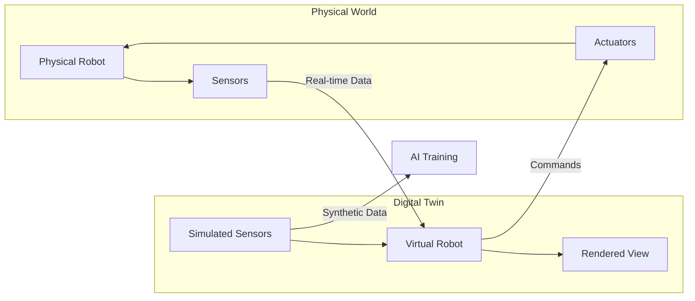
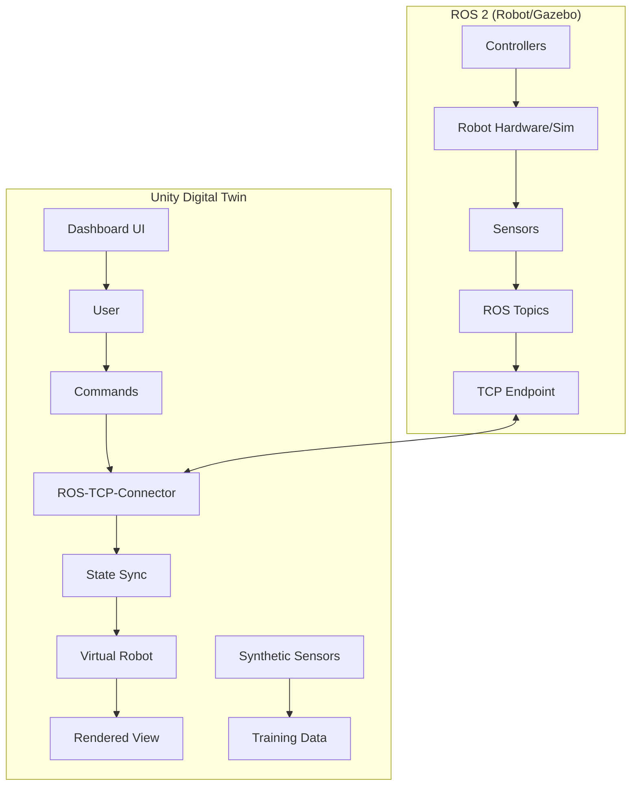

# Chapter 7: Unity Digital Twin Capstone

## Learning Objectives

By the end of this chapter, you will be able to:

- Set up Unity for robotics simulation and visualization
- Integrate Unity with ROS 2 via Unity Robotics Hub
- Create photorealistic environments for training and testing
- Implement real-time synchronization between physical and digital twins
- Build interactive visualization dashboards
- Complete a capstone project integrating all Module 2 concepts

## Prerequisites

- Completed [Chapter 6: Gazebo & Physics Simulation](/module-2-digital-twin/ch06-gazebo-physics)
- Unity 2022 LTS or later installed
- Basic C# programming knowledge
- Understanding of 3D graphics concepts

---

## 7.1 Introduction to Digital Twins

A **digital twin** is a virtual replica of a physical system that mirrors its state in real-time. Unlike pure simulation, digital twins maintain a bidirectional connection with their physical counterparts.



### Why Unity for Digital Twins?

| Feature | Gazebo | Unity |
|---------|--------|-------|
| Physics | ODE/Bullet (accurate) | PhysX (good) |
| Rendering | Basic/Ogre | High-fidelity (HDRP/URP) |
| Domain Randomization | Limited | Extensive |
| Asset Ecosystem | Small | Massive (Asset Store) |
| ML Integration | ROS 2 based | ML-Agents, Barracuda |
| VR/AR Support | Limited | Native |
| Performance | Good | Excellent (GPU) |

Unity excels at:
- **Photorealistic visualization** for stakeholders and debugging
- **Synthetic data generation** for AI training
- **Domain randomization** for robust perception models
- **VR/AR interfaces** for remote operation and training

---

## 7.2 Unity Setup for Robotics

### Installation

1. Download **Unity Hub** from [unity.com](https://unity.com/download)
2. Install **Unity 2022.3 LTS** or later
3. Create a new **3D (URP)** or **3D (HDRP)** project

### Installing Unity Robotics Packages

Open the Package Manager (Window → Package Manager) and add packages by git URL:

```
# ROS-TCP-Connector (ROS 2 communication)
https://github.com/Unity-Technologies/ROS-TCP-Connector.git?path=/com.unity.robotics.ros-tcp-connector

# URDF Importer
https://github.com/Unity-Technologies/URDF-Importer.git?path=/com.unity.robotics.urdf-importer

# Visualizations (optional)
https://github.com/Unity-Technologies/ROS-TCP-Connector.git?path=/com.unity.robotics.visualizations
```

### Project Structure

```
Assets/
├── Robots/
│   ├── Humanoid/
│   │   ├── humanoid.urdf
│   │   ├── Meshes/
│   │   └── Materials/
├── Environments/
│   ├── Laboratory/
│   └── Warehouse/
├── Scripts/
│   ├── ROS/
│   │   ├── RobotController.cs
│   │   └── SensorPublisher.cs
│   └── UI/
│       └── Dashboard.cs
├── Prefabs/
└── Scenes/
    └── DigitalTwin.unity
```

---

## 7.3 Importing Robot Models

### URDF Import

Import your humanoid robot URDF into Unity:

1. Drag the `.urdf` file into `Assets/Robots/Humanoid/`
2. Right-click → **Import Robot from URDF**
3. Configure import settings:

```
Import Settings:
├── Axis Type: Z-Axis
├── Mesh Decomposer: VHACD
├── Convex Decomposition:
│   ├── Resolution: 100000
│   ├── Max Hull Vertices: 64
│   └── Skinning Width: 0.0
└── Joint Types:
    ├── Default: Physics
    └── Fixed Joints: Fixed
```

### Manual Robot Setup

For complex robots, configure joints manually:

```csharp
// Scripts/ROS/RobotSetup.cs
using UnityEngine;
using Unity.Robotics.UrdfImporter;

public class RobotSetup : MonoBehaviour
{
    [Header("Joint Configuration")]
    public ArticulationBody[] joints;

    void Start()
    {
        ConfigureJoints();
    }

    void ConfigureJoints()
    {
        foreach (var joint in joints)
        {
            // Configure joint limits
            var drive = joint.xDrive;
            drive.stiffness = 10000f;
            drive.damping = 100f;
            drive.forceLimit = float.MaxValue;
            joint.xDrive = drive;

            // Enable collision detection
            joint.linearDamping = 0.05f;
            joint.angularDamping = 0.05f;
        }
    }

    public void SetJointTarget(string jointName, float targetPosition)
    {
        var joint = System.Array.Find(joints, j => j.name == jointName);
        if (joint != null)
        {
            var drive = joint.xDrive;
            drive.target = targetPosition * Mathf.Rad2Deg;
            joint.xDrive = drive;
        }
    }
}
```

---

## 7.4 ROS 2 Integration

### ROS-TCP-Endpoint Setup

On the ROS 2 side, install and run the TCP endpoint:

```bash
# Install ROS-TCP-Endpoint
cd ~/ros2_ws/src
git clone https://github.com/Unity-Technologies/ROS-TCP-Endpoint.git -b ROS2v0.7.0
cd ..
colcon build --packages-select ros_tcp_endpoint

# Run the endpoint
ros2 run ros_tcp_endpoint default_server_endpoint --ros-args -p ROS_IP:=0.0.0.0
```

### Unity ROS Settings

Configure Unity to connect to ROS:

1. Robotics → ROS Settings
2. Set Protocol: **ROS2**
3. Set ROS IP Address: `127.0.0.1` (or robot IP)
4. Set ROS Port: `10000`

### Subscribing to ROS Topics

```csharp
// Scripts/ROS/JointStateSubscriber.cs
using UnityEngine;
using Unity.Robotics.ROSTCPConnector;
using RosMessageTypes.Sensor;

public class JointStateSubscriber : MonoBehaviour
{
    [Header("Robot Configuration")]
    public RobotSetup robotSetup;

    private ROSConnection ros;

    void Start()
    {
        ros = ROSConnection.GetOrCreateInstance();
        ros.Subscribe<JointStateMsg>("/joint_states", OnJointStateReceived);
    }

    void OnJointStateReceived(JointStateMsg msg)
    {
        for (int i = 0; i < msg.name.Length; i++)
        {
            string jointName = msg.name[i];
            float position = (float)msg.position[i];

            robotSetup.SetJointTarget(jointName, position);
        }
    }
}
```

### Publishing to ROS Topics

```csharp
// Scripts/ROS/CameraPublisher.cs
using UnityEngine;
using Unity.Robotics.ROSTCPConnector;
using RosMessageTypes.Sensor;
using RosMessageTypes.Std;

public class CameraPublisher : MonoBehaviour
{
    [Header("Camera Settings")]
    public Camera sourceCamera;
    public int imageWidth = 640;
    public int imageHeight = 480;
    public float publishRate = 30f;

    [Header("ROS Settings")]
    public string topicName = "/unity/camera/image_raw";

    private ROSConnection ros;
    private RenderTexture renderTexture;
    private Texture2D texture2D;
    private float publishInterval;
    private float timeSincePublish;

    void Start()
    {
        ros = ROSConnection.GetOrCreateInstance();
        ros.RegisterPublisher<ImageMsg>(topicName);

        // Create render texture
        renderTexture = new RenderTexture(imageWidth, imageHeight, 24);
        texture2D = new Texture2D(imageWidth, imageHeight, TextureFormat.RGB24, false);

        publishInterval = 1f / publishRate;
    }

    void Update()
    {
        timeSincePublish += Time.deltaTime;

        if (timeSincePublish >= publishInterval)
        {
            PublishImage();
            timeSincePublish = 0f;
        }
    }

    void PublishImage()
    {
        // Render camera to texture
        sourceCamera.targetTexture = renderTexture;
        sourceCamera.Render();

        // Read pixels
        RenderTexture.active = renderTexture;
        texture2D.ReadPixels(new Rect(0, 0, imageWidth, imageHeight), 0, 0);
        texture2D.Apply();

        sourceCamera.targetTexture = null;
        RenderTexture.active = null;

        // Create ROS message
        byte[] imageData = texture2D.GetRawTextureData();

        var msg = new ImageMsg
        {
            header = new HeaderMsg
            {
                stamp = new RosMessageTypes.BuiltinInterfaces.TimeMsg
                {
                    sec = (int)Time.time,
                    nanosec = (uint)((Time.time % 1) * 1e9)
                },
                frame_id = "unity_camera"
            },
            height = (uint)imageHeight,
            width = (uint)imageWidth,
            encoding = "rgb8",
            is_bigendian = 0,
            step = (uint)(imageWidth * 3),
            data = imageData
        };

        ros.Publish(topicName, msg);
    }

    void OnDestroy()
    {
        if (renderTexture != null)
            Destroy(renderTexture);
        if (texture2D != null)
            Destroy(texture2D);
    }
}
```

### Service Calls

```csharp
// Scripts/ROS/TrajectoryService.cs
using UnityEngine;
using Unity.Robotics.ROSTCPConnector;
using Unity.Robotics.ROSTCPConnector.ROSGeometry;
using RosMessageTypes.Geometry;

public class TrajectoryService : MonoBehaviour
{
    private ROSConnection ros;

    void Start()
    {
        ros = ROSConnection.GetOrCreateInstance();
    }

    public void RequestTrajectory(Vector3 targetPosition, System.Action<bool> callback)
    {
        var request = new RosMessageTypes.MyRobot.ComputeTrajectoryRequest
        {
            target_pose = new PoseMsg
            {
                position = targetPosition.To<FLU>(),
                orientation = Quaternion.identity.To<FLU>()
            }
        };

        ros.SendServiceMessage<RosMessageTypes.MyRobot.ComputeTrajectoryResponse>(
            "/compute_trajectory",
            request,
            (response) => {
                callback(response.success);
            }
        );
    }
}
```

---

## 7.5 Creating Photorealistic Environments

### High Definition Render Pipeline (HDRP)

For maximum visual fidelity, use HDRP:

```
Project Settings → Graphics:
├── Scriptable Render Pipeline: HDRenderPipelineAsset
├── Quality Settings:
│   ├── Shadows: Ultra
│   ├── Reflection Probes: High
│   └── Screen Space Reflections: Enabled
```

### Lighting Setup

```csharp
// Scripts/Environment/LightingController.cs
using UnityEngine;
using UnityEngine.Rendering;
using UnityEngine.Rendering.HighDefinition;

public class LightingController : MonoBehaviour
{
    [Header("Sun")]
    public Light sunLight;
    public float timeOfDay = 12f; // 0-24

    [Header("Domain Randomization")]
    public bool randomizeLighting = false;
    public float intensityMin = 0.5f;
    public float intensityMax = 2f;

    [Header("Volume")]
    public Volume postProcessVolume;

    void Update()
    {
        UpdateSunPosition();
    }

    void UpdateSunPosition()
    {
        float sunAngle = (timeOfDay / 24f) * 360f - 90f;
        sunLight.transform.rotation = Quaternion.Euler(sunAngle, 170f, 0f);

        // Adjust color temperature based on time
        float normalizedTime = timeOfDay / 24f;
        if (normalizedTime < 0.25f || normalizedTime > 0.75f)
        {
            // Night/dawn/dusk - warmer colors
            sunLight.colorTemperature = Mathf.Lerp(2000f, 6500f,
                Mathf.Abs(normalizedTime - 0.5f) * 4f);
        }
        else
        {
            sunLight.colorTemperature = 6500f; // Daylight
        }
    }

    public void RandomizeLightingConditions()
    {
        if (!randomizeLighting) return;

        // Random time of day
        timeOfDay = Random.Range(6f, 18f);

        // Random intensity
        sunLight.intensity = Random.Range(intensityMin, intensityMax);

        // Random cloud coverage (if using volumetric clouds)
        var profile = postProcessVolume.profile;
        if (profile.TryGet<VolumetricClouds>(out var clouds))
        {
            clouds.cloudPreset.value = (VolumetricClouds.CloudPresets)Random.Range(0, 5);
        }
    }
}
```

### Material Randomization for Domain Randomization

```csharp
// Scripts/Environment/MaterialRandomizer.cs
using UnityEngine;
using System.Collections.Generic;

public class MaterialRandomizer : MonoBehaviour
{
    [System.Serializable]
    public class RandomizableObject
    {
        public Renderer renderer;
        public Material[] possibleMaterials;
        public bool randomizeColor = true;
        public Color colorRangeMin = Color.gray;
        public Color colorRangeMax = Color.white;
    }

    public List<RandomizableObject> objects = new List<RandomizableObject>();

    [Header("Randomization Settings")]
    public bool randomizeOnStart = true;
    public float randomizationInterval = 0f; // 0 = once, >0 = periodic

    void Start()
    {
        if (randomizeOnStart)
        {
            RandomizeAll();
        }

        if (randomizationInterval > 0)
        {
            InvokeRepeating(nameof(RandomizeAll), randomizationInterval, randomizationInterval);
        }
    }

    public void RandomizeAll()
    {
        foreach (var obj in objects)
        {
            // Randomize material
            if (obj.possibleMaterials.Length > 0)
            {
                int index = Random.Range(0, obj.possibleMaterials.Length);
                obj.renderer.material = obj.possibleMaterials[index];
            }

            // Randomize color
            if (obj.randomizeColor)
            {
                Color randomColor = new Color(
                    Random.Range(obj.colorRangeMin.r, obj.colorRangeMax.r),
                    Random.Range(obj.colorRangeMin.g, obj.colorRangeMax.g),
                    Random.Range(obj.colorRangeMin.b, obj.colorRangeMax.b)
                );
                obj.renderer.material.color = randomColor;
            }
        }
    }
}
```

---

## 7.6 Real-Time Synchronization

### State Synchronization

```csharp
// Scripts/ROS/TwinSynchronizer.cs
using UnityEngine;
using Unity.Robotics.ROSTCPConnector;
using RosMessageTypes.Sensor;
using RosMessageTypes.Nav;
using System.Collections.Generic;

public class TwinSynchronizer : MonoBehaviour
{
    [Header("Robot")]
    public Transform robotBase;
    public ArticulationBody[] joints;

    [Header("Sync Settings")]
    public float positionLerpSpeed = 10f;
    public float rotationLerpSpeed = 10f;
    public float jointLerpSpeed = 20f;

    [Header("Status")]
    public bool isSynchronized = false;
    public float lastUpdateTime;

    private ROSConnection ros;
    private Dictionary<string, ArticulationBody> jointDict;

    // Target states
    private Vector3 targetPosition;
    private Quaternion targetRotation;
    private Dictionary<string, float> targetJointPositions;

    void Start()
    {
        ros = ROSConnection.GetOrCreateInstance();

        // Subscribe to state topics
        ros.Subscribe<OdometryMsg>("/odom", OnOdometryReceived);
        ros.Subscribe<JointStateMsg>("/joint_states", OnJointStateReceived);

        // Build joint dictionary
        jointDict = new Dictionary<string, ArticulationBody>();
        foreach (var joint in joints)
        {
            jointDict[joint.name] = joint;
        }

        targetJointPositions = new Dictionary<string, float>();
        targetPosition = robotBase.position;
        targetRotation = robotBase.rotation;
    }

    void OnOdometryReceived(OdometryMsg msg)
    {
        // Convert ROS coordinates to Unity
        targetPosition = new Vector3(
            (float)msg.pose.pose.position.x,
            (float)msg.pose.pose.position.z,
            (float)msg.pose.pose.position.y
        );

        targetRotation = new Quaternion(
            -(float)msg.pose.pose.orientation.x,
            -(float)msg.pose.pose.orientation.z,
            -(float)msg.pose.pose.orientation.y,
            (float)msg.pose.pose.orientation.w
        );

        lastUpdateTime = Time.time;
        isSynchronized = true;
    }

    void OnJointStateReceived(JointStateMsg msg)
    {
        for (int i = 0; i < msg.name.Length; i++)
        {
            targetJointPositions[msg.name[i]] = (float)msg.position[i];
        }
    }

    void Update()
    {
        // Check sync status
        if (Time.time - lastUpdateTime > 1f)
        {
            isSynchronized = false;
        }

        // Interpolate robot base
        robotBase.position = Vector3.Lerp(
            robotBase.position,
            targetPosition,
            Time.deltaTime * positionLerpSpeed
        );

        robotBase.rotation = Quaternion.Slerp(
            robotBase.rotation,
            targetRotation,
            Time.deltaTime * rotationLerpSpeed
        );

        // Interpolate joints
        foreach (var kvp in targetJointPositions)
        {
            if (jointDict.TryGetValue(kvp.Key, out var joint))
            {
                var drive = joint.xDrive;
                drive.target = Mathf.Lerp(
                    drive.target,
                    kvp.Value * Mathf.Rad2Deg,
                    Time.deltaTime * jointLerpSpeed
                );
                joint.xDrive = drive;
            }
        }
    }
}
```

### Latency Compensation

```csharp
// Scripts/ROS/LatencyCompensator.cs
using UnityEngine;
using System.Collections.Generic;

public class LatencyCompensator : MonoBehaviour
{
    [Header("Settings")]
    public float bufferTime = 0.1f; // 100ms buffer
    public int maxBufferSize = 100;

    [Header("Debug")]
    public float estimatedLatency;

    private Queue<TimestampedState> stateBuffer = new Queue<TimestampedState>();

    public struct TimestampedState
    {
        public float timestamp;
        public Vector3 position;
        public Quaternion rotation;
        public float[] jointPositions;
    }

    public void AddState(TimestampedState state)
    {
        stateBuffer.Enqueue(state);

        // Remove old states
        while (stateBuffer.Count > maxBufferSize)
        {
            stateBuffer.Dequeue();
        }
    }

    public TimestampedState GetInterpolatedState(float targetTime)
    {
        // Find states bracketing target time
        TimestampedState before = default;
        TimestampedState after = default;
        bool foundBefore = false;

        foreach (var state in stateBuffer)
        {
            if (state.timestamp <= targetTime)
            {
                before = state;
                foundBefore = true;
            }
            else if (foundBefore)
            {
                after = state;
                break;
            }
        }

        if (!foundBefore)
        {
            return stateBuffer.Count > 0 ? stateBuffer.Peek() : default;
        }

        // Interpolate between states
        float t = (targetTime - before.timestamp) / (after.timestamp - before.timestamp);
        t = Mathf.Clamp01(t);

        return new TimestampedState
        {
            timestamp = targetTime,
            position = Vector3.Lerp(before.position, after.position, t),
            rotation = Quaternion.Slerp(before.rotation, after.rotation, t),
            jointPositions = InterpolateJoints(before.jointPositions, after.jointPositions, t)
        };
    }

    private float[] InterpolateJoints(float[] a, float[] b, float t)
    {
        if (a == null || b == null) return a ?? b;

        float[] result = new float[a.Length];
        for (int i = 0; i < a.Length; i++)
        {
            result[i] = Mathf.Lerp(a[i], b[i], t);
        }
        return result;
    }
}
```

---

## 7.7 Visualization Dashboard

### Dashboard UI

```csharp
// Scripts/UI/Dashboard.cs
using UnityEngine;
using UnityEngine.UI;
using TMPro;
using Unity.Robotics.ROSTCPConnector;
using RosMessageTypes.Diagnostic;

public class Dashboard : MonoBehaviour
{
    [Header("Connection Status")]
    public Image connectionIndicator;
    public TMP_Text connectionStatus;
    public Color connectedColor = Color.green;
    public Color disconnectedColor = Color.red;

    [Header("Robot Status")]
    public TMP_Text positionText;
    public TMP_Text velocityText;
    public TMP_Text batteryText;
    public Slider batterySlider;

    [Header("Sensor Displays")]
    public RawImage cameraFeed;
    public TMP_Text imuText;
    public TMP_Text lidarText;

    [Header("Joint Display")]
    public Transform jointPanelParent;
    public GameObject jointDisplayPrefab;

    [Header("Diagnostics")]
    public TMP_Text diagnosticsText;
    public ScrollRect diagnosticsScroll;

    private ROSConnection ros;
    private RenderTexture cameraTexture;

    void Start()
    {
        ros = ROSConnection.GetOrCreateInstance();

        // Subscribe to diagnostics
        ros.Subscribe<DiagnosticArrayMsg>("/diagnostics", OnDiagnosticsReceived);

        // Setup camera feed texture
        cameraTexture = new RenderTexture(640, 480, 24);
        cameraFeed.texture = cameraTexture;
    }

    void Update()
    {
        // Update connection status
        bool isConnected = ros != null && ros.HasConnectionThread;
        connectionIndicator.color = isConnected ? connectedColor : disconnectedColor;
        connectionStatus.text = isConnected ? "Connected" : "Disconnected";
    }

    public void UpdatePosition(Vector3 position, Quaternion rotation)
    {
        positionText.text = $"Position: ({position.x:F2}, {position.y:F2}, {position.z:F2})\n" +
                           $"Rotation: ({rotation.eulerAngles.x:F1}, {rotation.eulerAngles.y:F1}, {rotation.eulerAngles.z:F1})";
    }

    public void UpdateVelocity(Vector3 linear, Vector3 angular)
    {
        velocityText.text = $"Linear: {linear.magnitude:F2} m/s\n" +
                           $"Angular: {angular.magnitude:F2} rad/s";
    }

    public void UpdateBattery(float percentage)
    {
        batteryText.text = $"Battery: {percentage:F0}%";
        batterySlider.value = percentage / 100f;

        // Color based on level
        var fillImage = batterySlider.fillRect.GetComponent<Image>();
        if (percentage > 50)
            fillImage.color = Color.green;
        else if (percentage > 20)
            fillImage.color = Color.yellow;
        else
            fillImage.color = Color.red;
    }

    public void UpdateIMU(Vector3 orientation, Vector3 angularVelocity, Vector3 linearAcceleration)
    {
        imuText.text = $"Orientation: ({orientation.x:F1}, {orientation.y:F1}, {orientation.z:F1})\n" +
                      $"Angular Vel: ({angularVelocity.x:F2}, {angularVelocity.y:F2}, {angularVelocity.z:F2})\n" +
                      $"Linear Acc: ({linearAcceleration.x:F2}, {linearAcceleration.y:F2}, {linearAcceleration.z:F2})";
    }

    void OnDiagnosticsReceived(DiagnosticArrayMsg msg)
    {
        string text = "";
        foreach (var status in msg.status)
        {
            string icon = status.level switch
            {
                0 => "[OK]",
                1 => "[WARN]",
                2 => "[ERROR]",
                _ => "[?]"
            };
            text += $"{icon} {status.name}: {status.message}\n";
        }
        diagnosticsText.text = text;
    }
}
```

### 3D Overlays

```csharp
// Scripts/UI/RobotOverlay.cs
using UnityEngine;
using TMPro;

public class RobotOverlay : MonoBehaviour
{
    [Header("Target")]
    public Transform robotTransform;
    public Vector3 offset = new Vector3(0, 2, 0);

    [Header("UI Elements")]
    public TMP_Text nameLabel;
    public TMP_Text statusLabel;
    public SpriteRenderer statusIndicator;

    [Header("Colors")]
    public Color normalColor = Color.green;
    public Color warningColor = Color.yellow;
    public Color errorColor = Color.red;

    private Camera mainCamera;

    void Start()
    {
        mainCamera = Camera.main;
    }

    void LateUpdate()
    {
        // Billboard - always face camera
        transform.position = robotTransform.position + offset;
        transform.LookAt(mainCamera.transform);
        transform.Rotate(0, 180, 0); // Flip to face camera
    }

    public void SetStatus(string status, int level)
    {
        statusLabel.text = status;

        statusIndicator.color = level switch
        {
            0 => normalColor,
            1 => warningColor,
            _ => errorColor
        };
    }
}
```

---

## 7.8 Capstone Project: Complete Digital Twin

### Project Requirements

Build a complete digital twin system that:

1. **Synchronizes** with a physical or simulated robot in real-time
2. **Visualizes** all sensor data (camera, LIDAR, IMU)
3. **Provides** an interactive dashboard for monitoring
4. **Supports** domain randomization for training data
5. **Enables** bidirectional control

### System Architecture



### Implementation Checklist

```markdown
## Capstone Requirements

### Environment Design (20 points)
- [ ] (5) Photorealistic laboratory environment
- [ ] (5) Proper lighting with shadows
- [ ] (5) Domain randomization for materials/lighting
- [ ] (5) Multiple camera viewpoints

### ROS 2 Integration (25 points)
- [ ] (10) Bidirectional communication via ROS-TCP-Connector
- [ ] (5) Joint state synchronization at 50+ Hz
- [ ] (5) Odometry synchronization
- [ ] (5) Service calls for trajectory planning

### Physics Accuracy (20 points)
- [ ] (10) Robot model matches physical/Gazebo dimensions
- [ ] (5) Joint limits and dynamics configured
- [ ] (5) Collision detection working

### Visualization Quality (20 points)
- [ ] (5) Real-time camera feed display
- [ ] (5) 3D LIDAR point cloud visualization
- [ ] (5) IMU orientation indicator
- [ ] (5) Joint position gauges

### Documentation (15 points)
- [ ] (5) README with setup instructions
- [ ] (5) Architecture diagram
- [ ] (5) Video demo
```

### Grading Rubric

| Criteria | Points | Description |
|----------|--------|-------------|
| **Environment Design** | 20 | Realistic, well-lit environment with randomization |
| **ROS 2 Integration** | 25 | Reliable bidirectional communication |
| **Physics Accuracy** | 20 | Model matches physical robot behavior |
| **Visualization Quality** | 20 | Clear, informative sensor displays |
| **Documentation** | 15 | Complete setup and usage instructions |
| **Total** | 100 | |

### Submission Requirements

1. **Unity Project** (zipped, excluding Library folder)
2. **ROS 2 Package** with launch files
3. **Video Demo** (3-5 minutes) showing:
   - Unity environment walkthrough
   - Real-time synchronization with robot
   - Dashboard functionality
   - Domain randomization in action
4. **Written Report** (3-4 pages):
   - Design decisions and trade-offs
   - Performance measurements (latency, frame rate)
   - Challenges and solutions

---

## Lab Exercise

Complete the hands-on lab in [`labs/module-2/ch07-unity-twin/`](https://github.com/physical-ai-textbook/physical-ai-textbook/tree/main/labs/module-2/ch07-unity-twin) where you will:

1. Set up a Unity project with ROS-TCP-Connector
2. Import your humanoid robot URDF
3. Create a laboratory environment with HDRP
4. Implement real-time state synchronization
5. Build an interactive monitoring dashboard

**Estimated time**: 3-4 hours

---

## Summary

In this chapter, you learned:

- **Unity setup**: Configuring Unity for robotics with ROS-TCP-Connector
- **URDF import**: Bringing robot models into Unity with proper physics
- **ROS 2 integration**: Subscribing, publishing, and service calls
- **Photorealistic rendering**: HDRP, lighting, and materials
- **Domain randomization**: Generating varied training data
- **Real-time sync**: Maintaining state consistency with latency compensation
- **Dashboard design**: Building informative monitoring interfaces

Digital twins enable powerful visualization, training data generation, and remote operation capabilities for physical AI systems.

---

## Further Reading

- [Unity Robotics Hub](https://github.com/Unity-Technologies/Unity-Robotics-Hub)
- [ROS-TCP-Connector](https://github.com/Unity-Technologies/ROS-TCP-Connector)
- [URDF Importer](https://github.com/Unity-Technologies/URDF-Importer)
- [Unity HDRP Documentation](https://docs.unity3d.com/Packages/com.unity.render-pipelines.high-definition@latest)
- [Domain Randomization in Unity](https://unity.com/products/machine-learning-agents)
- [ArticulationBody Documentation](https://docs.unity3d.com/Manual/class-ArticulationBody.html)
