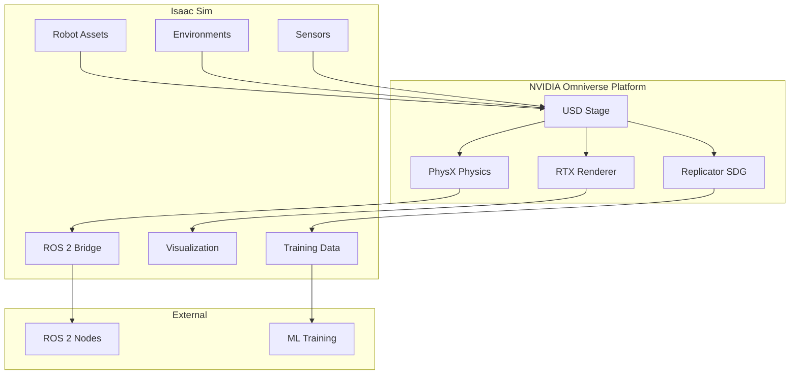

# Chapter 8: Isaac Sim Fundamentals

## Learning Objectives

By the end of this chapter, you will be able to:

- Navigate the Isaac Sim interface and understand the USD workflow
- Create robotic scenes using Omniverse primitives and assets
- Import and configure robot assets from URDF
- Write Python extensions and standalone scripts
- Utilize Isaac Sim's PhysX physics engine for accurate simulation
- Generate synthetic data for perception training

## Prerequisites

- Completed [Module 2: Digital Twin](/module-2-digital-twin/ch06-gazebo-physics)
- NVIDIA RTX GPU with 8GB+ VRAM (RTX 3080+ recommended)
- Isaac Sim 2023.1.1 or later installed
- Basic Python programming knowledge

---

## 8.1 Introduction to Isaac Sim

**NVIDIA Isaac Sim** is a robotics simulation platform built on NVIDIA Omniverse. It provides:

- **Physically accurate simulation** via PhysX 5
- **Photorealistic rendering** with ray tracing
- **Massive parallelization** for training (1000s of robots)
- **Synthetic data generation** for perception AI
- **Direct ROS 2 integration**



### Isaac Sim vs Other Simulators

| Feature | Isaac Sim | Gazebo | Unity |
|---------|-----------|--------|-------|
| Physics Engine | PhysX 5 | ODE/Bullet | PhysX |
| Ray Tracing | Native RTX | Limited | Limited |
| Parallel Sims | 1000s (GPU) | ~10s | ~100s |
| USD Support | Native | None | Plugin |
| ROS 2 Bridge | Native | ros_gz | TCP |
| Domain Randomization | Replicator | Limited | Manual |
| Target | Training/Testing | Testing | Viz/Training |

---

## 8.2 Installation and Setup

### System Requirements

| Component | Minimum | Recommended |
|-----------|---------|-------------|
| GPU | RTX 2070 | RTX 4080+ |
| VRAM | 8 GB | 16+ GB |
| RAM | 32 GB | 64 GB |
| Storage | 50 GB SSD | 100 GB NVMe |
| OS | Ubuntu 22.04 | Ubuntu 22.04 |
| Driver | 525+ | 535+ |

### Installation via Omniverse Launcher

1. Download [Omniverse Launcher](https://www.nvidia.com/en-us/omniverse/)
2. Install Isaac Sim from the Exchange tab
3. Launch Isaac Sim

### Workstation vs Container

For production and CI/CD, use the Docker container:

```bash
# Pull Isaac Sim container
docker pull nvcr.io/nvidia/isaac-sim:2023.1.1

# Run with GPU support
docker run --name isaac-sim --entrypoint bash -it --gpus all \
    -e "ACCEPT_EULA=Y" \
    -v ~/docker/isaac-sim/cache/kit:/isaac-sim/kit/cache:rw \
    -v ~/docker/isaac-sim/cache/ov:/root/.cache/ov:rw \
    -v ~/docker/isaac-sim/cache/pip:/root/.cache/pip:rw \
    -v ~/docker/isaac-sim/cache/glcache:/root/.cache/nvidia/GLCache:rw \
    -v ~/docker/isaac-sim/cache/computecache:/root/.nv/ComputeCache:rw \
    -v ~/docker/isaac-sim/logs:/root/.nvidia-omniverse/logs:rw \
    -v ~/docker/isaac-sim/data:/root/.local/share/ov/data:rw \
    -v ~/workspace:/workspace:rw \
    nvcr.io/nvidia/isaac-sim:2023.1.1
```

### Verify Installation

```bash
# In Isaac Sim terminal
cd /isaac-sim
./python.sh -c "from omni.isaac.core import World; print('Isaac Sim OK')"
```

---

## 8.3 USD and the Omniverse Workflow

Isaac Sim uses **Universal Scene Description (USD)** from Pixar as its native format.

### USD Concepts

| Concept | Description |
|---------|-------------|
| **Stage** | Root container for the scene |
| **Prim** | Any object in the scene (mesh, light, camera) |
| **Property** | Attribute of a prim (position, color) |
| **Layer** | Non-destructive override mechanism |
| **Reference** | Include external USD files |

### Creating a Simple Scene

```python
# scripts/create_scene.py
from omni.isaac.kit import SimulationApp

# Launch Isaac Sim
simulation_app = SimulationApp({"headless": False})

from omni.isaac.core import World
from omni.isaac.core.objects import DynamicCuboid, GroundPlane
from omni.isaac.core.prims import XFormPrim
import numpy as np

# Create world
world = World(stage_units_in_meters=1.0)

# Add ground plane
world.scene.add_default_ground_plane()

# Add a dynamic cube
cube = world.scene.add(
    DynamicCuboid(
        prim_path="/World/Cube",
        name="my_cube",
        position=np.array([0.0, 0.0, 1.0]),
        scale=np.array([0.2, 0.2, 0.2]),
        color=np.array([1.0, 0.0, 0.0])  # Red
    )
)

# Reset world
world.reset()

# Run simulation
while simulation_app.is_running():
    world.step(render=True)

    # Get cube position
    position, orientation = cube.get_world_pose()
    print(f"Cube position: {position}")

simulation_app.close()
```

### Running Standalone Scripts

```bash
# Run with Isaac Sim Python
cd /isaac-sim
./python.sh /path/to/create_scene.py
```

---

## 8.4 Importing Robot Models

### URDF to USD Conversion

Isaac Sim can import URDF and convert to USD:

```python
# scripts/import_robot.py
from omni.isaac.kit import SimulationApp
simulation_app = SimulationApp({"headless": False})

from omni.isaac.core import World
from omni.isaac.core.utils.stage import add_reference_to_stage
from omni.isaac.urdf import _urdf
import omni.kit.commands

# Create world
world = World()

# URDF import configuration
urdf_config = _urdf.ImportConfig()
urdf_config.merge_fixed_joints = False
urdf_config.convex_decomp = True
urdf_config.import_inertia_tensor = True
urdf_config.fix_base = False
urdf_config.make_default_prim = True
urdf_config.self_collision = False
urdf_config.create_physics_scene = True
urdf_config.default_drive_strength = 1000.0
urdf_config.default_position_drive_damping = 100.0
urdf_config.default_drive_type = _urdf.UrdfJointTargetType.JOINT_DRIVE_POSITION

# Import URDF
result, prim_path = omni.kit.commands.execute(
    "URDFParseAndImportFile",
    urdf_path="/path/to/humanoid.urdf",
    import_config=urdf_config,
    dest_path="/World/Humanoid"
)

print(f"Robot imported at: {prim_path}")

# Reset and run
world.reset()

for i in range(1000):
    world.step(render=True)

simulation_app.close()
```

### Using Isaac Sim Assets

Isaac Sim includes many robot models:

```python
from omni.isaac.core.utils.nucleus import get_assets_root_path

# Get Nucleus assets path
assets_root = get_assets_root_path()

# Available robots
robots = {
    "franka": f"{assets_root}/Isaac/Robots/Franka/franka_alt_fingers.usd",
    "ur10": f"{assets_root}/Isaac/Robots/UniversalRobots/ur10/ur10.usd",
    "carter": f"{assets_root}/Isaac/Robots/Carter/carter_v1.usd",
    "jetbot": f"{assets_root}/Isaac/Robots/Jetbot/jetbot.usd",
}

# Add robot to scene
add_reference_to_stage(robots["franka"], "/World/Robot")
```

---

## 8.5 Articulation and Joint Control

Isaac Sim uses **Articulations** for rigid body chains (robots).

### Articulation Controller

```python
# scripts/joint_control.py
from omni.isaac.kit import SimulationApp
simulation_app = SimulationApp({"headless": False})

from omni.isaac.core import World
from omni.isaac.core.articulations import Articulation
from omni.isaac.core.utils.stage import add_reference_to_stage
from omni.isaac.core.utils.nucleus import get_assets_root_path
import numpy as np

# Create world
world = World()
world.scene.add_default_ground_plane()

# Add robot
assets_root = get_assets_root_path()
add_reference_to_stage(
    f"{assets_root}/Isaac/Robots/Franka/franka_alt_fingers.usd",
    "/World/Franka"
)

# Wrap as Articulation
robot = world.scene.add(
    Articulation(
        prim_path="/World/Franka",
        name="franka_robot"
    )
)

world.reset()

# Get joint info
num_dof = robot.num_dof
joint_names = robot.dof_names
print(f"Robot has {num_dof} DOFs: {joint_names}")

# Control loop
target_positions = np.zeros(num_dof)

for i in range(10000):
    # Sinusoidal motion on joint 0
    target_positions[0] = 0.5 * np.sin(i * 0.01)
    target_positions[3] = -1.5 + 0.5 * np.sin(i * 0.01)

    # Apply position targets
    robot.set_joint_position_targets(target_positions)

    # Step simulation
    world.step(render=True)

    # Read current state
    positions = robot.get_joint_positions()
    velocities = robot.get_joint_velocities()

simulation_app.close()
```

### Velocity and Effort Control

```python
# Velocity control
robot.set_joint_velocity_targets(target_velocities)

# Effort (torque) control
robot.set_joint_efforts(target_efforts)

# Switch control mode
from omni.isaac.core.utils.types import ArticulationAction

action = ArticulationAction(
    joint_positions=target_positions,  # or None to disable
    joint_velocities=None,
    joint_efforts=None
)
robot.apply_action(action)
```

---

## 8.6 Sensors in Isaac Sim

### Camera Sensor

```python
# scripts/camera_sensor.py
from omni.isaac.kit import SimulationApp
simulation_app = SimulationApp({"headless": False})

from omni.isaac.core import World
from omni.isaac.sensor import Camera
import numpy as np

world = World()
world.scene.add_default_ground_plane()

# Create camera
camera = Camera(
    prim_path="/World/Camera",
    name="my_camera",
    position=np.array([3.0, 0.0, 1.0]),
    frequency=30,
    resolution=(640, 480),
    orientation=np.array([0.0, 0.0, 0.707, 0.707])  # Look at origin
)
world.scene.add(camera)

world.reset()

# Initialize camera (required before getting data)
camera.initialize()

for i in range(1000):
    world.step(render=True)

    # Get camera data
    rgb = camera.get_rgba()[:, :, :3]  # RGB image
    depth = camera.get_depth()          # Depth in meters

    print(f"Frame {i}: RGB shape={rgb.shape}, Depth range=[{depth.min():.2f}, {depth.max():.2f}]")

simulation_app.close()
```

### LIDAR Sensor

```python
from omni.isaac.range_sensor import _range_sensor
from omni.isaac.core.utils.rotations import quat_to_euler_angles
import omni.replicator.core as rep

# Create LIDAR
lidar_config = {
    "min_range": 0.1,
    "max_range": 100.0,
    "horizontal_fov": 360.0,
    "vertical_fov": 30.0,
    "horizontal_resolution": 0.4,
    "vertical_resolution": 2.0,
    "rotation_rate": 20.0,
}

# Add LIDAR to robot
_, lidar = omni.kit.commands.execute(
    "RangeSensorCreateLidar",
    path="/World/Robot/base_link/Lidar",
    parent="/World/Robot/base_link",
    **lidar_config
)

# Get LIDAR interface
lidar_interface = _range_sensor.acquire_lidar_sensor_interface()

# Read data
point_cloud = lidar_interface.get_point_cloud_data("/World/Robot/base_link/Lidar")
linear_depth = lidar_interface.get_linear_depth_data("/World/Robot/base_link/Lidar")
```

### IMU Sensor

```python
from omni.isaac.sensor import IMUSensor
import numpy as np

# Create IMU
imu = IMUSensor(
    prim_path="/World/Robot/base_link/IMU",
    name="robot_imu",
    frequency=200,
    translation=np.array([0, 0, 0]),
)
world.scene.add(imu)

# Read IMU data (after world.step)
imu_data = imu.get_current_frame()
linear_acceleration = imu_data["lin_acc"]
angular_velocity = imu_data["ang_vel"]
orientation = imu_data["orientation"]
```

---

## 8.7 Physics Configuration

### PhysX Scene Settings

```python
from omni.isaac.core.utils.prims import set_prim_attribute_value
from pxr import UsdPhysics, PhysxSchema

# Get physics scene
stage = world.stage
physics_scene_path = "/physicsScene"

# Configure physics
physics_scene = UsdPhysics.Scene.Define(stage, physics_scene_path)
physics_scene.CreateGravityDirectionAttr().Set((0, 0, -1))
physics_scene.CreateGravityMagnitudeAttr().Set(9.81)

# PhysX-specific settings
physx_scene = PhysxSchema.PhysxSceneAPI.Apply(stage.GetPrimAtPath(physics_scene_path))
physx_scene.CreateTimeStepsPerSecondAttr().Set(500)  # 500 Hz physics
physx_scene.CreateEnableCCDAttr().Set(True)  # Continuous collision detection
physx_scene.CreateEnableGPUDynamicsAttr().Set(True)  # GPU physics
physx_scene.CreateBroadphaseTypeAttr().Set("GPU")  # GPU broadphase
physx_scene.CreateSolverTypeAttr().Set("TGS")  # Temporal Gauss-Seidel solver
```

### Contact Properties

```python
from pxr import UsdPhysics, PhysxSchema

# Set material properties
def create_physics_material(stage, path, static_friction, dynamic_friction, restitution):
    material = UsdPhysics.MaterialAPI.Define(stage, path)
    material.CreateStaticFrictionAttr().Set(static_friction)
    material.CreateDynamicFrictionAttr().Set(dynamic_friction)
    material.CreateRestitutionAttr().Set(restitution)
    return material

# Create rubber material (high friction)
rubber = create_physics_material(
    stage, "/World/Materials/Rubber",
    static_friction=1.0,
    dynamic_friction=0.8,
    restitution=0.3
)

# Create ice material (low friction)
ice = create_physics_material(
    stage, "/World/Materials/Ice",
    static_friction=0.05,
    dynamic_friction=0.02,
    restitution=0.1
)
```

---

## 8.8 Python Extensions

For complex applications, create an Isaac Sim extension:

### Extension Structure

```
my_extension/
├── config/
│   └── extension.toml
├── data/
├── docs/
└── my_extension/
    ├── __init__.py
    ├── extension.py
    └── robot_controller.py
```

### Extension Configuration

```toml
# config/extension.toml
[package]
version = "1.0.0"
title = "My Robot Extension"
description = "Custom robot control extension"
category = "Robotics"
authors = ["Your Name"]

[dependencies]
"omni.isaac.core" = {}
"omni.isaac.sensor" = {}

[[python.module]]
name = "my_extension"
```

### Extension Code

```python
# my_extension/extension.py
import omni.ext
import omni.ui as ui
from omni.isaac.core import World
from .robot_controller import RobotController

class MyExtension(omni.ext.IExt):
    """Custom Isaac Sim Extension"""

    def on_startup(self, ext_id):
        print("[my_extension] Extension starting up")

        self._world = None
        self._controller = None

        # Create UI window
        self._window = ui.Window("Robot Control", width=300, height=200)
        with self._window.frame:
            with ui.VStack():
                ui.Label("Robot Controller")
                ui.Button("Initialize", clicked_fn=self._on_init)
                ui.Button("Start", clicked_fn=self._on_start)
                ui.Button("Stop", clicked_fn=self._on_stop)
                self._status = ui.Label("Status: Idle")

    def on_shutdown(self):
        print("[my_extension] Extension shutting down")
        if self._controller:
            self._controller.stop()

    def _on_init(self):
        self._world = World.instance()
        if self._world is None:
            self._world = World()

        self._controller = RobotController(self._world)
        self._status.text = "Status: Initialized"

    def _on_start(self):
        if self._controller:
            self._controller.start()
            self._status.text = "Status: Running"

    def _on_stop(self):
        if self._controller:
            self._controller.stop()
            self._status.text = "Status: Stopped"
```

```python
# my_extension/robot_controller.py
from omni.isaac.core.articulations import Articulation
import numpy as np

class RobotController:
    """Custom robot controller"""

    def __init__(self, world):
        self._world = world
        self._robot = None
        self._running = False

    def start(self):
        # Get robot from scene
        self._robot = self._world.scene.get_object("robot")
        if self._robot is None:
            print("No robot found in scene!")
            return

        self._running = True
        self._world.add_physics_callback("controller", self._physics_step)

    def stop(self):
        self._running = False
        self._world.remove_physics_callback("controller")

    def _physics_step(self, step_size):
        if not self._running or self._robot is None:
            return

        # Your control logic here
        current_positions = self._robot.get_joint_positions()
        target_positions = self._compute_targets(current_positions)
        self._robot.set_joint_position_targets(target_positions)

    def _compute_targets(self, current):
        # Simple PD control example
        target = np.zeros_like(current)
        return target
```

---

## 8.9 Synthetic Data Generation

Isaac Sim's **Replicator** generates training data with domain randomization.

### Basic Replicator Setup

```python
# scripts/synthetic_data.py
from omni.isaac.kit import SimulationApp
simulation_app = SimulationApp({"headless": True})

import omni.replicator.core as rep
from omni.isaac.core import World
import numpy as np

world = World()
world.scene.add_default_ground_plane()

# Create objects to capture
with rep.new_layer():
    # Create randomized cubes
    cubes = rep.create.cube(
        count=10,
        scale=rep.distribution.uniform((0.05, 0.05, 0.05), (0.2, 0.2, 0.2)),
        position=rep.distribution.uniform((-1, -1, 0.1), (1, 1, 0.5)),
        rotation=rep.distribution.uniform((0, 0, 0), (360, 360, 360)),
    )

    # Randomize materials
    rep.randomizer.materials(
        cubes,
        materials=rep.create.material_omnipbr(
            diffuse=rep.distribution.uniform((0, 0, 0), (1, 1, 1)),
            roughness=rep.distribution.uniform(0.1, 0.9),
            metallic=rep.distribution.choice([0.0, 1.0])
        )
    )

# Create camera
camera = rep.create.camera(
    position=(3, 0, 2),
    look_at=(0, 0, 0)
)

# Create render product
render_product = rep.create.render_product(camera, (1024, 1024))

# Setup writers
writer = rep.WriterRegistry.get("BasicWriter")
writer.initialize(
    output_dir="/tmp/synthetic_data",
    rgb=True,
    bounding_box_2d_tight=True,
    semantic_segmentation=True,
    instance_segmentation=True,
    distance_to_camera=True,
)
writer.attach([render_product])

# Generate data
with rep.trigger.on_frame(num_frames=100):
    # Randomize on each frame
    with cubes:
        rep.modify.pose(
            position=rep.distribution.uniform((-1, -1, 0.1), (1, 1, 0.5)),
            rotation=rep.distribution.uniform((0, 0, 0), (360, 360, 360))
        )

rep.orchestrator.run()

simulation_app.close()
```

### Domain Randomization

```python
# Randomize lighting
with rep.new_layer():
    light = rep.create.light(
        light_type="dome",
        intensity=rep.distribution.uniform(500, 2000),
        temperature=rep.distribution.uniform(3000, 8000),
    )

# Randomize camera pose
with rep.trigger.on_frame():
    with camera:
        rep.modify.pose(
            position=rep.distribution.uniform((2, -1, 1), (4, 1, 3)),
            look_at=(0, 0, 0)
        )

# Add distractors (background objects)
distractors = rep.create.from_usd(
    rep.distribution.choice([
        "path/to/mesh1.usd",
        "path/to/mesh2.usd",
        "path/to/mesh3.usd",
    ]),
    count=rep.distribution.uniform(5, 15)
)
```

---

## Lab Exercise

Complete the hands-on lab in [`labs/module-3/ch08-isaac-scene/`](https://github.com/physical-ai-textbook/physical-ai-textbook/tree/main/labs/module-3/ch08-isaac-scene) where you will:

1. Create a warehouse environment in Isaac Sim
2. Import your humanoid robot from URDF
3. Add camera, LIDAR, and IMU sensors
4. Implement basic joint position control
5. Generate synthetic RGB-D data with domain randomization

**Estimated time**: 2-3 hours

---

## Summary

In this chapter, you learned:

- **Isaac Sim architecture**: Omniverse platform, USD workflow, PhysX physics
- **Installation**: Workstation and container deployment options
- **Scene creation**: USD primitives, world setup, object spawning
- **Robot import**: URDF to USD conversion, articulation configuration
- **Joint control**: Position, velocity, and effort control modes
- **Sensors**: Camera, LIDAR, and IMU simulation
- **Physics**: PhysX configuration, materials, contact properties
- **Extensions**: Creating custom Python extensions
- **Synthetic data**: Replicator for domain-randomized training data

Isaac Sim provides the foundation for high-fidelity robotics simulation and AI training at scale.

---

## Further Reading

- [Isaac Sim Documentation](https://docs.omniverse.nvidia.com/isaacsim/latest/)
- [USD Documentation](https://openusd.org/release/index.html)
- [PhysX Documentation](https://nvidia-omniverse.github.io/PhysX/)
- [Replicator Documentation](https://docs.omniverse.nvidia.com/extensions/latest/ext_replicator.html)
- [Omniverse Code Samples](https://github.com/NVIDIA-Omniverse)
