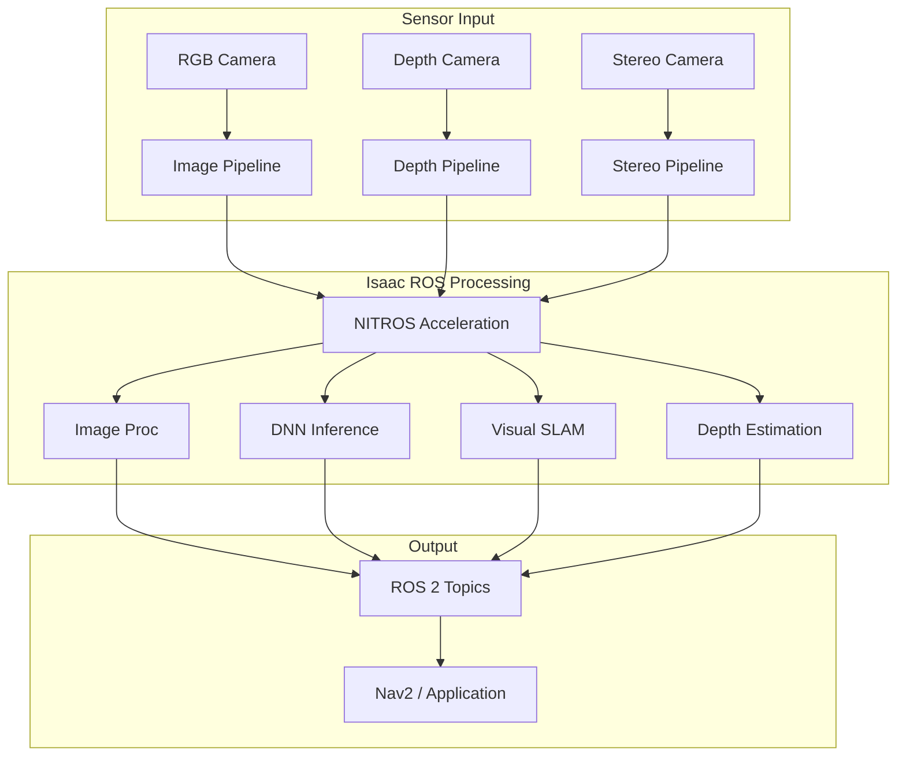
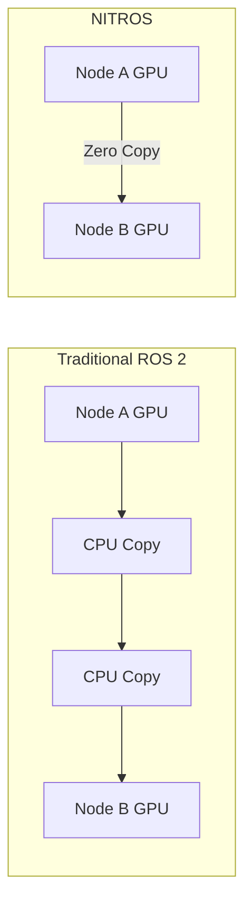

# Chapter 9: Isaac ROS & GPU Perception

## Learning Objectives

By the end of this chapter, you will be able to:

- Set up Isaac ROS perception packages
- Implement GPU-accelerated image processing
- Run object detection on NVIDIA hardware
- Process depth data with CUDA acceleration
- Integrate perception with ROS 2 navigation

## Prerequisites

- Completed Chapter 8
- NVIDIA Jetson or RTX GPU
- CUDA and TensorRT installed

---

## 9.1 Introduction to Isaac ROS

**Isaac ROS** is NVIDIA's collection of GPU-accelerated ROS 2 packages designed to bring high-performance perception to robotics applications. Unlike standard ROS 2 packages that run on CPU, Isaac ROS leverages NVIDIA's CUDA cores and TensorRT for real-time inference.



### Key Isaac ROS Packages

| Package | Function | GPU Acceleration |
|---------|----------|------------------|
| `isaac_ros_image_pipeline` | Image rectification, resize | CUDA kernels |
| `isaac_ros_dnn_inference` | TensorRT model execution | TensorRT |
| `isaac_ros_visual_slam` | cuVSLAM for localization | CUDA + Tensor Cores |
| `isaac_ros_depth_image_proc` | Depth processing | CUDA |
| `isaac_ros_object_detection` | YOLO, SSD inference | TensorRT |
| `isaac_ros_apriltag` | Fiducial detection | CUDA |

### NITROS: Zero-Copy Data Transfer

Isaac ROS uses **NITROS** (NVIDIA Isaac Transport for ROS) to enable zero-copy GPU memory sharing between nodes:



---

## 9.2 Environment Setup

### System Requirements

| Component | Minimum | Recommended |
|-----------|---------|-------------|
| Platform | Jetson Orin Nano | Jetson AGX Orin |
| JetPack | 5.1.2 | 6.0+ |
| CUDA | 11.4 | 12.2 |
| TensorRT | 8.5 | 8.6+ |
| ROS 2 | Humble | Humble |

### Docker-Based Setup

Isaac ROS packages are distributed via Docker containers:

```bash
# Clone Isaac ROS common
mkdir -p ~/workspaces/isaac_ros-dev/src
cd ~/workspaces/isaac_ros-dev/src
git clone https://github.com/NVIDIA-ISAAC-ROS/isaac_ros_common.git

# Build the development container
cd ~/workspaces/isaac_ros-dev/src/isaac_ros_common
./scripts/run_dev.sh
```

### Installing Isaac ROS Packages

Inside the Docker container:

```bash
# Install Isaac ROS packages
sudo apt update
sudo apt install -y ros-humble-isaac-ros-image-pipeline \
                    ros-humble-isaac-ros-dnn-inference \
                    ros-humble-isaac-ros-visual-slam \
                    ros-humble-isaac-ros-apriltag

# Source the workspace
source /opt/ros/humble/setup.bash
```

### Verify GPU Acceleration

```bash
# Check CUDA availability
nvidia-smi

# Verify TensorRT
python3 -c "import tensorrt; print(f'TensorRT version: {tensorrt.__version__}')"

# Test Isaac ROS NITROS
ros2 run isaac_ros_nitros isaac_ros_nitros_test
```

---

## 9.3 GPU-Accelerated Image Processing

### Image Pipeline Nodes

The `isaac_ros_image_pipeline` provides GPU-accelerated versions of standard image processing:

```python
# scripts/gpu_image_pipeline.py
import rclpy
from rclpy.node import Node
from sensor_msgs.msg import Image, CameraInfo
from cv_bridge import CvBridge
import cv2

class GPUImageProcessor(Node):
    """Demonstrates Isaac ROS GPU image pipeline integration."""

    def __init__(self):
        super().__init__('gpu_image_processor')

        # Subscribe to rectified output from Isaac ROS
        self.subscription = self.create_subscription(
            Image,
            '/camera/image_rect',  # Output from isaac_ros_image_proc
            self.image_callback,
            10
        )

        self.publisher = self.create_publisher(
            Image,
            '/processed/image',
            10
        )

        self.bridge = CvBridge()
        self.get_logger().info('GPU Image Processor initialized')

    def image_callback(self, msg):
        # Image is already rectified on GPU
        cv_image = self.bridge.imgmsg_to_cv2(msg, 'bgr8')

        # Additional CPU processing if needed
        # Note: Keep heavy processing on GPU via Isaac ROS nodes
        processed = cv2.resize(cv_image, (640, 480))

        # Publish result
        out_msg = self.bridge.cv2_to_imgmsg(processed, 'bgr8')
        out_msg.header = msg.header
        self.publisher.publish(out_msg)


def main(args=None):
    rclpy.init(args=args)
    node = GPUImageProcessor()
    rclpy.spin(node)
    node.destroy_node()
    rclpy.shutdown()


if __name__ == '__main__':
    main()
```

### Launch File for GPU Image Pipeline

```python
# launch/gpu_image_pipeline.launch.py
from launch import LaunchDescription
from launch_ros.actions import Node, ComposableNodeContainer
from launch_ros.descriptions import ComposableNode


def generate_launch_description():
    """Launch GPU-accelerated image pipeline."""

    # Isaac ROS image processing container
    image_processing_container = ComposableNodeContainer(
        name='image_processing_container',
        namespace='',
        package='rclcpp_components',
        executable='component_container_mt',
        composable_node_descriptions=[
            # GPU-accelerated rectification
            ComposableNode(
                package='isaac_ros_image_proc',
                plugin='nvidia::isaac_ros::image_proc::RectifyNode',
                name='rectify_node',
                parameters=[{
                    'output_width': 1280,
                    'output_height': 720,
                }],
                remappings=[
                    ('image_raw', '/camera/image_raw'),
                    ('camera_info', '/camera/camera_info'),
                    ('image_rect', '/camera/image_rect'),
                ]
            ),
            # GPU-accelerated resize
            ComposableNode(
                package='isaac_ros_image_proc',
                plugin='nvidia::isaac_ros::image_proc::ResizeNode',
                name='resize_node',
                parameters=[{
                    'output_width': 640,
                    'output_height': 480,
                    'keep_aspect_ratio': True,
                }],
                remappings=[
                    ('image', '/camera/image_rect'),
                    ('camera_info', '/camera/camera_info'),
                    ('resize/image', '/camera/image_resized'),
                    ('resize/camera_info', '/camera/camera_info_resized'),
                ]
            ),
        ],
        output='screen',
    )

    return LaunchDescription([
        image_processing_container,
    ])
```

---

## 9.4 Object Detection with TensorRT

### Setting Up DNN Inference

Isaac ROS DNN Inference runs neural networks with TensorRT optimization:

```python
# scripts/object_detection_node.py
import rclpy
from rclpy.node import Node
from sensor_msgs.msg import Image
from vision_msgs.msg import Detection2DArray
from cv_bridge import CvBridge
import cv2


class ObjectDetectionVisualizer(Node):
    """Visualizes object detection results from Isaac ROS."""

    def __init__(self):
        super().__init__('detection_visualizer')

        # Subscribe to detections from Isaac ROS
        self.det_sub = self.create_subscription(
            Detection2DArray,
            '/detectnet/detections',
            self.detection_callback,
            10
        )

        # Subscribe to original image
        self.img_sub = self.create_subscription(
            Image,
            '/camera/image_rect',
            self.image_callback,
            10
        )

        self.publisher = self.create_publisher(
            Image,
            '/detection/visualization',
            10
        )

        self.bridge = CvBridge()
        self.latest_image = None
        self.latest_detections = None

        # Class labels for COCO
        self.class_labels = {
            1: 'person', 2: 'bicycle', 3: 'car', 4: 'motorcycle',
            5: 'airplane', 6: 'bus', 7: 'train', 8: 'truck',
            # ... additional classes
        }

        self.get_logger().info('Detection Visualizer initialized')

    def image_callback(self, msg):
        self.latest_image = msg
        self.visualize()

    def detection_callback(self, msg):
        self.latest_detections = msg
        self.visualize()

    def visualize(self):
        if self.latest_image is None or self.latest_detections is None:
            return

        # Convert image
        cv_image = self.bridge.imgmsg_to_cv2(self.latest_image, 'bgr8')

        # Draw detections
        for detection in self.latest_detections.detections:
            bbox = detection.bbox
            cx, cy = int(bbox.center.position.x), int(bbox.center.position.y)
            w, h = int(bbox.size_x), int(bbox.size_y)

            x1, y1 = cx - w // 2, cy - h // 2
            x2, y2 = cx + w // 2, cy + h // 2

            # Get class and confidence
            if detection.results:
                class_id = int(detection.results[0].hypothesis.class_id)
                score = detection.results[0].hypothesis.score
                label = self.class_labels.get(class_id, f'class_{class_id}')

                # Draw bounding box
                cv2.rectangle(cv_image, (x1, y1), (x2, y2), (0, 255, 0), 2)

                # Draw label
                text = f'{label}: {score:.2f}'
                cv2.putText(cv_image, text, (x1, y1 - 10),
                           cv2.FONT_HERSHEY_SIMPLEX, 0.5, (0, 255, 0), 2)

        # Publish visualization
        out_msg = self.bridge.cv2_to_imgmsg(cv_image, 'bgr8')
        out_msg.header = self.latest_image.header
        self.publisher.publish(out_msg)


def main(args=None):
    rclpy.init(args=args)
    node = ObjectDetectionVisualizer()
    rclpy.spin(node)
    node.destroy_node()
    rclpy.shutdown()


if __name__ == '__main__':
    main()
```

### TensorRT Model Preparation

Convert models to TensorRT format for optimal performance:

```bash
# Convert ONNX model to TensorRT engine
# Run inside Isaac ROS container

/opt/nvidia/tao/tao-converter \
    -k nvidia_tlt \
    -d 3,544,960 \
    -o output_cov/Sigmoid,output_bbox/BiasAdd \
    -e /tmp/detectnet.engine \
    -t fp16 \
    /path/to/model.etlt
```

### Detection Launch Configuration

```python
# launch/object_detection.launch.py
from launch import LaunchDescription
from launch_ros.actions import ComposableNodeContainer
from launch_ros.descriptions import ComposableNode


def generate_launch_description():
    """Launch TensorRT-accelerated object detection."""

    detection_container = ComposableNodeContainer(
        name='detection_container',
        namespace='',
        package='rclcpp_components',
        executable='component_container_mt',
        composable_node_descriptions=[
            # TensorRT inference node
            ComposableNode(
                package='isaac_ros_tensor_rt',
                plugin='nvidia::isaac_ros::dnn_inference::TensorRTNode',
                name='tensor_rt_node',
                parameters=[{
                    'model_file_path': '/tmp/detectnet.engine',
                    'engine_file_path': '/tmp/detectnet.plan',
                    'input_tensor_names': ['input_1'],
                    'input_binding_names': ['input_1'],
                    'output_tensor_names': ['output_cov/Sigmoid', 'output_bbox/BiasAdd'],
                    'output_binding_names': ['output_cov/Sigmoid', 'output_bbox/BiasAdd'],
                    'verbose': False,
                    'force_engine_update': False,
                }]
            ),
            # Detection decoder
            ComposableNode(
                package='isaac_ros_detectnet',
                plugin='nvidia::isaac_ros::detectnet::DetectNetDecoderNode',
                name='detectnet_decoder',
                parameters=[{
                    'label_list': ['person', 'car', 'bicycle'],
                    'confidence_threshold': 0.5,
                    'nms_threshold': 0.45,
                }]
            ),
        ],
        output='screen',
    )

    return LaunchDescription([detection_container])
```

---

## 9.5 Depth Processing Pipeline

### Stereo Depth Estimation

Isaac ROS provides GPU-accelerated stereo depth estimation:

```python
# scripts/depth_processor.py
import rclpy
from rclpy.node import Node
from sensor_msgs.msg import Image, PointCloud2
from sensor_msgs_py import point_cloud2
import numpy as np
from cv_bridge import CvBridge


class DepthProcessor(Node):
    """Process depth images from Isaac ROS stereo pipeline."""

    def __init__(self):
        super().__init__('depth_processor')

        # Subscribe to depth from Isaac ROS ESS (stereo depth)
        self.depth_sub = self.create_subscription(
            Image,
            '/depth',
            self.depth_callback,
            10
        )

        # Publish point cloud
        self.pc_pub = self.create_publisher(
            PointCloud2,
            '/depth/points',
            10
        )

        self.bridge = CvBridge()

        # Camera intrinsics (from camera_info)
        self.fx = 525.0
        self.fy = 525.0
        self.cx = 319.5
        self.cy = 239.5

        self.get_logger().info('Depth Processor initialized')

    def depth_callback(self, msg):
        # Convert depth image (32FC1 meters)
        depth_image = self.bridge.imgmsg_to_cv2(msg, '32FC1')

        # Generate point cloud
        points = self.depth_to_pointcloud(depth_image)

        # Create PointCloud2 message
        pc_msg = point_cloud2.create_cloud_xyz32(msg.header, points)
        self.pc_pub.publish(pc_msg)

    def depth_to_pointcloud(self, depth_image):
        """Convert depth image to 3D points."""
        height, width = depth_image.shape

        # Create pixel coordinate grids
        u = np.arange(width)
        v = np.arange(height)
        u, v = np.meshgrid(u, v)

        # Convert to 3D
        z = depth_image
        x = (u - self.cx) * z / self.fx
        y = (v - self.cy) * z / self.fy

        # Filter invalid depths
        valid = (z > 0.1) & (z < 10.0)

        points = np.stack([
            x[valid],
            y[valid],
            z[valid]
        ], axis=-1)

        return points.tolist()


def main(args=None):
    rclpy.init(args=args)
    node = DepthProcessor()
    rclpy.spin(node)
    node.destroy_node()
    rclpy.shutdown()


if __name__ == '__main__':
    main()
```

### ESS Stereo Depth Launch

```python
# launch/stereo_depth.launch.py
from launch import LaunchDescription
from launch_ros.actions import ComposableNodeContainer
from launch_ros.descriptions import ComposableNode


def generate_launch_description():
    """Launch GPU-accelerated stereo depth estimation."""

    ess_container = ComposableNodeContainer(
        name='ess_container',
        namespace='',
        package='rclcpp_components',
        executable='component_container_mt',
        composable_node_descriptions=[
            # ESS DNN stereo depth
            ComposableNode(
                package='isaac_ros_ess',
                plugin='nvidia::isaac_ros::dnn_stereo_depth::ESSDisparityNode',
                name='ess_node',
                parameters=[{
                    'model_file_path': '/opt/nvidia/ess/ess.engine',
                    'threshold': 0.9,
                }],
                remappings=[
                    ('left/image_rect', '/stereo/left/image_rect'),
                    ('right/image_rect', '/stereo/right/image_rect'),
                    ('left/camera_info', '/stereo/left/camera_info'),
                    ('right/camera_info', '/stereo/right/camera_info'),
                ]
            ),
            # Disparity to depth conversion
            ComposableNode(
                package='isaac_ros_stereo_image_proc',
                plugin='nvidia::isaac_ros::stereo_image_proc::DisparityToDepthNode',
                name='disparity_to_depth',
            ),
        ],
        output='screen',
    )

    return LaunchDescription([ess_container])
```

---

## 9.6 Visual SLAM Integration

### cuVSLAM Setup

Isaac ROS Visual SLAM (cuVSLAM) provides GPU-accelerated localization:

```python
# launch/visual_slam.launch.py
from launch import LaunchDescription
from launch_ros.actions import Node
from launch.substitutions import LaunchConfiguration


def generate_launch_description():
    """Launch cuVSLAM for visual localization."""

    visual_slam_node = Node(
        package='isaac_ros_visual_slam',
        executable='visual_slam_node',
        name='visual_slam',
        parameters=[{
            # Input configuration
            'denoise_input_images': False,
            'rectified_images': True,

            # Visual odometry parameters
            'enable_localization_n_mapping': True,
            'enable_imu_fusion': True,

            # Output frames
            'map_frame': 'map',
            'odom_frame': 'odom',
            'base_frame': 'base_link',

            # Performance tuning
            'image_jitter_threshold_ms': 22.0,
            'sync_matching_threshold_ms': 2.0,
        }],
        remappings=[
            ('visual_slam/image_0', '/camera/left/image_rect'),
            ('visual_slam/camera_info_0', '/camera/left/camera_info'),
            ('visual_slam/image_1', '/camera/right/image_rect'),
            ('visual_slam/camera_info_1', '/camera/right/camera_info'),
            ('visual_slam/imu', '/imu/data'),
        ],
        output='screen',
    )

    return LaunchDescription([visual_slam_node])
```

### SLAM with Navigation Integration

```python
# scripts/slam_nav_bridge.py
import rclpy
from rclpy.node import Node
from nav_msgs.msg import Odometry
from geometry_msgs.msg import PoseStamped, TransformStamped
from tf2_ros import TransformBroadcaster


class SLAMNavBridge(Node):
    """Bridge Isaac ROS SLAM output to Nav2."""

    def __init__(self):
        super().__init__('slam_nav_bridge')

        # Subscribe to VSLAM odometry
        self.odom_sub = self.create_subscription(
            Odometry,
            '/visual_slam/tracking/odometry',
            self.odom_callback,
            10
        )

        # Publish for Nav2
        self.odom_pub = self.create_publisher(
            Odometry,
            '/odom',
            10
        )

        # TF broadcaster
        self.tf_broadcaster = TransformBroadcaster(self)

        self.get_logger().info('SLAM-Nav Bridge initialized')

    def odom_callback(self, msg):
        # Republish odometry
        self.odom_pub.publish(msg)

        # Broadcast transform
        t = TransformStamped()
        t.header = msg.header
        t.child_frame_id = msg.child_frame_id

        t.transform.translation.x = msg.pose.pose.position.x
        t.transform.translation.y = msg.pose.pose.position.y
        t.transform.translation.z = msg.pose.pose.position.z
        t.transform.rotation = msg.pose.pose.orientation

        self.tf_broadcaster.sendTransform(t)


def main(args=None):
    rclpy.init(args=args)
    node = SLAMNavBridge()
    rclpy.spin(node)
    node.destroy_node()
    rclpy.shutdown()


if __name__ == '__main__':
    main()
```

---

## 9.7 Performance Benchmarking

### Measuring Pipeline Latency

```python
# scripts/benchmark_perception.py
import rclpy
from rclpy.node import Node
from sensor_msgs.msg import Image
from vision_msgs.msg import Detection2DArray
import time


class PerceptionBenchmark(Node):
    """Benchmark Isaac ROS perception pipeline latency."""

    def __init__(self):
        super().__init__('perception_benchmark')

        self.image_timestamps = {}
        self.latencies = []

        # Track input images
        self.img_sub = self.create_subscription(
            Image,
            '/camera/image_raw',
            self.image_callback,
            10
        )

        # Track detection output
        self.det_sub = self.create_subscription(
            Detection2DArray,
            '/detectnet/detections',
            self.detection_callback,
            10
        )

        # Report timer
        self.create_timer(5.0, self.report_stats)

        self.get_logger().info('Perception Benchmark started')

    def image_callback(self, msg):
        stamp = msg.header.stamp.sec + msg.header.stamp.nanosec * 1e-9
        self.image_timestamps[stamp] = time.time()

    def detection_callback(self, msg):
        stamp = msg.header.stamp.sec + msg.header.stamp.nanosec * 1e-9
        if stamp in self.image_timestamps:
            latency = (time.time() - self.image_timestamps[stamp]) * 1000
            self.latencies.append(latency)
            del self.image_timestamps[stamp]

    def report_stats(self):
        if not self.latencies:
            return

        import numpy as np
        latencies = np.array(self.latencies)

        self.get_logger().info(
            f'Pipeline Latency - '
            f'Mean: {latencies.mean():.1f}ms, '
            f'P95: {np.percentile(latencies, 95):.1f}ms, '
            f'Max: {latencies.max():.1f}ms, '
            f'FPS: {len(latencies) / 5.0:.1f}'
        )

        self.latencies = []


def main(args=None):
    rclpy.init(args=args)
    node = PerceptionBenchmark()
    rclpy.spin(node)
    node.destroy_node()
    rclpy.shutdown()


if __name__ == '__main__':
    main()
```

### Expected Performance

| Platform | Detection FPS | Stereo Depth FPS | VSLAM FPS |
|----------|--------------|------------------|-----------|
| Jetson Orin Nano | 15-20 | 20-30 | 30 |
| Jetson AGX Orin | 30-45 | 60-90 | 60 |
| RTX 3080 | 60+ | 90+ | 60 |
| RTX 4090 | 100+ | 120+ | 60 |

---

## Lab Exercise

Complete the hands-on lab in [`labs/module-3/ch09-gpu-vision/`](https://github.com/physical-ai-textbook/physical-ai-textbook/tree/main/labs/module-3/ch09-gpu-vision) where you will:

1. Set up Isaac ROS development environment
2. Configure GPU-accelerated image rectification
3. Deploy a TensorRT object detection model
4. Implement stereo depth estimation
5. Benchmark pipeline performance on your hardware

**Estimated time**: 2-3 hours

---

## Summary

In this chapter, you learned:

- **Isaac ROS architecture**: NITROS zero-copy transport, composable nodes
- **Environment setup**: Docker-based development, GPU requirements
- **Image processing**: GPU-accelerated rectification and resize
- **Object detection**: TensorRT inference, detection visualization
- **Depth processing**: Stereo depth estimation, point cloud generation
- **Visual SLAM**: cuVSLAM setup and Nav2 integration
- **Benchmarking**: Measuring latency and throughput

GPU-accelerated perception is essential for real-time robotics applications. Isaac ROS provides the building blocks for high-performance perception pipelines that scale from embedded Jetson platforms to powerful workstations.

---

## Further Reading

- [Isaac ROS Documentation](https://nvidia-isaac-ros.github.io/)
- [NVIDIA Jetson Developer Guide](https://docs.nvidia.com/jetson/)
- [TensorRT Documentation](https://docs.nvidia.com/deeplearning/tensorrt/)
- [cuVSLAM Paper](https://developer.nvidia.com/isaac-ros-visual-slam)
- [NITROS Architecture](https://nvidia-isaac-ros.github.io/concepts/nitros/)
