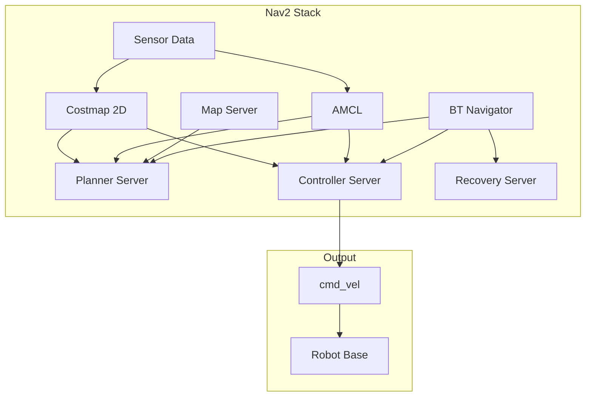

# Chapter 10: Navigation, RL & Sim2Real

## Learning Objectives

By the end of this chapter, you will be able to:

- Configure ROS 2 Nav2 for autonomous navigation
- Train RL policies in Isaac Sim
- Apply domain randomization techniques
- Transfer learned policies to real robots
- Evaluate sim2real performance gaps

## Prerequisites

- Completed Chapters 8-9
- Understanding of reinforcement learning basics
- PyTorch or TensorFlow knowledge

---

## 10.1 Introduction to Robot Navigation

Autonomous navigation is a fundamental capability for mobile robots. This chapter covers two complementary approaches:

1. **Classical Navigation (Nav2)**: Map-based planning with costmaps and planners
2. **Learning-Based Navigation (RL)**: End-to-end policies trained in simulation

```mermaid
graph TB
    subgraph "Classical Navigation"
        A[Sensors] --> B[Localization]
        B --> C[Global Planner]
        C --> D[Local Planner]
        D --> E[Motor Control]
    end

    subgraph "Learning-Based Navigation"
        F[Observations] --> G[Neural Network Policy]
        G --> H[Actions]
        H --> I[Motor Control]
    end

    subgraph "Hybrid Approach"
        J[Sensors] --> K[Perception + RL Policy]
        K --> L[Nav2 Integration]
        L --> M[Motor Control]
    end
```



### When to Use Each Approach

| Approach | Best For | Limitations |
|----------|----------|-------------|
| Nav2 Classical | Structured environments, known maps | Static assumptions, limited adaptability |
| RL End-to-End | Dynamic environments, complex terrains | Sample inefficiency, sim2real gap |
| Hybrid | Production systems, safety-critical | Implementation complexity |

---

## 10.2 ROS 2 Nav2 Setup

### Nav2 Architecture

Nav2 provides a complete navigation stack for ROS 2:



### Basic Nav2 Configuration

```yaml
# config/nav2_params.yaml
bt_navigator:
  ros__parameters:
    global_frame: map
    robot_base_frame: base_link
    odom_topic: /odom
    default_bt_xml_filename: "navigate_w_replanning_and_recovery.xml"
    plugin_lib_names:
      - nav2_compute_path_to_pose_action_bt_node
      - nav2_follow_path_action_bt_node
      - nav2_back_up_action_bt_node
      - nav2_spin_action_bt_node
      - nav2_wait_action_bt_node
      - nav2_clear_costmap_service_bt_node
      - nav2_is_stuck_condition_bt_node
      - nav2_goal_reached_condition_bt_node

controller_server:
  ros__parameters:
    controller_frequency: 20.0
    min_x_velocity_threshold: 0.001
    min_y_velocity_threshold: 0.5
    min_theta_velocity_threshold: 0.001
    progress_checker_plugin: "progress_checker"
    goal_checker_plugins: ["goal_checker"]
    controller_plugins: ["FollowPath"]

    progress_checker:
      plugin: "nav2_controller::SimpleProgressChecker"
      required_movement_radius: 0.5
      movement_time_allowance: 10.0

    goal_checker:
      plugin: "nav2_controller::SimpleGoalChecker"
      xy_goal_tolerance: 0.25
      yaw_goal_tolerance: 0.25
      stateful: True

    FollowPath:
      plugin: "dwb_core::DWBLocalPlanner"
      debug_trajectory_details: True
      min_vel_x: 0.0
      min_vel_y: 0.0
      max_vel_x: 0.5
      max_vel_y: 0.0
      max_vel_theta: 1.0
      min_speed_xy: 0.0
      max_speed_xy: 0.5
      min_speed_theta: 0.0
      acc_lim_x: 2.5
      acc_lim_y: 0.0
      acc_lim_theta: 3.2
      decel_lim_x: -2.5
      decel_lim_y: 0.0
      decel_lim_theta: -3.2

planner_server:
  ros__parameters:
    planner_plugins: ["GridBased"]
    GridBased:
      plugin: "nav2_navfn_planner/NavfnPlanner"
      tolerance: 0.5
      use_astar: false
      allow_unknown: true

local_costmap:
  local_costmap:
    ros__parameters:
      update_frequency: 5.0
      publish_frequency: 2.0
      global_frame: odom
      robot_base_frame: base_link
      rolling_window: true
      width: 3
      height: 3
      resolution: 0.05
      plugins: ["obstacle_layer", "inflation_layer"]
      obstacle_layer:
        plugin: "nav2_costmap_2d::ObstacleLayer"
        enabled: True
        observation_sources: scan
        scan:
          topic: /scan
          max_obstacle_height: 2.0
          clearing: True
          marking: True
          data_type: "LaserScan"
      inflation_layer:
        plugin: "nav2_costmap_2d::InflationLayer"
        cost_scaling_factor: 3.0
        inflation_radius: 0.55

global_costmap:
  global_costmap:
    ros__parameters:
      update_frequency: 1.0
      publish_frequency: 1.0
      global_frame: map
      robot_base_frame: base_link
      robot_radius: 0.22
      resolution: 0.05
      track_unknown_space: true
      plugins: ["static_layer", "obstacle_layer", "inflation_layer"]
      static_layer:
        plugin: "nav2_costmap_2d::StaticLayer"
        map_subscribe_transient_local: True
      obstacle_layer:
        plugin: "nav2_costmap_2d::ObstacleLayer"
        enabled: True
        observation_sources: scan
        scan:
          topic: /scan
          max_obstacle_height: 2.0
          clearing: True
          marking: True
          data_type: "LaserScan"
      inflation_layer:
        plugin: "nav2_costmap_2d::InflationLayer"
        cost_scaling_factor: 3.0
        inflation_radius: 0.55
```

### Nav2 Launch File

```python
# launch/navigation.launch.py
from launch import LaunchDescription
from launch_ros.actions import Node
from launch.actions import IncludeLaunchDescription
from launch.launch_description_sources import PythonLaunchDescriptionSource
from ament_index_python.packages import get_package_share_directory
import os


def generate_launch_description():
    """Launch Nav2 navigation stack."""

    nav2_dir = get_package_share_directory('nav2_bringup')
    params_file = os.path.join(
        get_package_share_directory('my_robot_navigation'),
        'config',
        'nav2_params.yaml'
    )
    map_file = os.path.join(
        get_package_share_directory('my_robot_navigation'),
        'maps',
        'warehouse.yaml'
    )

    return LaunchDescription([
        # Map server
        Node(
            package='nav2_map_server',
            executable='map_server',
            name='map_server',
            parameters=[{'yaml_filename': map_file}],
        ),

        # AMCL localization
        Node(
            package='nav2_amcl',
            executable='amcl',
            name='amcl',
            parameters=[params_file],
        ),

        # Nav2 bringup
        IncludeLaunchDescription(
            PythonLaunchDescriptionSource(
                os.path.join(nav2_dir, 'launch', 'navigation_launch.py')
            ),
            launch_arguments={
                'params_file': params_file,
                'use_sim_time': 'true',
            }.items(),
        ),

        # Lifecycle manager
        Node(
            package='nav2_lifecycle_manager',
            executable='lifecycle_manager',
            name='lifecycle_manager_navigation',
            parameters=[{
                'autostart': True,
                'node_names': [
                    'map_server',
                    'amcl',
                    'controller_server',
                    'planner_server',
                    'bt_navigator',
                ]
            }],
        ),
    ])
```

---

## 10.3 Reinforcement Learning in Isaac Sim

### Isaac Gym Environment Setup

Isaac Sim provides **Isaac Gym** for massively parallel RL training:

```python
# scripts/navigation_env.py
from omni.isaac.kit import SimulationApp

simulation_app = SimulationApp({"headless": True})

from omni.isaac.core import World
from omni.isaac.core.robots import Robot
from omni.isaac.core.utils.stage import add_reference_to_stage
from omni.isaac.core.prims import XFormPrim
import numpy as np
import torch


class NavigationEnv:
    """Isaac Sim environment for navigation RL training."""

    def __init__(self, num_envs=64, env_spacing=4.0):
        self.num_envs = num_envs
        self.env_spacing = env_spacing

        # Create world
        self.world = World(stage_units_in_meters=1.0)

        # Environment parameters
        self.max_episode_steps = 500
        self.goal_threshold = 0.3

        # Observation and action spaces
        self.obs_dim = 18  # [position(3), orientation(4), velocity(3), goal(3), lidar(5)]
        self.action_dim = 2  # [linear_vel, angular_vel]

        # Setup environments
        self._setup_envs()

    def _setup_envs(self):
        """Create parallel simulation environments."""
        for i in range(self.num_envs):
            env_offset = np.array([
                (i % 8) * self.env_spacing,
                (i // 8) * self.env_spacing,
                0.0
            ])

            # Add ground plane
            self.world.scene.add_default_ground_plane(
                prim_path=f"/World/Env_{i}/Ground",
                position=env_offset
            )

            # Add robot
            add_reference_to_stage(
                usd_path="/Isaac/Robots/Jetbot/jetbot.usd",
                prim_path=f"/World/Env_{i}/Robot"
            )

            # Position robot
            robot_prim = XFormPrim(f"/World/Env_{i}/Robot")
            robot_prim.set_world_pose(position=env_offset + np.array([0, 0, 0.05]))

            # Add obstacles
            self._add_random_obstacles(i, env_offset)

        self.world.reset()

    def _add_random_obstacles(self, env_id, offset):
        """Add random obstacles to environment."""
        from omni.isaac.core.objects import DynamicCuboid

        num_obstacles = np.random.randint(3, 8)
        for j in range(num_obstacles):
            pos = offset + np.array([
                np.random.uniform(-1.5, 1.5),
                np.random.uniform(-1.5, 1.5),
                0.25
            ])

            self.world.scene.add(
                DynamicCuboid(
                    prim_path=f"/World/Env_{env_id}/Obstacle_{j}",
                    name=f"obstacle_{env_id}_{j}",
                    position=pos,
                    scale=np.array([0.2, 0.2, 0.5]),
                    color=np.array([0.5, 0.5, 0.5])
                )
            )

    def reset(self, env_ids=None):
        """Reset environments and return initial observations."""
        if env_ids is None:
            env_ids = range(self.num_envs)

        # Reset robot positions and goals
        self.robot_positions = torch.zeros((self.num_envs, 3))
        self.goal_positions = torch.zeros((self.num_envs, 3))

        for i in env_ids:
            # Random start position
            self.robot_positions[i] = torch.tensor([
                np.random.uniform(-1.0, 1.0),
                np.random.uniform(-1.0, 1.0),
                0.05
            ])

            # Random goal position
            self.goal_positions[i] = torch.tensor([
                np.random.uniform(-1.5, 1.5),
                np.random.uniform(-1.5, 1.5),
                0.0
            ])

        self.step_count = torch.zeros(self.num_envs, dtype=torch.int32)

        return self._get_observations()

    def step(self, actions):
        """Execute actions and return (obs, reward, done, info)."""
        # Apply actions to robots
        self._apply_actions(actions)

        # Step simulation
        self.world.step(render=False)

        # Get observations
        obs = self._get_observations()

        # Compute rewards
        rewards = self._compute_rewards()

        # Check termination
        dones = self._check_termination()

        self.step_count += 1

        return obs, rewards, dones, {}

    def _apply_actions(self, actions):
        """Apply velocity commands to robots."""
        # actions: [batch, 2] - linear_vel, angular_vel
        linear_vel = actions[:, 0].clamp(-0.5, 0.5)
        angular_vel = actions[:, 1].clamp(-1.0, 1.0)

        # Convert to wheel velocities (differential drive)
        wheel_base = 0.1
        left_vel = linear_vel - angular_vel * wheel_base / 2
        right_vel = linear_vel + angular_vel * wheel_base / 2

        # Apply to simulation (simplified)
        for i in range(self.num_envs):
            # In practice, use articulation controller
            pass

    def _get_observations(self):
        """Construct observation tensor."""
        obs = torch.zeros((self.num_envs, self.obs_dim))

        for i in range(self.num_envs):
            # Robot state (position, orientation, velocity)
            obs[i, 0:3] = self.robot_positions[i]
            obs[i, 3:7] = torch.tensor([0, 0, 0, 1])  # Quaternion
            obs[i, 7:10] = torch.zeros(3)  # Velocity

            # Goal relative position
            obs[i, 10:13] = self.goal_positions[i] - self.robot_positions[i]

            # Simulated LIDAR (5 rays)
            obs[i, 13:18] = torch.ones(5) * 2.0  # Max range

        return obs

    def _compute_rewards(self):
        """Compute reward for each environment."""
        rewards = torch.zeros(self.num_envs)

        for i in range(self.num_envs):
            # Distance to goal
            dist_to_goal = torch.norm(
                self.goal_positions[i, :2] - self.robot_positions[i, :2]
            )

            # Reward components
            distance_reward = -0.1 * dist_to_goal
            goal_reward = 10.0 if dist_to_goal < self.goal_threshold else 0.0
            time_penalty = -0.01

            rewards[i] = distance_reward + goal_reward + time_penalty

        return rewards

    def _check_termination(self):
        """Check if episodes should terminate."""
        dones = torch.zeros(self.num_envs, dtype=torch.bool)

        for i in range(self.num_envs):
            # Goal reached
            dist_to_goal = torch.norm(
                self.goal_positions[i, :2] - self.robot_positions[i, :2]
            )
            if dist_to_goal < self.goal_threshold:
                dones[i] = True

            # Max steps
            if self.step_count[i] >= self.max_episode_steps:
                dones[i] = True

        return dones
```

### PPO Training Script

```python
# scripts/train_navigation.py
import torch
import torch.nn as nn
import torch.optim as optim
from torch.distributions import Normal
import numpy as np


class PolicyNetwork(nn.Module):
    """Actor-Critic network for navigation."""

    def __init__(self, obs_dim, action_dim, hidden_dim=256):
        super().__init__()

        # Shared encoder
        self.encoder = nn.Sequential(
            nn.Linear(obs_dim, hidden_dim),
            nn.ELU(),
            nn.Linear(hidden_dim, hidden_dim),
            nn.ELU(),
        )

        # Actor head
        self.actor_mean = nn.Linear(hidden_dim, action_dim)
        self.actor_log_std = nn.Parameter(torch.zeros(action_dim))

        # Critic head
        self.critic = nn.Linear(hidden_dim, 1)

    def forward(self, obs):
        features = self.encoder(obs)
        return features

    def get_action(self, obs, deterministic=False):
        features = self.forward(obs)
        mean = self.actor_mean(features)
        std = self.actor_log_std.exp()

        if deterministic:
            return mean

        dist = Normal(mean, std)
        action = dist.sample()
        log_prob = dist.log_prob(action).sum(-1)

        return action, log_prob

    def get_value(self, obs):
        features = self.forward(obs)
        return self.critic(features)

    def evaluate_actions(self, obs, actions):
        features = self.forward(obs)
        mean = self.actor_mean(features)
        std = self.actor_log_std.exp()

        dist = Normal(mean, std)
        log_prob = dist.log_prob(actions).sum(-1)
        entropy = dist.entropy().sum(-1)
        value = self.critic(features)

        return log_prob, entropy, value


class PPOTrainer:
    """Proximal Policy Optimization trainer."""

    def __init__(self, env, policy, lr=3e-4, gamma=0.99, gae_lambda=0.95,
                 clip_ratio=0.2, value_coef=0.5, entropy_coef=0.01):
        self.env = env
        self.policy = policy
        self.optimizer = optim.Adam(policy.parameters(), lr=lr)

        self.gamma = gamma
        self.gae_lambda = gae_lambda
        self.clip_ratio = clip_ratio
        self.value_coef = value_coef
        self.entropy_coef = entropy_coef

    def collect_rollouts(self, num_steps):
        """Collect experience from parallel environments."""
        obs_buffer = []
        action_buffer = []
        reward_buffer = []
        done_buffer = []
        value_buffer = []
        log_prob_buffer = []

        obs = self.env.reset()

        for _ in range(num_steps):
            with torch.no_grad():
                actions, log_probs = self.policy.get_action(obs)
                values = self.policy.get_value(obs)

            next_obs, rewards, dones, _ = self.env.step(actions)

            obs_buffer.append(obs)
            action_buffer.append(actions)
            reward_buffer.append(rewards)
            done_buffer.append(dones)
            value_buffer.append(values.squeeze())
            log_prob_buffer.append(log_probs)

            obs = next_obs

            # Reset done environments
            done_indices = torch.where(dones)[0]
            if len(done_indices) > 0:
                obs = self.env.reset(done_indices)

        return {
            'obs': torch.stack(obs_buffer),
            'actions': torch.stack(action_buffer),
            'rewards': torch.stack(reward_buffer),
            'dones': torch.stack(done_buffer),
            'values': torch.stack(value_buffer),
            'log_probs': torch.stack(log_prob_buffer),
        }

    def compute_gae(self, rewards, values, dones):
        """Compute Generalized Advantage Estimation."""
        num_steps = rewards.shape[0]
        advantages = torch.zeros_like(rewards)
        last_gae = 0

        for t in reversed(range(num_steps)):
            if t == num_steps - 1:
                next_value = 0
            else:
                next_value = values[t + 1]

            delta = rewards[t] + self.gamma * next_value * (~dones[t]) - values[t]
            advantages[t] = last_gae = delta + self.gamma * self.gae_lambda * (~dones[t]) * last_gae

        returns = advantages + values
        return advantages, returns

    def update(self, rollouts, num_epochs=10, batch_size=256):
        """Update policy using PPO."""
        obs = rollouts['obs'].reshape(-1, self.env.obs_dim)
        actions = rollouts['actions'].reshape(-1, self.env.action_dim)
        old_log_probs = rollouts['log_probs'].reshape(-1)

        advantages, returns = self.compute_gae(
            rollouts['rewards'],
            rollouts['values'],
            rollouts['dones']
        )
        advantages = advantages.reshape(-1)
        returns = returns.reshape(-1)

        # Normalize advantages
        advantages = (advantages - advantages.mean()) / (advantages.std() + 1e-8)

        # PPO update epochs
        for _ in range(num_epochs):
            # Random mini-batches
            indices = torch.randperm(obs.shape[0])

            for start in range(0, obs.shape[0], batch_size):
                end = start + batch_size
                batch_indices = indices[start:end]

                batch_obs = obs[batch_indices]
                batch_actions = actions[batch_indices]
                batch_old_log_probs = old_log_probs[batch_indices]
                batch_advantages = advantages[batch_indices]
                batch_returns = returns[batch_indices]

                # Evaluate actions
                log_probs, entropy, values = self.policy.evaluate_actions(
                    batch_obs, batch_actions
                )

                # Policy loss (PPO clip)
                ratio = torch.exp(log_probs - batch_old_log_probs)
                clip_adv = torch.clamp(ratio, 1 - self.clip_ratio, 1 + self.clip_ratio) * batch_advantages
                policy_loss = -torch.min(ratio * batch_advantages, clip_adv).mean()

                # Value loss
                value_loss = 0.5 * (values.squeeze() - batch_returns).pow(2).mean()

                # Entropy bonus
                entropy_loss = -entropy.mean()

                # Total loss
                loss = policy_loss + self.value_coef * value_loss + self.entropy_coef * entropy_loss

                self.optimizer.zero_grad()
                loss.backward()
                torch.nn.utils.clip_grad_norm_(self.policy.parameters(), 0.5)
                self.optimizer.step()

        return {
            'policy_loss': policy_loss.item(),
            'value_loss': value_loss.item(),
            'entropy': -entropy_loss.item(),
        }

    def train(self, total_timesteps, rollout_steps=256):
        """Main training loop."""
        timesteps = 0
        iteration = 0

        while timesteps < total_timesteps:
            # Collect rollouts
            rollouts = self.collect_rollouts(rollout_steps)
            timesteps += rollout_steps * self.env.num_envs

            # Update policy
            stats = self.update(rollouts)

            iteration += 1
            if iteration % 10 == 0:
                print(f"Iteration {iteration}, Timesteps {timesteps}")
                print(f"  Policy Loss: {stats['policy_loss']:.4f}")
                print(f"  Value Loss: {stats['value_loss']:.4f}")
                print(f"  Entropy: {stats['entropy']:.4f}")

        return self.policy
```

---

## 10.4 Domain Randomization

Domain randomization is critical for sim2real transfer. It trains policies that are robust to variations in the environment.

### Randomization Categories

```python
# scripts/domain_randomization.py
import numpy as np
from dataclasses import dataclass
from typing import Tuple


@dataclass
class DomainRandomizationConfig:
    """Configuration for domain randomization."""

    # Visual randomization
    lighting_intensity: Tuple[float, float] = (0.5, 2.0)
    lighting_color: Tuple[float, float] = (0.8, 1.2)  # RGB multiplier
    texture_randomization: bool = True
    camera_noise_std: float = 0.02

    # Physics randomization
    friction_range: Tuple[float, float] = (0.5, 1.5)
    mass_scale: Tuple[float, float] = (0.8, 1.2)
    motor_strength_scale: Tuple[float, float] = (0.9, 1.1)

    # Sensor randomization
    lidar_noise_std: float = 0.05
    imu_bias_range: Tuple[float, float] = (-0.1, 0.1)
    latency_range: Tuple[float, float] = (0.0, 0.05)  # seconds

    # Environment randomization
    obstacle_density: Tuple[int, int] = (5, 15)
    obstacle_size_scale: Tuple[float, float] = (0.5, 2.0)


class DomainRandomizer:
    """Apply domain randomization to Isaac Sim environments."""

    def __init__(self, config: DomainRandomizationConfig):
        self.config = config

    def randomize_physics(self, world, env_id):
        """Randomize physics properties."""
        from pxr import UsdPhysics

        # Randomize friction
        friction = np.random.uniform(*self.config.friction_range)

        # Randomize robot mass
        mass_scale = np.random.uniform(*self.config.mass_scale)

        # Apply to robot links
        robot_path = f"/World/Env_{env_id}/Robot"
        # Implementation depends on robot structure

        return {
            'friction': friction,
            'mass_scale': mass_scale
        }

    def randomize_visuals(self, world, env_id):
        """Randomize visual properties."""
        import omni.replicator.core as rep

        # Randomize lighting
        intensity = np.random.uniform(*self.config.lighting_intensity)
        color_mult = np.random.uniform(*self.config.lighting_color)

        # Apply lighting changes
        # Implementation with Replicator

        return {
            'light_intensity': intensity,
            'color_multiplier': color_mult
        }

    def randomize_sensors(self, obs):
        """Add noise to sensor observations."""
        # LIDAR noise
        lidar_start = 13  # Assuming lidar observations start at index 13
        lidar_end = 18
        obs[:, lidar_start:lidar_end] += np.random.normal(
            0, self.config.lidar_noise_std,
            size=obs[:, lidar_start:lidar_end].shape
        )

        # IMU bias
        imu_start = 7
        imu_end = 10
        obs[:, imu_start:imu_end] += np.random.uniform(
            *self.config.imu_bias_range,
            size=obs[:, imu_start:imu_end].shape
        )

        return obs

    def randomize_dynamics(self, actions):
        """Randomize action execution (motor noise)."""
        motor_scale = np.random.uniform(*self.config.motor_strength_scale)
        return actions * motor_scale

    def apply_latency(self, obs_buffer, current_obs):
        """Simulate sensor latency."""
        latency = np.random.uniform(*self.config.latency_range)
        # Return delayed observation from buffer
        # Implementation depends on timestep duration
        return current_obs


class RandomizedNavigationEnv:
    """Navigation environment with domain randomization."""

    def __init__(self, base_env, randomizer):
        self.env = base_env
        self.randomizer = randomizer
        self.randomization_params = {}

    def reset(self, env_ids=None):
        obs = self.env.reset(env_ids)

        # Apply randomization
        for env_id in (env_ids or range(self.env.num_envs)):
            self.randomization_params[env_id] = {
                'physics': self.randomizer.randomize_physics(
                    self.env.world, env_id
                ),
                'visuals': self.randomizer.randomize_visuals(
                    self.env.world, env_id
                ),
            }

        # Randomize sensor observations
        obs = self.randomizer.randomize_sensors(obs.numpy())

        return torch.from_numpy(obs).float()

    def step(self, actions):
        # Randomize actions
        randomized_actions = self.randomizer.randomize_dynamics(actions)

        obs, rewards, dones, info = self.env.step(randomized_actions)

        # Randomize observations
        obs = self.randomizer.randomize_sensors(obs.numpy())

        return torch.from_numpy(obs).float(), rewards, dones, info
```

---

## 10.5 Sim-to-Real Transfer

### Policy Export

```python
# scripts/export_policy.py
import torch
import torch.onnx


def export_policy_onnx(policy, obs_dim, output_path):
    """Export trained policy to ONNX format."""
    policy.eval()

    # Create dummy input
    dummy_input = torch.randn(1, obs_dim)

    # Export to ONNX
    torch.onnx.export(
        policy,
        dummy_input,
        output_path,
        export_params=True,
        opset_version=11,
        do_constant_folding=True,
        input_names=['observation'],
        output_names=['action_mean'],
        dynamic_axes={
            'observation': {0: 'batch_size'},
            'action_mean': {0: 'batch_size'}
        }
    )
    print(f"Policy exported to {output_path}")


def export_policy_torchscript(policy, output_path):
    """Export policy using TorchScript."""
    policy.eval()

    # Trace the model
    scripted_policy = torch.jit.script(policy)
    scripted_policy.save(output_path)
    print(f"Policy exported to {output_path}")
```

### ROS 2 Policy Deployment Node

```python
# scripts/policy_node.py
import rclpy
from rclpy.node import Node
from geometry_msgs.msg import Twist
from sensor_msgs.msg import LaserScan, Imu
from nav_msgs.msg import Odometry
import torch
import numpy as np


class RLPolicyNode(Node):
    """ROS 2 node for deploying trained RL policy."""

    def __init__(self):
        super().__init__('rl_policy_node')

        # Load trained policy
        self.declare_parameter('policy_path', 'policy.pt')
        policy_path = self.get_parameter('policy_path').value
        self.policy = torch.jit.load(policy_path)
        self.policy.eval()

        # Goal position
        self.declare_parameter('goal_x', 0.0)
        self.declare_parameter('goal_y', 0.0)
        self.goal = np.array([
            self.get_parameter('goal_x').value,
            self.get_parameter('goal_y').value,
            0.0
        ])

        # State variables
        self.position = np.zeros(3)
        self.orientation = np.array([0, 0, 0, 1])
        self.velocity = np.zeros(3)
        self.lidar_ranges = np.ones(5) * 10.0

        # Subscribers
        self.odom_sub = self.create_subscription(
            Odometry, '/odom', self.odom_callback, 10
        )
        self.scan_sub = self.create_subscription(
            LaserScan, '/scan', self.scan_callback, 10
        )

        # Publisher
        self.cmd_pub = self.create_publisher(Twist, '/cmd_vel', 10)

        # Control timer
        self.create_timer(0.05, self.control_callback)  # 20 Hz

        self.get_logger().info('RL Policy Node initialized')

    def odom_callback(self, msg):
        self.position = np.array([
            msg.pose.pose.position.x,
            msg.pose.pose.position.y,
            msg.pose.pose.position.z
        ])
        self.orientation = np.array([
            msg.pose.pose.orientation.x,
            msg.pose.pose.orientation.y,
            msg.pose.pose.orientation.z,
            msg.pose.pose.orientation.w
        ])
        self.velocity = np.array([
            msg.twist.twist.linear.x,
            msg.twist.twist.linear.y,
            msg.twist.twist.linear.z
        ])

    def scan_callback(self, msg):
        # Downsample LIDAR to 5 rays
        ranges = np.array(msg.ranges)
        indices = np.linspace(0, len(ranges) - 1, 5, dtype=int)
        self.lidar_ranges = np.clip(ranges[indices], 0.1, 10.0)

    def construct_observation(self):
        """Build observation vector matching training format."""
        obs = np.zeros(18)

        # Position
        obs[0:3] = self.position

        # Orientation (quaternion)
        obs[3:7] = self.orientation

        # Velocity
        obs[7:10] = self.velocity

        # Goal relative position
        obs[10:13] = self.goal - self.position

        # LIDAR
        obs[13:18] = self.lidar_ranges

        return obs

    def control_callback(self):
        # Build observation
        obs = self.construct_observation()
        obs_tensor = torch.from_numpy(obs).float().unsqueeze(0)

        # Get action from policy
        with torch.no_grad():
            action = self.policy.get_action(obs_tensor, deterministic=True)
            action = action.squeeze().numpy()

        # Create Twist message
        cmd = Twist()
        cmd.linear.x = float(np.clip(action[0], -0.5, 0.5))
        cmd.angular.z = float(np.clip(action[1], -1.0, 1.0))

        self.cmd_pub.publish(cmd)

        # Check goal reached
        dist_to_goal = np.linalg.norm(self.goal[:2] - self.position[:2])
        if dist_to_goal < 0.3:
            self.get_logger().info('Goal reached!')
            cmd = Twist()  # Stop
            self.cmd_pub.publish(cmd)


def main(args=None):
    rclpy.init(args=args)
    node = RLPolicyNode()
    rclpy.spin(node)
    node.destroy_node()
    rclpy.shutdown()


if __name__ == '__main__':
    main()
```

---

## 10.6 Evaluating Sim2Real Gap

### Performance Metrics

```python
# scripts/sim2real_evaluation.py
import numpy as np
from dataclasses import dataclass
from typing import List, Dict


@dataclass
class EpisodeResult:
    """Results from a single navigation episode."""
    success: bool
    time_to_goal: float
    path_length: float
    collisions: int
    smoothness: float  # Average angular velocity


class Sim2RealEvaluator:
    """Evaluate sim2real transfer performance."""

    def __init__(self):
        self.sim_results: List[EpisodeResult] = []
        self.real_results: List[EpisodeResult] = []

    def add_sim_episode(self, result: EpisodeResult):
        self.sim_results.append(result)

    def add_real_episode(self, result: EpisodeResult):
        self.real_results.append(result)

    def compute_metrics(self, results: List[EpisodeResult]) -> Dict:
        """Compute aggregate metrics."""
        if not results:
            return {}

        successes = [r.success for r in results]
        times = [r.time_to_goal for r in results if r.success]
        paths = [r.path_length for r in results if r.success]
        collisions = [r.collisions for r in results]

        return {
            'success_rate': np.mean(successes),
            'avg_time': np.mean(times) if times else float('inf'),
            'std_time': np.std(times) if times else 0,
            'avg_path_length': np.mean(paths) if paths else float('inf'),
            'avg_collisions': np.mean(collisions),
            'total_episodes': len(results)
        }

    def compute_sim2real_gap(self) -> Dict:
        """Compare simulation and real-world performance."""
        sim_metrics = self.compute_metrics(self.sim_results)
        real_metrics = self.compute_metrics(self.real_results)

        gap = {}
        for key in sim_metrics:
            if key != 'total_episodes':
                sim_val = sim_metrics.get(key, 0)
                real_val = real_metrics.get(key, 0)
                if sim_val != 0:
                    gap[f'{key}_gap'] = (real_val - sim_val) / sim_val
                else:
                    gap[f'{key}_gap'] = float('inf') if real_val != 0 else 0

        return {
            'simulation': sim_metrics,
            'real_world': real_metrics,
            'gap': gap
        }

    def generate_report(self) -> str:
        """Generate human-readable report."""
        results = self.compute_sim2real_gap()

        report = "=== Sim2Real Evaluation Report ===\n\n"

        report += "Simulation Performance:\n"
        for k, v in results['simulation'].items():
            report += f"  {k}: {v:.3f}\n"

        report += "\nReal-World Performance:\n"
        for k, v in results['real_world'].items():
            report += f"  {k}: {v:.3f}\n"

        report += "\nSim2Real Gap:\n"
        for k, v in results['gap'].items():
            report += f"  {k}: {v*100:.1f}%\n"

        return report
```

### Common Sim2Real Challenges

| Challenge | Cause | Mitigation |
|-----------|-------|------------|
| Action delay | Real actuator latency | Train with latency randomization |
| Sensor noise | Real sensor imperfections | Add noise during training |
| Visual gap | Rendering vs. reality | Domain randomization, real images |
| Dynamics gap | Physics approximations | System identification, DR |
| Terrain variance | Floor friction differences | Friction randomization |

---

## Lab Exercise

Complete the hands-on lab in [`labs/module-3/ch10-sim2real/`](/labs/module-3/ch10-sim2real/) where you will:

1. Configure Nav2 for a simulated robot in Gazebo
2. Train a navigation RL policy in Isaac Sim
3. Apply domain randomization techniques
4. Export and deploy the policy to ROS 2
5. Compare simulation vs. real-world performance

**Estimated time**: 3-4 hours

---

## Summary

In this chapter, you learned:

- **Nav2 architecture**: Classical navigation stack components and configuration
- **RL environments**: Creating parallel training environments in Isaac Sim
- **PPO training**: Implementing proximal policy optimization for navigation
- **Domain randomization**: Physics, visual, and sensor randomization
- **Sim2real transfer**: Policy export and ROS 2 deployment
- **Gap evaluation**: Measuring and analyzing performance differences

Successful sim2real transfer requires careful attention to the simulation-reality gap. Domain randomization, proper sensor modeling, and systematic evaluation are essential for deploying learned policies on real robots.

---

## Further Reading

- [Isaac Gym](https://developer.nvidia.com/isaac-gym)
- [Nav2 Documentation](https://navigation.ros.org/)
- [Domain Randomization for Sim2Real Transfer](https://arxiv.org/abs/1703.06907)
- [Sim-to-Real Robot Learning from Pixels](https://arxiv.org/abs/1812.03201)
- [OpenAI Solving Rubik's Cube](https://openai.com/blog/solving-rubiks-cube/)
