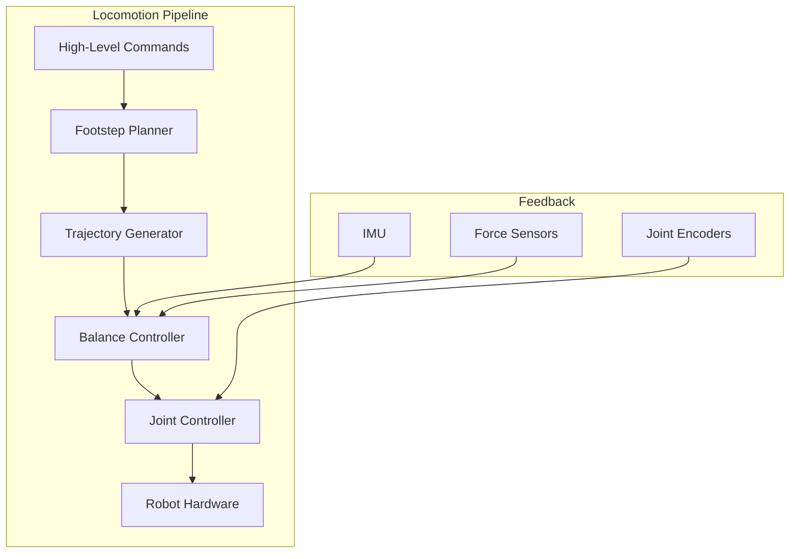

# Chapter 11: Humanoid Locomotion

## Learning Objectives

By the end of this chapter, you will be able to:

- Understand bipedal balance dynamics and ZMP theory
- Implement balance controllers for humanoid robots
- Generate walking gaits using trajectory optimization
- Handle dynamic balance during perturbations
- Integrate locomotion with ROS 2 control

## Prerequisites

- Completed Module 3
- Strong understanding of dynamics and control
- Linear algebra and optimization basics

---

## 11.1 Introduction to Bipedal Locomotion

Bipedal locomotion is one of the most challenging problems in robotics. Unlike wheeled robots, humanoids must constantly maintain balance while moving through inherently unstable walking gaits.



### Key Challenges

| Challenge | Description |
|-----------|-------------|
| Underactuation | Floating base cannot be directly controlled |
| Hybrid Dynamics | Discrete contact mode changes |
| High DoF | 20-30+ actuated joints |
| Real-time | Control loops at 500-1000 Hz |
| Robustness | Handle perturbations and terrain |

### Locomotion Approaches

| Approach | Description | Examples |
|----------|-------------|----------|
| ZMP-based | Keep Zero Moment Point in support polygon | ASIMO, HRP |
| Capture Point | Use momentum-based stepping | Atlas, Digit |
| Model Predictive | Optimize over prediction horizon | Cassie, Spot |
| Learning-based | End-to-end neural network | Various research |

---

## 11.2 Bipedal Dynamics Fundamentals

### Simplified Models

#### Linear Inverted Pendulum Model (LIPM)

The LIPM approximates the humanoid as a point mass on a massless leg:

```python
# scripts/lipm_dynamics.py
import numpy as np
from dataclasses import dataclass


@dataclass
class LIPMParams:
    """Linear Inverted Pendulum Model parameters."""
    mass: float = 50.0      # kg
    height: float = 0.9     # CoM height (m)
    gravity: float = 9.81   # m/s^2

    @property
    def omega(self):
        """Natural frequency."""
        return np.sqrt(self.gravity / self.height)


class LIPM:
    """Linear Inverted Pendulum Model for bipedal walking."""

    def __init__(self, params: LIPMParams):
        self.params = params
        self.omega = params.omega

        # State: [x, x_dot, y, y_dot]
        self.state = np.zeros(4)

    def dynamics(self, state, cop):
        """
        Compute state derivative.

        Args:
            state: [x, x_dot, y, y_dot] - CoM position and velocity
            cop: [cop_x, cop_y] - Center of Pressure position
        """
        x, x_dot, y, y_dot = state
        cop_x, cop_y = cop

        # LIPM dynamics: x_ddot = omega^2 * (x - cop_x)
        x_ddot = self.omega**2 * (x - cop_x)
        y_ddot = self.omega**2 * (y - cop_y)

        return np.array([x_dot, x_ddot, y_dot, y_ddot])

    def step(self, cop, dt):
        """Integrate dynamics forward by dt."""
        # RK4 integration
        k1 = self.dynamics(self.state, cop)
        k2 = self.dynamics(self.state + 0.5 * dt * k1, cop)
        k3 = self.dynamics(self.state + 0.5 * dt * k2, cop)
        k4 = self.dynamics(self.state + dt * k3, cop)

        self.state += (dt / 6.0) * (k1 + 2*k2 + 2*k3 + k4)
        return self.state.copy()

    def analytical_solution(self, x0, x_dot0, cop_x, t):
        """
        Analytical solution for 1D LIPM.

        x(t) = (x0 - cop_x) * cosh(omega*t) +
               (x_dot0 / omega) * sinh(omega*t) + cop_x
        """
        omega = self.omega
        x = (x0 - cop_x) * np.cosh(omega * t) + \
            (x_dot0 / omega) * np.sinh(omega * t) + cop_x
        x_dot = (x0 - cop_x) * omega * np.sinh(omega * t) + \
                x_dot0 * np.cosh(omega * t)
        return x, x_dot
```

### Zero Moment Point (ZMP)

The ZMP is the point where the net ground reaction force produces zero moment:

```python
# scripts/zmp_calculation.py
import numpy as np


def compute_zmp(com_pos, com_acc, com_height, gravity=9.81):
    """
    Compute Zero Moment Point from CoM motion.

    ZMP_x = CoM_x - (CoM_z / g) * CoM_ddot_x
    ZMP_y = CoM_y - (CoM_z / g) * CoM_ddot_y
    """
    zmp_x = com_pos[0] - (com_height / gravity) * com_acc[0]
    zmp_y = com_pos[1] - (com_height / gravity) * com_acc[1]

    return np.array([zmp_x, zmp_y])


def compute_zmp_from_forces(contact_positions, contact_forces):
    """
    Compute ZMP from contact forces.

    ZMP = sum(p_i * f_z_i) / sum(f_z_i)
    """
    total_force_z = sum(f[2] for f in contact_forces)

    if total_force_z < 1e-6:
        return None  # No ground contact

    zmp = np.zeros(2)
    for pos, force in zip(contact_positions, contact_forces):
        zmp += pos[:2] * force[2]

    zmp /= total_force_z
    return zmp


class SupportPolygon:
    """Compute and check support polygon constraints."""

    def __init__(self, foot_vertices):
        """
        Args:
            foot_vertices: List of 2D vertices defining foot shape
        """
        self.foot_vertices = np.array(foot_vertices)

    def get_support_polygon(self, left_foot_pose, right_foot_pose, stance='double'):
        """
        Get current support polygon based on stance.

        Args:
            left_foot_pose: [x, y, theta] of left foot
            right_foot_pose: [x, y, theta] of right foot
            stance: 'left', 'right', or 'double'
        """
        if stance == 'left':
            return self._transform_foot(self.foot_vertices, left_foot_pose)
        elif stance == 'right':
            return self._transform_foot(self.foot_vertices, right_foot_pose)
        else:  # double support
            left_verts = self._transform_foot(self.foot_vertices, left_foot_pose)
            right_verts = self._transform_foot(self.foot_vertices, right_foot_pose)
            return self._convex_hull(np.vstack([left_verts, right_verts]))

    def _transform_foot(self, vertices, pose):
        """Transform foot vertices to world frame."""
        x, y, theta = pose
        c, s = np.cos(theta), np.sin(theta)
        R = np.array([[c, -s], [s, c]])

        transformed = vertices @ R.T + np.array([x, y])
        return transformed

    def _convex_hull(self, points):
        """Compute convex hull of points."""
        from scipy.spatial import ConvexHull
        hull = ConvexHull(points)
        return points[hull.vertices]

    def is_zmp_stable(self, zmp, support_polygon, margin=0.02):
        """Check if ZMP is within support polygon with margin."""
        from matplotlib.path import Path

        # Shrink polygon by margin
        centroid = support_polygon.mean(axis=0)
        shrunk = centroid + (1 - margin) * (support_polygon - centroid)

        path = Path(shrunk)
        return path.contains_point(zmp)
```

### Capture Point Dynamics

The Capture Point (or Divergent Component of Motion) helps determine where to step:

```python
# scripts/capture_point.py
import numpy as np


class CapturePointController:
    """Capture Point based balance controller."""

    def __init__(self, com_height, gravity=9.81):
        self.omega = np.sqrt(gravity / com_height)

    def compute_capture_point(self, com_pos, com_vel):
        """
        Compute Capture Point (Instantaneous Capture Point).

        CP = CoM + CoM_vel / omega
        """
        cp = com_pos[:2] + com_vel[:2] / self.omega
        return cp

    def compute_dcm(self, com_pos, com_vel):
        """
        Compute Divergent Component of Motion.
        (Same as Capture Point for LIPM)
        """
        return self.compute_capture_point(com_pos, com_vel)

    def compute_desired_cop(self, current_dcm, desired_dcm, gain=3.0):
        """
        Compute desired CoP to drive DCM to desired value.

        CoP = DCM + (1/omega) * gain * (DCM - DCM_des)
        """
        cop = current_dcm + (gain / self.omega) * (current_dcm - desired_dcm)
        return cop

    def compute_step_location(self, com_pos, com_vel, step_time):
        """
        Compute where to step to capture balance.

        Uses the analytical DCM trajectory to find foot placement.
        """
        # DCM at end of step
        dcm_0 = self.compute_dcm(com_pos, com_vel)

        # Assuming constant CoP during step, DCM evolves as:
        # DCM(t) = CoP + (DCM_0 - CoP) * exp(omega * t)

        # To stop at step_time, we need DCM(step_time) = foot_pos
        # So: foot_pos = CoP + (DCM_0 - CoP) * exp(omega * step_time)

        # Simple heuristic: step to capture point + offset
        step_offset = 0.05  # meters ahead for momentum
        step_location = dcm_0 + step_offset * com_vel[:2] / (np.linalg.norm(com_vel[:2]) + 1e-6)

        return step_location
```

---

## 11.3 Gait Generation

### Footstep Planning

```python
# scripts/footstep_planner.py
import numpy as np
from dataclasses import dataclass
from typing import List, Tuple


@dataclass
class FootstepParams:
    """Parameters for footstep generation."""
    step_length: float = 0.3      # meters
    step_width: float = 0.2       # meters (lateral distance between feet)
    step_height: float = 0.05     # meters (swing height)
    step_duration: float = 0.4    # seconds
    double_support_ratio: float = 0.2  # fraction of step in double support


@dataclass
class Footstep:
    """Single footstep specification."""
    position: np.ndarray  # [x, y, z]
    orientation: float    # yaw angle
    foot: str            # 'left' or 'right'
    timestamp: float     # when foot lands


class FootstepPlanner:
    """Generate footstep sequences for walking."""

    def __init__(self, params: FootstepParams):
        self.params = params

    def plan_straight_walk(self, start_pos, distance, start_foot='left') -> List[Footstep]:
        """
        Plan footsteps for straight-line walking.

        Args:
            start_pos: Starting position [x, y]
            distance: Total distance to walk
            start_foot: Which foot takes first step
        """
        footsteps = []
        num_steps = int(np.ceil(distance / self.params.step_length))

        current_foot = start_foot
        current_time = 0.0

        # Initial stance
        left_pos = np.array([start_pos[0], start_pos[1] + self.params.step_width/2, 0])
        right_pos = np.array([start_pos[0], start_pos[1] - self.params.step_width/2, 0])

        for i in range(num_steps):
            current_time += self.params.step_duration

            if current_foot == 'left':
                # Move left foot forward
                left_pos[0] += self.params.step_length
                footsteps.append(Footstep(
                    position=left_pos.copy(),
                    orientation=0.0,
                    foot='left',
                    timestamp=current_time
                ))
                current_foot = 'right'
            else:
                # Move right foot forward
                right_pos[0] += self.params.step_length
                footsteps.append(Footstep(
                    position=right_pos.copy(),
                    orientation=0.0,
                    foot='right',
                    timestamp=current_time
                ))
                current_foot = 'left'

        return footsteps

    def plan_turn(self, start_pos, start_yaw, turn_angle, num_steps=4) -> List[Footstep]:
        """Plan footsteps for turning in place."""
        footsteps = []
        angle_per_step = turn_angle / num_steps

        current_yaw = start_yaw
        current_time = 0.0

        for i in range(num_steps):
            current_time += self.params.step_duration
            current_yaw += angle_per_step

            foot = 'left' if i % 2 == 0 else 'right'
            lateral_offset = self.params.step_width/2 if foot == 'left' else -self.params.step_width/2

            # Rotate position around center
            pos = np.array([
                start_pos[0] + lateral_offset * np.sin(current_yaw),
                start_pos[1] + lateral_offset * np.cos(current_yaw),
                0.0
            ])

            footsteps.append(Footstep(
                position=pos,
                orientation=current_yaw,
                foot=foot,
                timestamp=current_time
            ))

        return footsteps
```

### Swing Foot Trajectory

```python
# scripts/swing_trajectory.py
import numpy as np
from scipy.interpolate import CubicSpline


class SwingTrajectoryGenerator:
    """Generate smooth swing foot trajectories."""

    def __init__(self, swing_height=0.05):
        self.swing_height = swing_height

    def generate_trajectory(self, start_pos, end_pos, duration, num_points=50):
        """
        Generate swing foot trajectory with smooth velocity profile.

        Uses cubic spline for x,y and raised cosine for z.
        """
        t = np.linspace(0, duration, num_points)

        # X-Y: Cubic interpolation with zero velocity at endpoints
        times = [0, duration]
        x_points = [start_pos[0], end_pos[0]]
        y_points = [start_pos[1], end_pos[1]]

        x_spline = CubicSpline(times, x_points, bc_type='clamped')
        y_spline = CubicSpline(times, y_points, bc_type='clamped')

        x = x_spline(t)
        y = y_spline(t)

        # Z: Raised cosine (smooth up and down)
        # z(t) = h * sin(pi * t / T)
        z = start_pos[2] + self.swing_height * np.sin(np.pi * t / duration)

        # Velocities
        x_dot = x_spline(t, 1)
        y_dot = y_spline(t, 1)
        z_dot = self.swing_height * (np.pi / duration) * np.cos(np.pi * t / duration)

        positions = np.column_stack([x, y, z])
        velocities = np.column_stack([x_dot, y_dot, z_dot])

        return t, positions, velocities

    def generate_bezier_trajectory(self, start_pos, end_pos, duration, num_points=50):
        """
        Generate swing trajectory using Bezier curve.

        Provides more control over trajectory shape.
        """
        t = np.linspace(0, 1, num_points)

        # Control points for cubic Bezier
        p0 = start_pos
        p3 = end_pos
        p1 = start_pos + np.array([0.3 * (end_pos[0] - start_pos[0]), 0, self.swing_height])
        p2 = end_pos + np.array([-0.3 * (end_pos[0] - start_pos[0]), 0, self.swing_height])

        # Bezier curve: B(t) = (1-t)^3*P0 + 3*(1-t)^2*t*P1 + 3*(1-t)*t^2*P2 + t^3*P3
        positions = np.zeros((num_points, 3))
        for i, ti in enumerate(t):
            positions[i] = (
                (1-ti)**3 * p0 +
                3 * (1-ti)**2 * ti * p1 +
                3 * (1-ti) * ti**2 * p2 +
                ti**3 * p3
            )

        # Compute velocities via finite differences
        dt = duration / (num_points - 1)
        velocities = np.gradient(positions, dt, axis=0)

        time = np.linspace(0, duration, num_points)
        return time, positions, velocities
```

### CoM Trajectory Generation

```python
# scripts/com_trajectory.py
import numpy as np
from scipy.linalg import solve_discrete_are


class PreviewController:
    """
    Preview control for CoM trajectory generation.

    Generates CoM trajectory that keeps ZMP within support polygon.
    """

    def __init__(self, com_height, dt, preview_horizon=1.6):
        self.com_height = com_height
        self.dt = dt
        self.preview_steps = int(preview_horizon / dt)
        self.gravity = 9.81

        # LIPM state space model (discretized)
        omega2 = self.gravity / com_height

        # Continuous: x_ddot = omega^2 * (x - zmp)
        # State: [x, x_dot, x_ddot], Control: zmp
        self.A = np.array([
            [1, dt, dt**2/2],
            [0, 1, dt],
            [0, 0, 1]
        ])
        self.B = np.array([
            [dt**3/6],
            [dt**2/2],
            [dt]
        ]) * omega2

        self.C = np.array([[1, 0, -com_height/self.gravity]])

        # Compute preview gains
        self._compute_gains()

    def _compute_gains(self):
        """Compute preview controller gains using LQR."""
        Q = np.eye(1) * 1.0  # ZMP tracking weight
        R = np.eye(1) * 1e-6  # Jerk weight

        # Augmented system for integral control
        A_aug = np.block([
            [1, self.C @ self.A],
            [np.zeros((3, 1)), self.A]
        ])
        B_aug = np.block([
            [self.C @ self.B],
            [self.B]
        ])
        Q_aug = np.block([
            [Q, np.zeros((1, 3))],
            [np.zeros((3, 1)), np.zeros((3, 3))]
        ])
        R_aug = R

        # Solve DARE
        P = solve_discrete_are(A_aug, B_aug, Q_aug, R_aug)

        # State feedback gain
        self.K = np.linalg.inv(R_aug + B_aug.T @ P @ B_aug) @ B_aug.T @ P @ A_aug

        # Preview gains (simplified)
        self.Ks = self.K[0, 0]  # Integral gain
        self.Kx = self.K[0, 1:]  # State feedback gain

        # Preview gain computation
        self.Kp = np.zeros(self.preview_steps)
        Ac = A_aug - B_aug @ self.K
        X = -Ac.T @ P @ np.vstack([1, np.zeros((3, 1))])

        for i in range(self.preview_steps):
            self.Kp[i] = (np.linalg.inv(R_aug + B_aug.T @ P @ B_aug) @ B_aug.T @ X)[0, 0]
            X = Ac.T @ X

    def generate_trajectory(self, zmp_reference, initial_state=None):
        """
        Generate CoM trajectory given ZMP reference.

        Args:
            zmp_reference: [N, 2] array of desired ZMP positions
            initial_state: [x, x_dot, x_ddot] initial CoM state

        Returns:
            com_trajectory: [N, 2] CoM positions
        """
        if initial_state is None:
            initial_state = np.array([0, 0, 0])

        N = len(zmp_reference)
        com_trajectory = np.zeros((N, 2))

        # Process each axis independently
        for axis in range(2):
            state = initial_state.copy()
            zmp_ref = zmp_reference[:, axis]
            integral_error = 0

            for i in range(N):
                # Current ZMP
                zmp_current = self.C @ state

                # Integral of ZMP error
                integral_error += zmp_current[0] - zmp_ref[i]

                # Preview sum
                preview_sum = 0
                for j in range(min(self.preview_steps, N - i)):
                    preview_sum += self.Kp[j] * zmp_ref[i + j]

                # Control input (jerk)
                u = -self.Ks * integral_error - self.Kx @ state + preview_sum

                # State update
                state = self.A @ state + self.B.flatten() * u

                com_trajectory[i, axis] = state[0]

        return com_trajectory
```

---

## 11.4 Balance Control

### Whole-Body Controller

```python
# scripts/whole_body_controller.py
import numpy as np
from scipy.optimize import minimize


class WholeBodyController:
    """
    Quadratic Programming based whole-body controller.

    Tracks desired CoM, foot positions, and joint postures
    while respecting dynamics and contact constraints.
    """

    def __init__(self, robot_model):
        self.robot = robot_model

        # Task weights
        self.w_com = 100.0
        self.w_foot = 50.0
        self.w_posture = 1.0
        self.w_torque = 0.01

    def compute_torques(self, state, tasks, contacts):
        """
        Compute joint torques to achieve desired tasks.

        Args:
            state: Current robot state (q, q_dot)
            tasks: Dict of task targets (com, left_foot, right_foot, posture)
            contacts: List of active contacts

        Returns:
            torques: Joint torques
        """
        q, q_dot = state['q'], state['q_dot']

        # Get robot dynamics matrices
        M = self.robot.mass_matrix(q)
        h = self.robot.nonlinear_effects(q, q_dot)

        # Get Jacobians
        J_com = self.robot.com_jacobian(q)
        J_lfoot = self.robot.foot_jacobian(q, 'left')
        J_rfoot = self.robot.foot_jacobian(q, 'right')

        # Current task values
        com_pos = self.robot.com_position(q)
        lfoot_pos = self.robot.foot_position(q, 'left')
        rfoot_pos = self.robot.foot_position(q, 'right')

        # Task errors
        com_error = tasks['com'] - com_pos
        lfoot_error = tasks['left_foot'] - lfoot_pos
        rfoot_error = tasks['right_foot'] - rfoot_pos
        posture_error = tasks['posture'] - q

        # Desired accelerations (PD control)
        kp, kd = 100.0, 20.0
        com_acc_des = kp * com_error - kd * (J_com @ q_dot)
        lfoot_acc_des = kp * lfoot_error - kd * (J_lfoot @ q_dot)
        rfoot_acc_des = kp * rfoot_error - kd * (J_rfoot @ q_dot)
        posture_acc_des = kp * posture_error - kd * q_dot

        # Stack tasks
        J_tasks = np.vstack([
            J_com * np.sqrt(self.w_com),
            J_lfoot * np.sqrt(self.w_foot),
            J_rfoot * np.sqrt(self.w_foot),
            np.eye(len(q)) * np.sqrt(self.w_posture)
        ])

        acc_des = np.concatenate([
            com_acc_des * np.sqrt(self.w_com),
            lfoot_acc_des * np.sqrt(self.w_foot),
            rfoot_acc_des * np.sqrt(self.w_foot),
            posture_acc_des * np.sqrt(self.w_posture)
        ])

        # QP: minimize ||J*q_ddot - acc_des||^2 + w_torque * ||tau||^2
        # subject to: M*q_ddot + h = S^T*tau + J_c^T*f
        #             friction cone constraints
        #             torque limits

        # Simplified: Solve least squares
        q_ddot = np.linalg.lstsq(J_tasks, acc_des, rcond=None)[0]

        # Compute torques
        tau = M @ q_ddot + h

        # Apply torque limits
        tau_max = self.robot.torque_limits
        tau = np.clip(tau, -tau_max, tau_max)

        return tau


class BalanceController:
    """Simple balance controller using CoM feedback."""

    def __init__(self, robot_model, com_height):
        self.robot = robot_model
        self.omega = np.sqrt(9.81 / com_height)

        # Gains
        self.kp_com = np.array([100, 100, 200])  # x, y, z
        self.kd_com = np.array([20, 20, 40])

    def compute_desired_com_acceleration(self, com_pos, com_vel, com_des, com_vel_des):
        """Compute desired CoM acceleration for balance."""
        com_error = com_des - com_pos
        com_vel_error = com_vel_des - com_vel

        acc_des = self.kp_com * com_error + self.kd_com * com_vel_error

        return acc_des

    def compute_desired_wrench(self, com_acc_des, total_mass):
        """
        Compute desired ground reaction wrench.

        F_des = m * (g + acc_des)
        """
        gravity = np.array([0, 0, 9.81])
        F_des = total_mass * (gravity + com_acc_des)

        return F_des
```

---

## 11.5 ROS 2 Integration

### Locomotion Controller Node

```python
# scripts/locomotion_node.py
import rclpy
from rclpy.node import Node
from geometry_msgs.msg import Twist, PoseStamped
from sensor_msgs.msg import JointState, Imu
from nav_msgs.msg import Odometry
from std_msgs.msg import Float64MultiArray
import numpy as np


class LocomotionController(Node):
    """ROS 2 node for humanoid locomotion control."""

    def __init__(self):
        super().__init__('locomotion_controller')

        # Parameters
        self.declare_parameter('com_height', 0.9)
        self.declare_parameter('control_frequency', 500.0)
        self.declare_parameter('step_length', 0.3)
        self.declare_parameter('step_duration', 0.4)

        self.com_height = self.get_parameter('com_height').value
        self.control_freq = self.get_parameter('control_frequency').value

        # State
        self.joint_positions = None
        self.joint_velocities = None
        self.imu_orientation = None
        self.imu_angular_velocity = None
        self.com_position = np.zeros(3)
        self.com_velocity = np.zeros(3)

        # Desired velocity command
        self.cmd_vel = Twist()

        # Controllers
        from scripts.com_trajectory import PreviewController
        from scripts.footstep_planner import FootstepPlanner, FootstepParams

        self.preview_controller = PreviewController(
            self.com_height,
            dt=1.0/self.control_freq
        )
        self.footstep_planner = FootstepPlanner(FootstepParams(
            step_length=self.get_parameter('step_length').value,
            step_duration=self.get_parameter('step_duration').value
        ))

        # Subscribers
        self.joint_sub = self.create_subscription(
            JointState, '/joint_states', self.joint_callback, 10
        )
        self.imu_sub = self.create_subscription(
            Imu, '/imu/data', self.imu_callback, 10
        )
        self.cmd_vel_sub = self.create_subscription(
            Twist, '/cmd_vel', self.cmd_vel_callback, 10
        )

        # Publishers
        self.joint_cmd_pub = self.create_publisher(
            Float64MultiArray, '/joint_commands', 10
        )
        self.com_pub = self.create_publisher(
            PoseStamped, '/com_state', 10
        )

        # Control timer
        self.create_timer(1.0 / self.control_freq, self.control_loop)

        # State machine
        self.state = 'standing'
        self.gait_phase = 0.0
        self.current_footsteps = []
        self.current_step_index = 0

        self.get_logger().info('Locomotion Controller initialized')

    def joint_callback(self, msg):
        self.joint_positions = np.array(msg.position)
        self.joint_velocities = np.array(msg.velocity)

    def imu_callback(self, msg):
        self.imu_orientation = np.array([
            msg.orientation.x,
            msg.orientation.y,
            msg.orientation.z,
            msg.orientation.w
        ])
        self.imu_angular_velocity = np.array([
            msg.angular_velocity.x,
            msg.angular_velocity.y,
            msg.angular_velocity.z
        ])

    def cmd_vel_callback(self, msg):
        self.cmd_vel = msg

        # Update state machine
        if abs(msg.linear.x) > 0.01 or abs(msg.angular.z) > 0.01:
            if self.state == 'standing':
                self.state = 'walking'
                self._plan_footsteps()
        else:
            if self.state == 'walking':
                self.state = 'stopping'

    def _plan_footsteps(self):
        """Generate footstep plan based on velocity command."""
        distance = self.cmd_vel.linear.x * 5.0  # Plan 5 seconds ahead
        self.current_footsteps = self.footstep_planner.plan_straight_walk(
            self.com_position[:2],
            distance
        )
        self.current_step_index = 0

    def control_loop(self):
        """Main control loop at 500 Hz."""
        if self.joint_positions is None:
            return

        # Estimate CoM state
        self._estimate_com_state()

        if self.state == 'standing':
            self._standing_control()
        elif self.state == 'walking':
            self._walking_control()
        elif self.state == 'stopping':
            self._stopping_control()

        # Publish CoM state
        self._publish_com_state()

    def _estimate_com_state(self):
        """Estimate CoM position and velocity from sensors."""
        # Simplified: Use forward kinematics
        # In practice: Use state estimator (EKF/UKF)
        pass

    def _standing_control(self):
        """Control for standing balance."""
        # Keep CoM over center of support polygon
        com_des = np.array([0, 0, self.com_height])
        com_vel_des = np.zeros(3)

        # Compute desired joint positions
        joint_cmd = self._inverse_kinematics(com_des)

        # Publish
        msg = Float64MultiArray()
        msg.data = joint_cmd.tolist()
        self.joint_cmd_pub.publish(msg)

    def _walking_control(self):
        """Control for walking."""
        if self.current_step_index >= len(self.current_footsteps):
            self.state = 'stopping'
            return

        current_step = self.current_footsteps[self.current_step_index]

        # Generate CoM trajectory
        # ... (use preview controller)

        # Generate swing foot trajectory
        # ... (use swing trajectory generator)

        # Compute joint commands
        # ... (use inverse kinematics)

        # Update gait phase
        self.gait_phase += 1.0 / self.control_freq
        if self.gait_phase >= current_step.timestamp:
            self.current_step_index += 1
            self.gait_phase = 0

    def _stopping_control(self):
        """Control for stopping and returning to stand."""
        # Bring CoM to center and stop
        self.state = 'standing'

    def _inverse_kinematics(self, com_des):
        """Compute joint positions for desired CoM."""
        # Simplified placeholder
        return np.zeros(20)  # Return nominal joint positions

    def _publish_com_state(self):
        """Publish current CoM state."""
        msg = PoseStamped()
        msg.header.stamp = self.get_clock().now().to_msg()
        msg.header.frame_id = 'base_link'
        msg.pose.position.x = self.com_position[0]
        msg.pose.position.y = self.com_position[1]
        msg.pose.position.z = self.com_position[2]
        self.com_pub.publish(msg)


def main(args=None):
    rclpy.init(args=args)
    node = LocomotionController()
    rclpy.spin(node)
    node.destroy_node()
    rclpy.shutdown()


if __name__ == '__main__':
    main()
```

### Launch Configuration

```python
# launch/locomotion.launch.py
from launch import LaunchDescription
from launch_ros.actions import Node


def generate_launch_description():
    """Launch humanoid locomotion controller."""

    return LaunchDescription([
        Node(
            package='humanoid_locomotion',
            executable='locomotion_node',
            name='locomotion_controller',
            parameters=[{
                'com_height': 0.9,
                'control_frequency': 500.0,
                'step_length': 0.25,
                'step_duration': 0.4,
            }],
            output='screen',
        ),

        # State estimator
        Node(
            package='humanoid_locomotion',
            executable='state_estimator',
            name='state_estimator',
            output='screen',
        ),

        # Joint trajectory controller
        Node(
            package='controller_manager',
            executable='ros2_control_node',
            parameters=['config/controllers.yaml'],
            output='screen',
        ),
    ])
```

---

## 11.6 Learning-Based Locomotion

### Training Locomotion with RL

```python
# scripts/locomotion_rl_env.py
import numpy as np
import torch


class HumanoidLocomotionEnv:
    """Reinforcement learning environment for humanoid locomotion."""

    def __init__(self, sim, num_envs=1024):
        self.sim = sim
        self.num_envs = num_envs

        # Observation space
        self.obs_dim = 48  # Base state + joint state + commands

        # Action space (joint position targets)
        self.action_dim = 12  # 6 per leg

        # Reward weights
        self.w_forward = 1.0
        self.w_alive = 0.5
        self.w_energy = -0.001
        self.w_smooth = -0.01

    def reset(self):
        """Reset environments."""
        self.sim.reset()
        return self._get_obs()

    def step(self, actions):
        """Execute actions and return transition."""
        # Apply actions as joint position targets
        self.sim.set_joint_targets(actions)

        # Step simulation
        self.sim.step()

        # Get observations
        obs = self._get_obs()

        # Compute rewards
        rewards = self._compute_rewards()

        # Check termination
        dones = self._check_termination()

        return obs, rewards, dones, {}

    def _get_obs(self):
        """Construct observation tensor."""
        obs = torch.zeros((self.num_envs, self.obs_dim))

        # Base state (position, orientation, velocities)
        obs[:, 0:3] = self.sim.get_base_position()
        obs[:, 3:7] = self.sim.get_base_orientation()
        obs[:, 7:10] = self.sim.get_base_linear_velocity()
        obs[:, 10:13] = self.sim.get_base_angular_velocity()

        # Joint state
        obs[:, 13:25] = self.sim.get_joint_positions()
        obs[:, 25:37] = self.sim.get_joint_velocities()

        # Commands
        obs[:, 37:40] = self.cmd_vel  # [vx, vy, omega_z]

        # Contact states
        obs[:, 40:42] = self.sim.get_foot_contacts()

        # Previous actions
        obs[:, 42:48] = self.prev_actions[:, :6]

        return obs

    def _compute_rewards(self):
        """Compute reward for each environment."""
        # Forward velocity reward
        base_vel = self.sim.get_base_linear_velocity()
        forward_reward = self.w_forward * base_vel[:, 0]

        # Alive bonus
        alive_reward = self.w_alive * torch.ones(self.num_envs)

        # Energy penalty
        torques = self.sim.get_joint_torques()
        velocities = self.sim.get_joint_velocities()
        energy_penalty = self.w_energy * torch.sum(torques * velocities, dim=1)

        # Smoothness penalty
        action_diff = self.actions - self.prev_actions
        smooth_penalty = self.w_smooth * torch.sum(action_diff**2, dim=1)

        total_reward = forward_reward + alive_reward + energy_penalty + smooth_penalty

        return total_reward

    def _check_termination(self):
        """Check if episodes should terminate."""
        # Fall detection
        base_height = self.sim.get_base_position()[:, 2]
        fallen = base_height < 0.3

        # Large orientation
        orientation = self.sim.get_base_orientation()
        tilted = torch.abs(orientation[:, 0]) > 0.5  # Roll

        return fallen | tilted
```

---

## Lab Exercise

Complete the hands-on lab in [`labs/module-4/ch11-walking/`](/labs/module-4/ch11-walking/) where you will:

1. Implement the Linear Inverted Pendulum Model
2. Generate ZMP reference trajectories for walking
3. Implement a preview controller for CoM trajectory
4. Create swing foot trajectories with Bezier curves
5. Test walking in simulation (Isaac Sim or MuJoCo)

**Estimated time**: 3-4 hours

---

## Summary

In this chapter, you learned:

- **Bipedal dynamics**: LIPM, ZMP theory, and Capture Point concepts
- **Gait generation**: Footstep planning and trajectory optimization
- **Swing trajectories**: Smooth foot motion using splines and Bezier curves
- **Balance control**: Whole-body control and CoM tracking
- **ROS 2 integration**: Building a locomotion controller node
- **Learning approaches**: RL environment design for locomotion

Humanoid locomotion combines dynamics modeling, trajectory optimization, and real-time control. The foundations covered here apply to various bipedal platforms and can be extended with learning-based approaches for robust performance.

---

## Further Reading

- [Introduction to Humanoid Robotics (Kajita)](https://link.springer.com/book/10.1007/978-3-642-54536-8)
- [MuJoCo Documentation](https://mujoco.org/)
- [Capture Point Control](https://ieeexplore.ieee.org/document/4115602)
- [Preview Control of ZMP](https://ieeexplore.ieee.org/document/1241826)
- [Learning Humanoid Locomotion (DeepMind)](https://www.deepmind.com/publications/learning-to-walk-in-minutes)
