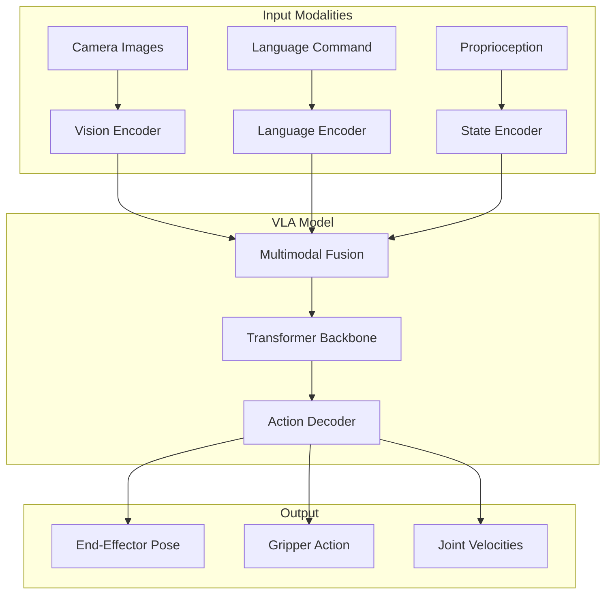

# Chapter 13: Vision-Language-Action Models

## Learning Objectives

By the end of this chapter, you will be able to:

- Understand VLA model architectures and training
- Process multimodal inputs (vision + language)
- Deploy foundation models for robot control
- Fine-tune models for specific tasks
- Integrate VLA models with ROS 2 systems

## Prerequisites

- Completed Chapters 11-12
- Understanding of transformer architectures
- PyTorch and deep learning fundamentals

---

## 13.1 Introduction to Vision-Language-Action Models

Vision-Language-Action (VLA) models represent a paradigm shift in robotics, enabling robots to understand natural language instructions and execute corresponding actions based on visual observations.



### Why VLA Models?

| Traditional Approach | VLA Approach |
|---------------------|--------------|
| Task-specific policies | General-purpose models |
| Manual feature engineering | Learned representations |
| Limited generalization | Zero/few-shot transfer |
| Structured commands | Natural language |

### Key VLA Models

| Model | Organization | Key Features |
|-------|--------------|--------------|
| RT-1 | Google | Real-world transformer |
| RT-2 | Google | VLM + robotics |
| RT-X | Open X-Embodiment | Cross-embodiment |
| Octo | Berkeley | Open-source generalist |
| OpenVLA | Stanford | Open-source VLA |
| PaLM-E | Google | Embodied multimodal |

---

## 13.2 VLA Architecture

### Vision Encoder

```python
# scripts/vision_encoder.py
import torch
import torch.nn as nn
from torchvision import transforms
from transformers import CLIPVisionModel, CLIPProcessor
import numpy as np
from PIL import Image


class VisionEncoder(nn.Module):
    """Vision encoder using CLIP or ViT backbone."""

    def __init__(self, model_name='openai/clip-vit-base-patch32',
                 output_dim=512, freeze_backbone=True):
        super().__init__()

        # Load pretrained CLIP vision encoder
        self.clip_vision = CLIPVisionModel.from_pretrained(model_name)
        self.processor = CLIPProcessor.from_pretrained(model_name)

        if freeze_backbone:
            for param in self.clip_vision.parameters():
                param.requires_grad = False

        # Projection layer
        clip_dim = self.clip_vision.config.hidden_size
        self.projection = nn.Linear(clip_dim, output_dim)

        # Image preprocessing
        self.image_transform = transforms.Compose([
            transforms.Resize((224, 224)),
            transforms.ToTensor(),
            transforms.Normalize(
                mean=[0.48145466, 0.4578275, 0.40821073],
                std=[0.26862954, 0.26130258, 0.27577711]
            ),
        ])

    def forward(self, images):
        """
        Encode images to feature vectors.

        Args:
            images: [B, C, H, W] batch of images

        Returns:
            features: [B, output_dim] image features
        """
        # Get CLIP vision features
        vision_outputs = self.clip_vision(pixel_values=images)

        # Use [CLS] token embedding
        cls_features = vision_outputs.last_hidden_state[:, 0, :]

        # Project to output dimension
        features = self.projection(cls_features)

        return features

    def encode_image(self, image):
        """Encode a single image (PIL or numpy)."""
        if isinstance(image, np.ndarray):
            image = Image.fromarray(image)

        image_tensor = self.image_transform(image).unsqueeze(0)
        with torch.no_grad():
            features = self.forward(image_tensor)

        return features


class MultiViewEncoder(nn.Module):
    """Encode multiple camera views."""

    def __init__(self, num_views=2, output_dim=512):
        super().__init__()

        self.num_views = num_views
        self.single_view_encoder = VisionEncoder(output_dim=output_dim)

        # Fusion layer
        self.fusion = nn.Sequential(
            nn.Linear(output_dim * num_views, output_dim),
            nn.ReLU(),
            nn.Linear(output_dim, output_dim)
        )

    def forward(self, images):
        """
        Encode multiple camera views.

        Args:
            images: [B, num_views, C, H, W] multi-view images

        Returns:
            features: [B, output_dim] fused features
        """
        batch_size = images.shape[0]
        view_features = []

        for v in range(self.num_views):
            view_img = images[:, v]
            feat = self.single_view_encoder(view_img)
            view_features.append(feat)

        # Concatenate and fuse
        concat_features = torch.cat(view_features, dim=1)
        fused = self.fusion(concat_features)

        return fused
```

### Language Encoder

```python
# scripts/language_encoder.py
import torch
import torch.nn as nn
from transformers import AutoTokenizer, AutoModel


class LanguageEncoder(nn.Module):
    """Language encoder using pretrained transformer."""

    def __init__(self, model_name='sentence-transformers/all-MiniLM-L6-v2',
                 output_dim=512, max_length=128):
        super().__init__()

        self.tokenizer = AutoTokenizer.from_pretrained(model_name)
        self.encoder = AutoModel.from_pretrained(model_name)
        self.max_length = max_length

        # Projection layer
        hidden_size = self.encoder.config.hidden_size
        self.projection = nn.Linear(hidden_size, output_dim)

    def forward(self, text_tokens):
        """
        Encode tokenized text.

        Args:
            text_tokens: Dict with input_ids and attention_mask

        Returns:
            features: [B, output_dim] text features
        """
        outputs = self.encoder(**text_tokens)

        # Mean pooling over tokens
        attention_mask = text_tokens['attention_mask']
        token_embeddings = outputs.last_hidden_state
        mask_expanded = attention_mask.unsqueeze(-1).expand(token_embeddings.size())
        sum_embeddings = torch.sum(token_embeddings * mask_expanded, dim=1)
        sum_mask = torch.clamp(mask_expanded.sum(dim=1), min=1e-9)
        mean_embeddings = sum_embeddings / sum_mask

        # Project
        features = self.projection(mean_embeddings)

        return features

    def encode_text(self, text):
        """Encode raw text string."""
        tokens = self.tokenizer(
            text,
            padding='max_length',
            truncation=True,
            max_length=self.max_length,
            return_tensors='pt'
        )

        with torch.no_grad():
            features = self.forward(tokens)

        return features

    def tokenize(self, texts):
        """Tokenize batch of texts."""
        return self.tokenizer(
            texts,
            padding='max_length',
            truncation=True,
            max_length=self.max_length,
            return_tensors='pt'
        )
```

### Multimodal Transformer

```python
# scripts/vla_model.py
import torch
import torch.nn as nn
import math


class PositionalEncoding(nn.Module):
    """Sinusoidal positional encoding."""

    def __init__(self, d_model, max_len=5000):
        super().__init__()

        pe = torch.zeros(max_len, d_model)
        position = torch.arange(0, max_len, dtype=torch.float).unsqueeze(1)
        div_term = torch.exp(torch.arange(0, d_model, 2).float() * (-math.log(10000.0) / d_model))

        pe[:, 0::2] = torch.sin(position * div_term)
        pe[:, 1::2] = torch.cos(position * div_term)
        pe = pe.unsqueeze(0)

        self.register_buffer('pe', pe)

    def forward(self, x):
        return x + self.pe[:, :x.size(1)]


class VLAModel(nn.Module):
    """Vision-Language-Action model for robot control."""

    def __init__(self, config):
        super().__init__()

        self.config = config
        hidden_dim = config.get('hidden_dim', 512)
        num_layers = config.get('num_layers', 6)
        num_heads = config.get('num_heads', 8)
        action_dim = config.get('action_dim', 7)  # 6 DoF + gripper

        # Modality encoders
        self.vision_encoder = VisionEncoder(output_dim=hidden_dim)
        self.language_encoder = LanguageEncoder(output_dim=hidden_dim)

        # Proprioception encoder
        proprio_dim = config.get('proprio_dim', 7)
        self.proprio_encoder = nn.Sequential(
            nn.Linear(proprio_dim, hidden_dim),
            nn.ReLU(),
            nn.Linear(hidden_dim, hidden_dim)
        )

        # Token type embeddings
        self.token_type_embedding = nn.Embedding(4, hidden_dim)  # vision, language, proprio, action

        # Positional encoding
        self.pos_encoder = PositionalEncoding(hidden_dim)

        # Transformer
        encoder_layer = nn.TransformerEncoderLayer(
            d_model=hidden_dim,
            nhead=num_heads,
            dim_feedforward=hidden_dim * 4,
            dropout=0.1,
            activation='gelu',
            batch_first=True
        )
        self.transformer = nn.TransformerEncoder(encoder_layer, num_layers=num_layers)

        # Action prediction head
        self.action_head = nn.Sequential(
            nn.Linear(hidden_dim, hidden_dim),
            nn.ReLU(),
            nn.Linear(hidden_dim, action_dim)
        )

        # Action token (learnable query)
        self.action_token = nn.Parameter(torch.randn(1, 1, hidden_dim))

    def forward(self, images, text_tokens, proprio, attention_mask=None):
        """
        Forward pass for VLA model.

        Args:
            images: [B, C, H, W] camera images
            text_tokens: Dict with tokenized language instruction
            proprio: [B, proprio_dim] proprioceptive state
            attention_mask: Optional attention mask

        Returns:
            actions: [B, action_dim] predicted actions
        """
        batch_size = images.shape[0]

        # Encode each modality
        vision_features = self.vision_encoder(images)  # [B, hidden_dim]
        language_features = self.language_encoder(text_tokens)  # [B, hidden_dim]
        proprio_features = self.proprio_encoder(proprio)  # [B, hidden_dim]

        # Add token type embeddings
        vision_tokens = vision_features.unsqueeze(1) + self.token_type_embedding(
            torch.zeros(batch_size, 1, dtype=torch.long, device=images.device)
        )
        language_tokens = language_features.unsqueeze(1) + self.token_type_embedding(
            torch.ones(batch_size, 1, dtype=torch.long, device=images.device)
        )
        proprio_tokens = proprio_features.unsqueeze(1) + self.token_type_embedding(
            torch.full((batch_size, 1), 2, dtype=torch.long, device=images.device)
        )

        # Action query token
        action_tokens = self.action_token.expand(batch_size, -1, -1) + self.token_type_embedding(
            torch.full((batch_size, 1), 3, dtype=torch.long, device=images.device)
        )

        # Concatenate all tokens
        tokens = torch.cat([vision_tokens, language_tokens, proprio_tokens, action_tokens], dim=1)

        # Add positional encoding
        tokens = self.pos_encoder(tokens)

        # Transformer
        transformer_out = self.transformer(tokens)

        # Extract action token output
        action_features = transformer_out[:, -1, :]  # Last token

        # Predict actions
        actions = self.action_head(action_features)

        return actions

    def predict_action(self, image, instruction, proprio):
        """
        Predict action for a single observation.

        Args:
            image: PIL Image or numpy array
            instruction: String instruction
            proprio: numpy array of proprioceptive state

        Returns:
            action: numpy array of predicted action
        """
        import numpy as np
        from PIL import Image as PILImage

        self.eval()

        # Preprocess inputs
        if isinstance(image, np.ndarray):
            image = PILImage.fromarray(image)
        image_tensor = self.vision_encoder.image_transform(image).unsqueeze(0)

        text_tokens = self.language_encoder.tokenize([instruction])
        proprio_tensor = torch.from_numpy(proprio).float().unsqueeze(0)

        # Move to device
        device = next(self.parameters()).device
        image_tensor = image_tensor.to(device)
        text_tokens = {k: v.to(device) for k, v in text_tokens.items()}
        proprio_tensor = proprio_tensor.to(device)

        with torch.no_grad():
            action = self.forward(image_tensor, text_tokens, proprio_tensor)

        return action.cpu().numpy()[0]
```

---

## 13.3 Training VLA Models

### Dataset Preparation

```python
# scripts/vla_dataset.py
import torch
from torch.utils.data import Dataset, DataLoader
import numpy as np
from PIL import Image
import json
import os


class RobotDataset(Dataset):
    """Dataset for VLA model training."""

    def __init__(self, data_dir, transform=None, max_episodes=None):
        """
        Args:
            data_dir: Path to dataset directory
            transform: Image transforms
            max_episodes: Limit number of episodes (for debugging)
        """
        self.data_dir = data_dir
        self.transform = transform

        # Load episode metadata
        self.episodes = []
        self._load_episodes(max_episodes)

    def _load_episodes(self, max_episodes):
        """Load all episode data."""
        episodes_dir = os.path.join(self.data_dir, 'episodes')

        for ep_name in sorted(os.listdir(episodes_dir)):
            if max_episodes and len(self.episodes) >= max_episodes:
                break

            ep_path = os.path.join(episodes_dir, ep_name)
            metadata_path = os.path.join(ep_path, 'metadata.json')

            if os.path.exists(metadata_path):
                with open(metadata_path, 'r') as f:
                    metadata = json.load(f)

                # Add each timestep as a sample
                for t in range(metadata['num_steps']):
                    self.episodes.append({
                        'episode_path': ep_path,
                        'timestep': t,
                        'instruction': metadata['instruction'],
                        'num_steps': metadata['num_steps']
                    })

    def __len__(self):
        return len(self.episodes)

    def __getitem__(self, idx):
        ep_data = self.episodes[idx]
        ep_path = ep_data['episode_path']
        t = ep_data['timestep']

        # Load image
        image_path = os.path.join(ep_path, 'images', f'{t:06d}.jpg')
        image = Image.open(image_path).convert('RGB')
        if self.transform:
            image = self.transform(image)

        # Load proprioception
        proprio_path = os.path.join(ep_path, 'proprio', f'{t:06d}.npy')
        proprio = np.load(proprio_path).astype(np.float32)

        # Load action (next timestep)
        action_path = os.path.join(ep_path, 'actions', f'{t:06d}.npy')
        action = np.load(action_path).astype(np.float32)

        return {
            'image': image,
            'instruction': ep_data['instruction'],
            'proprio': torch.from_numpy(proprio),
            'action': torch.from_numpy(action)
        }


def collate_fn(batch):
    """Custom collate function for batching."""
    images = torch.stack([item['image'] for item in batch])
    instructions = [item['instruction'] for item in batch]
    proprios = torch.stack([item['proprio'] for item in batch])
    actions = torch.stack([item['action'] for item in batch])

    return {
        'images': images,
        'instructions': instructions,
        'proprio': proprios,
        'actions': actions
    }


def create_dataloader(data_dir, batch_size=32, num_workers=4, transform=None):
    """Create DataLoader for training."""
    dataset = RobotDataset(data_dir, transform=transform)

    dataloader = DataLoader(
        dataset,
        batch_size=batch_size,
        shuffle=True,
        num_workers=num_workers,
        pin_memory=True,
        collate_fn=collate_fn
    )

    return dataloader
```

### Training Loop

```python
# scripts/train_vla.py
import torch
import torch.nn as nn
import torch.optim as optim
from torch.cuda.amp import GradScaler, autocast
from tqdm import tqdm


class VLATrainer:
    """Trainer for VLA models."""

    def __init__(self, model, train_loader, val_loader, config):
        self.model = model
        self.train_loader = train_loader
        self.val_loader = val_loader
        self.config = config

        self.device = torch.device('cuda' if torch.cuda.is_available() else 'cpu')
        self.model.to(self.device)

        # Optimizer
        self.optimizer = optim.AdamW(
            model.parameters(),
            lr=config.get('learning_rate', 1e-4),
            weight_decay=config.get('weight_decay', 0.01)
        )

        # Learning rate scheduler
        self.scheduler = optim.lr_scheduler.CosineAnnealingLR(
            self.optimizer,
            T_max=config.get('num_epochs', 100)
        )

        # Loss function
        self.criterion = nn.MSELoss()

        # Mixed precision training
        self.scaler = GradScaler()

    def train_epoch(self, epoch):
        """Train for one epoch."""
        self.model.train()
        total_loss = 0.0

        pbar = tqdm(self.train_loader, desc=f'Epoch {epoch}')
        for batch in pbar:
            # Move to device
            images = batch['images'].to(self.device)
            proprio = batch['proprio'].to(self.device)
            actions = batch['actions'].to(self.device)

            # Tokenize instructions
            text_tokens = self.model.language_encoder.tokenize(batch['instructions'])
            text_tokens = {k: v.to(self.device) for k, v in text_tokens.items()}

            # Forward pass with mixed precision
            self.optimizer.zero_grad()

            with autocast():
                predicted_actions = self.model(images, text_tokens, proprio)
                loss = self.criterion(predicted_actions, actions)

            # Backward pass
            self.scaler.scale(loss).backward()
            self.scaler.unscale_(self.optimizer)
            torch.nn.utils.clip_grad_norm_(self.model.parameters(), 1.0)
            self.scaler.step(self.optimizer)
            self.scaler.update()

            total_loss += loss.item()
            pbar.set_postfix({'loss': loss.item()})

        avg_loss = total_loss / len(self.train_loader)
        return avg_loss

    def validate(self):
        """Validate model."""
        self.model.eval()
        total_loss = 0.0

        with torch.no_grad():
            for batch in self.val_loader:
                images = batch['images'].to(self.device)
                proprio = batch['proprio'].to(self.device)
                actions = batch['actions'].to(self.device)

                text_tokens = self.model.language_encoder.tokenize(batch['instructions'])
                text_tokens = {k: v.to(self.device) for k, v in text_tokens.items()}

                predicted_actions = self.model(images, text_tokens, proprio)
                loss = self.criterion(predicted_actions, actions)

                total_loss += loss.item()

        avg_loss = total_loss / len(self.val_loader)
        return avg_loss

    def train(self, num_epochs):
        """Full training loop."""
        best_val_loss = float('inf')

        for epoch in range(num_epochs):
            train_loss = self.train_epoch(epoch)
            val_loss = self.validate()

            self.scheduler.step()

            print(f'Epoch {epoch}: Train Loss = {train_loss:.4f}, Val Loss = {val_loss:.4f}')

            # Save best model
            if val_loss < best_val_loss:
                best_val_loss = val_loss
                self.save_checkpoint('best_model.pt')

            # Save periodic checkpoint
            if (epoch + 1) % 10 == 0:
                self.save_checkpoint(f'checkpoint_epoch_{epoch + 1}.pt')

    def save_checkpoint(self, filename):
        """Save model checkpoint."""
        torch.save({
            'model_state_dict': self.model.state_dict(),
            'optimizer_state_dict': self.optimizer.state_dict(),
            'scheduler_state_dict': self.scheduler.state_dict(),
            'config': self.config
        }, filename)
```

---

## 13.4 Inference and Deployment

### ROS 2 VLA Node

```python
# scripts/vla_node.py
import rclpy
from rclpy.node import Node
from sensor_msgs.msg import Image, JointState
from std_msgs.msg import String
from geometry_msgs.msg import PoseStamped
from cv_bridge import CvBridge
import torch
import numpy as np


class VLAControllerNode(Node):
    """ROS 2 node for VLA-based robot control."""

    def __init__(self):
        super().__init__('vla_controller')

        # Parameters
        self.declare_parameter('model_path', 'vla_model.pt')
        self.declare_parameter('control_rate', 10.0)
        self.declare_parameter('action_scale', 0.1)

        model_path = self.get_parameter('model_path').value
        self.control_rate = self.get_parameter('control_rate').value
        self.action_scale = self.get_parameter('action_scale').value

        # Load VLA model
        self.device = torch.device('cuda' if torch.cuda.is_available() else 'cpu')
        self.model = self._load_model(model_path)
        self.model.to(self.device)
        self.model.eval()

        # State
        self.latest_image = None
        self.latest_proprio = None
        self.current_instruction = "pick up the red cube"

        # CV Bridge
        self.bridge = CvBridge()

        # Subscribers
        self.image_sub = self.create_subscription(
            Image, '/camera/color/image_raw', self.image_callback, 10
        )
        self.joint_sub = self.create_subscription(
            JointState, '/joint_states', self.joint_callback, 10
        )
        self.instruction_sub = self.create_subscription(
            String, '/vla/instruction', self.instruction_callback, 10
        )

        # Publishers
        self.action_pub = self.create_publisher(
            PoseStamped, '/vla/action', 10
        )

        # Control timer
        self.create_timer(1.0 / self.control_rate, self.control_loop)

        self.get_logger().info('VLA Controller initialized')

    def _load_model(self, model_path):
        """Load pretrained VLA model."""
        checkpoint = torch.load(model_path, map_location='cpu')
        config = checkpoint.get('config', {})
        model = VLAModel(config)
        model.load_state_dict(checkpoint['model_state_dict'])
        return model

    def image_callback(self, msg):
        """Process incoming camera image."""
        try:
            self.latest_image = self.bridge.imgmsg_to_cv2(msg, 'rgb8')
        except Exception as e:
            self.get_logger().error(f'Image conversion error: {e}')

    def joint_callback(self, msg):
        """Process joint state for proprioception."""
        self.latest_proprio = np.array(msg.position[:7], dtype=np.float32)

    def instruction_callback(self, msg):
        """Update current instruction."""
        self.current_instruction = msg.data
        self.get_logger().info(f'New instruction: {self.current_instruction}')

    def control_loop(self):
        """Main control loop - predict and publish actions."""
        if self.latest_image is None or self.latest_proprio is None:
            return

        # Predict action
        action = self.model.predict_action(
            self.latest_image,
            self.current_instruction,
            self.latest_proprio
        )

        # Scale action
        action = action * self.action_scale

        # Publish end-effector pose action
        pose_msg = PoseStamped()
        pose_msg.header.stamp = self.get_clock().now().to_msg()
        pose_msg.header.frame_id = 'base_link'

        # Position delta
        pose_msg.pose.position.x = float(action[0])
        pose_msg.pose.position.y = float(action[1])
        pose_msg.pose.position.z = float(action[2])

        # Orientation (identity for delta)
        pose_msg.pose.orientation.w = 1.0

        self.action_pub.publish(pose_msg)


def main(args=None):
    rclpy.init(args=args)
    node = VLAControllerNode()
    rclpy.spin(node)
    node.destroy_node()
    rclpy.shutdown()


if __name__ == '__main__':
    main()
```

### Action Safety Filter

```python
# scripts/vla_safety.py
import numpy as np
from dataclasses import dataclass


@dataclass
class SafetyLimits:
    """Safety limits for robot actions."""
    max_position_delta: float = 0.05  # meters
    max_rotation_delta: float = 0.1   # radians
    max_velocity: float = 0.5         # m/s
    workspace_bounds: tuple = ((-0.5, 0.5), (-0.5, 0.5), (0.0, 0.8))


class VLASafetyFilter:
    """Safety filter for VLA model outputs."""

    def __init__(self, limits: SafetyLimits = None):
        self.limits = limits or SafetyLimits()
        self.prev_action = None

    def filter_action(self, action: np.ndarray,
                     current_pose: np.ndarray,
                     dt: float) -> np.ndarray:
        """
        Apply safety constraints to action.

        Args:
            action: Raw action from VLA model
            current_pose: Current end-effector pose
            dt: Time step

        Returns:
            safe_action: Filtered action within safety limits
        """
        safe_action = action.copy()

        # Clip position delta
        pos_delta = action[:3]
        pos_delta_norm = np.linalg.norm(pos_delta)
        if pos_delta_norm > self.limits.max_position_delta:
            safe_action[:3] = pos_delta * (self.limits.max_position_delta / pos_delta_norm)

        # Clip rotation delta
        if len(action) > 3:
            rot_delta = action[3:6]
            rot_delta_norm = np.linalg.norm(rot_delta)
            if rot_delta_norm > self.limits.max_rotation_delta:
                safe_action[3:6] = rot_delta * (self.limits.max_rotation_delta / rot_delta_norm)

        # Check workspace bounds
        new_pose = current_pose[:3] + safe_action[:3]
        for i, (low, high) in enumerate(self.limits.workspace_bounds):
            new_pose[i] = np.clip(new_pose[i], low, high)
        safe_action[:3] = new_pose - current_pose[:3]

        # Clip gripper action
        if len(safe_action) > 6:
            safe_action[6] = np.clip(safe_action[6], -1.0, 1.0)

        self.prev_action = safe_action
        return safe_action
```

---

## 13.5 Open-Source VLA Models

### Using OpenVLA

```python
# scripts/openvla_interface.py
import torch
from transformers import AutoModelForVision2Seq, AutoProcessor
import numpy as np
from PIL import Image


class OpenVLAInterface:
    """Interface for OpenVLA model."""

    def __init__(self, model_name='openvla/openvla-7b'):
        """
        Initialize OpenVLA model.

        Args:
            model_name: HuggingFace model identifier
        """
        self.device = torch.device('cuda' if torch.cuda.is_available() else 'cpu')

        # Load model and processor
        self.processor = AutoProcessor.from_pretrained(model_name, trust_remote_code=True)
        self.model = AutoModelForVision2Seq.from_pretrained(
            model_name,
            torch_dtype=torch.bfloat16,
            trust_remote_code=True
        ).to(self.device)

        self.model.eval()

    def predict_action(self, image: np.ndarray, instruction: str) -> np.ndarray:
        """
        Predict action from image and instruction.

        Args:
            image: RGB image as numpy array [H, W, 3]
            instruction: Natural language instruction

        Returns:
            action: Predicted action [7] (6 DoF + gripper)
        """
        # Convert to PIL
        if isinstance(image, np.ndarray):
            image = Image.fromarray(image)

        # Prepare inputs
        prompt = f"In: What action should the robot take to {instruction}?\nOut:"
        inputs = self.processor(prompt, image).to(self.device, dtype=torch.bfloat16)

        # Generate action
        with torch.no_grad():
            action = self.model.predict_action(**inputs, unnorm_key='bridge_orig')

        return action.cpu().numpy()


class OctoInterface:
    """Interface for Octo generalist robot policy."""

    def __init__(self, model_path='hf://rail-berkeley/octo-base'):
        """
        Initialize Octo model.

        Args:
            model_path: Path to Octo model
        """
        from octo.model.octo_model import OctoModel
        self.model = OctoModel.load_pretrained(model_path)

    def predict_action(self, observation: dict, task: dict) -> np.ndarray:
        """
        Predict action from observation and task.

        Args:
            observation: Dict with 'image_primary', 'proprio'
            task: Dict with 'language_instruction'

        Returns:
            action: Predicted action
        """
        import jax
        action = self.model.sample_actions(
            observation,
            task,
            rng=jax.random.PRNGKey(0)
        )
        return np.array(action)
```

---

## 13.6 Evaluation and Benchmarking

### Task Success Metrics

```python
# scripts/vla_evaluation.py
import numpy as np
from dataclasses import dataclass
from typing import List, Dict
import json


@dataclass
class EvaluationResult:
    """Result from a single evaluation episode."""
    task_id: str
    instruction: str
    success: bool
    steps: int
    total_time: float


class VLAEvaluator:
    """Evaluate VLA model performance."""

    def __init__(self, env, model, tasks: List[dict]):
        self.env = env
        self.model = model
        self.tasks = tasks
        self.results: List[EvaluationResult] = []

    def evaluate_task(self, task: dict, max_steps: int = 200) -> EvaluationResult:
        """Evaluate model on a single task."""
        obs = self.env.reset(task.get('initial_state'))
        instruction = task['instruction']

        success = False
        total_time = 0.0

        for step in range(max_steps):
            action = self.model.predict_action(
                obs['image'],
                instruction,
                obs.get('proprio', np.zeros(7))
            )

            obs, reward, done, info = self.env.step(action)
            total_time += info.get('step_time', 0.05)

            if info.get('success', False):
                success = True
                break

        return EvaluationResult(
            task_id=task.get('id', 'unknown'),
            instruction=instruction,
            success=success,
            steps=step + 1,
            total_time=total_time
        )

    def evaluate_all(self, num_trials: int = 3) -> Dict:
        """Evaluate on all tasks with multiple trials."""
        all_results = []

        for task in self.tasks:
            for trial in range(num_trials):
                result = self.evaluate_task(task)
                all_results.append(result)

        successes = [r.success for r in all_results]
        steps = [r.steps for r in all_results if r.success]

        return {
            'success_rate': np.mean(successes),
            'avg_steps': np.mean(steps) if steps else float('inf'),
            'num_tasks': len(self.tasks),
            'total_episodes': len(all_results)
        }

    def save_results(self, filepath: str):
        """Save evaluation results to JSON."""
        results_dict = [
            {
                'task_id': r.task_id,
                'instruction': r.instruction,
                'success': r.success,
                'steps': r.steps,
                'total_time': r.total_time
            }
            for r in self.results
        ]

        with open(filepath, 'w') as f:
            json.dump(results_dict, f, indent=2)
```

---

## Lab Exercise

Complete the hands-on lab in [`labs/module-4/ch13-vla-commands/`](/labs/module-4/ch13-vla-commands/) where you will:

1. Set up a pretrained VLA model (OpenVLA or Octo)
2. Process multimodal inputs (images + language)
3. Deploy the model in a ROS 2 environment
4. Execute pick-and-place tasks via natural language
5. Evaluate model performance on benchmark tasks

**Estimated time**: 3-4 hours

---

## Summary

In this chapter, you learned:

- **VLA architecture**: Vision encoders, language encoders, and multimodal fusion
- **Training**: Dataset preparation, training loops, and fine-tuning strategies
- **Deployment**: ROS 2 integration and real-time inference
- **Safety**: Action filtering and workspace constraints
- **Open-source models**: Using OpenVLA, Octo, and other pretrained models
- **Evaluation**: Task success metrics and benchmarking

VLA models represent the frontier of robotic learning, enabling natural language interfaces and zero-shot generalization. As these models continue to improve, they will enable more intuitive and capable robotic systems.

---

## Further Reading

- [RT-1: Robotics Transformer](https://arxiv.org/abs/2212.06817)
- [RT-2: Vision-Language-Action Models](https://arxiv.org/abs/2307.15818)
- [OpenVLA Paper](https://openvla.github.io/)
- [Octo: An Open-Source Generalist Policy](https://octo-models.github.io/)
- [Open X-Embodiment Dataset](https://robotics-transformer-x.github.io/)
- [PaLM-E: An Embodied Multimodal Language Model](https://palm-e.github.io/)
